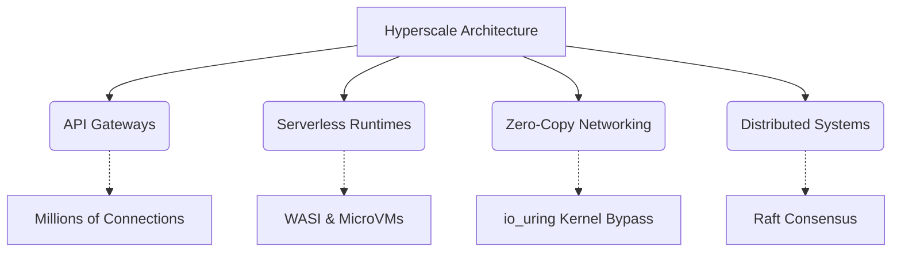

## 1. What is this Book?

Welcome to **Production-Grade Rust: Hyperscale Architecture**. This is not a beginner's guide to Rust syntax. This is an advanced, elite-tier engineering curriculum designed to bridge the massive gap between knowing how to write Rust code, and knowing how to design planet-scale distributed systems that can process 10 million requests per second without breaking a sweat.

We bypass standard web tutorials and drop straight into the mathematics of systems engineering. We cover everything from the theoretical physics of CPU cache lines and lock-free concurrency, down into Linux Kernel internals, eBPF hooking, Zero-Copy ring buffers, and hardware SIMD acceleration.

## 2. Vision and Mission

**Our Mission:** To forge engineers capable of architecting systems that do not crash under catastrophic load, do not leak memory, and operate at the physical limits of hardware capability.

**Our Vision:** A software ecosystem where the "N+1 Problem", Out-Of-Memory (OOM) panics, and unpredictable latency spikes are relegated to the past through the aggressive application of Rust's mathematical compile-time guarantees.

## 3. Rust Knowledge Required

To successfully navigate this book, you must already have a strong foundational understanding of Rust:
- **Ownership & Borrowing**: You must intuitively understand lifecycles and the borrow checker.
- **Traits & Generics**: You should be comfortable writing bounds and generic constraints.
- **Asynchronous Rust**: You must know how `async`/`await` works fundamentally, though we will dive deep into the internals of the `Future` trait and Executors.
- **Unsafe Rust**: You don't need to write it daily, but you must understand raw pointers and memory layout.

## 4. Crates Used and Versions

This book relies on the 2026 Rust ecosystem. All code examples target **Rust 1.95+** and rely heavily on the following foundational crates:
- `tokio` (v1.40+) - The core asynchronous runtime.
- `axum` / `hyper` / `tower` - The HTTP, routing, and middleware layer.
- `serde` - High-performance serialization.
- `sqlx` - Compile-time verified SQL queries.
- `wasmtime` - WebAssembly sandboxing.
- `aya` - eBPF kernel hooking.
- `io-uring` - Zero-copy kernel bypassing.
- `loom` - Permutation testing for lock-free concurrency.

## 5. How to Approach the Book

1. **Sequential Reading**: The book is organized into overarching categories. Do not skip the "Foundations" and "Core Infrastructure" chapters. The concepts build on each other. You cannot understand `io_uring` (Chapter 32) if you do not understand the standard `epoll` reactor physics discussed earlier.
2. **Read the Diagrams**: Every chapter contains intricate Mermaid diagrams. Study them. They map the exact execution flow of the system.
3. **Execute the Code**: Do not just read the Rust snippets. In Part 2 (Chapters 33-36), we build full projects. Type the code out yourself.

## 6. What Will You Achieve?

By intensely focusing on and finishing this book, you will undergo a paradigm shift in how you view software. You will no longer see "web requests"; you will see electron pulses moving through network interface cards, crossing kernel boundaries, and mutating state in mathematically verified memory. 

You will possess the capability to architect:
- API Gateways that process millions of concurrent connections.
- Secure, multi-tenant Serverless runtimes via MicroVMs and WASI.
- Zero-copy network applications that bypass the Linux kernel entirely.
- Distributed consensus databases using the Raft algorithm.

## 7. Technology and Requirements

To run the examples in this book locally, you will need:
- A Linux environment (Ubuntu 24.04 or later recommended).
- **Rust Toolchain**: `rustup default stable`.
- **eBPF dependencies**: Clang, LLVM, and a Linux kernel version 6.1 or higher for `aya` support.
- **Docker / Testcontainers**: For running local databases and isolation environments.
- **Performance Profilers**: Linux `perf` and `valgrind`.

## 8. Architectural Tradeoffs & Edge Cases

> [!WARNING]
> Building hyperscale systems requires sacrificing developer velocity. Do not apply these patterns prematurely.

*   **Edge Cases**: Hardware failure at the extreme limits. When pushing 10 million requests per second, you will encounter cosmic ray bit-flips in RAM and undocumented silicon bugs. These require error-correcting codes (ECC memory) and software-level checksums.
*   **Tradeoffs (Velocity vs. Execution Speed)**: Designing an application with `io_uring`, eBPF, and lock-free data structures will take 10x longer to develop than a standard MVC web application in Ruby or Python. You are trading expensive human developer time for highly optimized hardware execution time.
*   **Constraints**: Cognitive load. The learning curve for this stack is immense. It requires a team of elite engineers who deeply understand both the Linux kernel and Rust's strict compiler rules.
*   **Best Practices**: Standardize first, optimize second. Build your application using standard Axum and Postgres. Only reach for MicroVMs, eBPF, and SIMD hardware acceleration when you have cryptographic proof (via Flamegraphs) that your standard architecture is failing under load.
