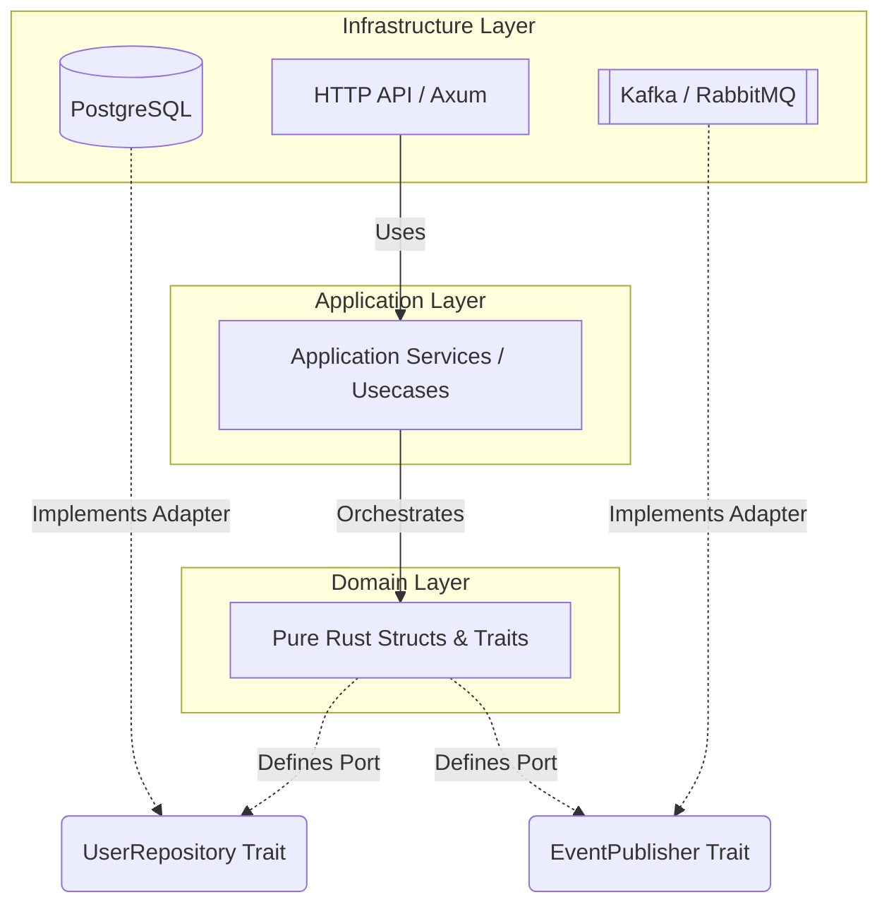
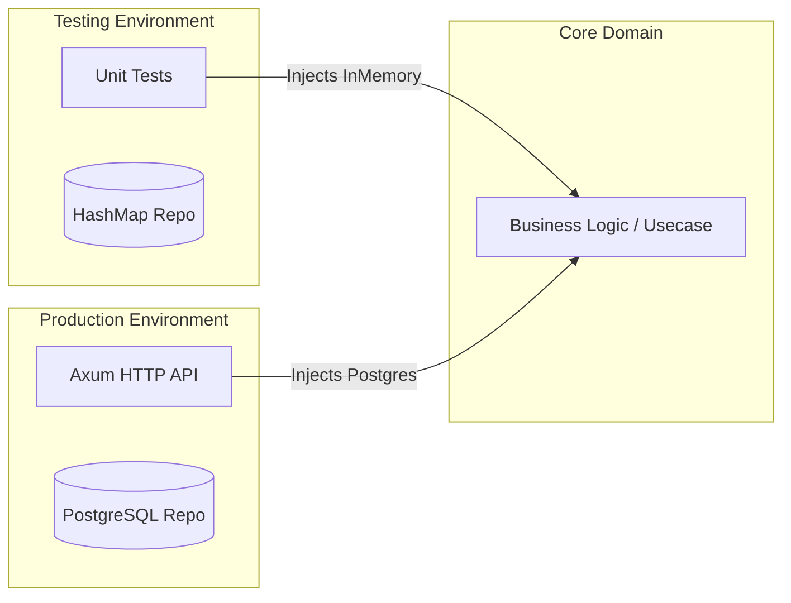

# 1. The Catastrophe of the Monolith

In standard MVC (Model-View-Controller) frameworks (like Ruby on Rails or Django), business logic is deeply intertwined with the database. A "User" object inherits directly from an ORM base class (e.g., `ActiveRecord`). This means the core business logic—the mathematical rules of your company—is permanently welded to the physical reality of a Postgres SQL database.

If you decide to migrate from Postgres to a distributed NoSQL database (like DynamoDB), you must completely rewrite the entire application. Furthermore, because the business logic is married to the database, you cannot write unit tests without spinning up a real, physical database, slowing down your CI/CD pipeline to a crawl.

# 2. Hexagonal Architecture (Ports and Adapters)

To construct a hyperscale system, we must implement **Hexagonal Architecture**. The core principle is that the application is divided into mathematical layers. The innermost layer is the **Domain**. The Domain contains the pure business rules (e.g., "A user cannot transfer more money than they have in their balance"). 

Crucially, the Domain must be **Pure**. It must have absolutely zero knowledge of HTTP, JSON, Postgres, or Kafka. It communicates with the outside world exclusively through abstract mathematical interfaces known as **Ports**.



# 3. Defining Ports with Rust Traits

In Rust, a Port is defined using a `trait`. 

```rust
// src/domain/ports/user_repository.rs

use async_trait::async_trait;
use uuid::Uuid;
use crate::domain::models::user::User;
use crate::domain::error::DomainError;

#[async_trait]
pub trait UserRepository: Send + Sync {
    async fn find_by_id(&self, id: Uuid) -> Result<Option<User>, DomainError>;
    async fn save(&self, user: &User) -> Result<(), DomainError>;
}
```

Notice what is *not* here. There is no mention of `sqlx`, no mention of `tokio_postgres`, and no raw SQL strings. The Domain simply mathematically demands that *something* must exist that can save a `User`.

# 4. The Dependency Inversion Principle

The physical implementations of these Ports are known as **Adapters**. An Adapter lives in the outermost layer of the application (the Infrastructure layer).

```rust
// src/infrastructure/adapters/postgres_user_repo.rs

use async_trait::async_trait;
use sqlx::PgPool;
use uuid::Uuid;
use crate::domain::ports::user_repository::UserRepository;
use crate::domain::models::user::User;
use crate::domain::error::DomainError;

pub struct PostgresUserRepository {
    pool: PgPool,
}

impl PostgresUserRepository {
    pub fn new(pool: PgPool) -> Self {
        Self { pool }
    }
}

#[async_trait]
impl UserRepository for PostgresUserRepository {
    async fn find_by_id(&self, id: Uuid) -> Result<Option<User>, DomainError> {
        // Here, we interact with physical reality.
        let record = sqlx::query!(
            "SELECT id, email, password_hash FROM users WHERE id = $1",
            id
        )
        .fetch_optional(&self.pool)
        .await
        .map_err(|e| DomainError::DatabaseFailure(e.to_string()))?;

        match record {
            Some(r) => Ok(Some(User::reconstitute(r.id, r.email, r.password_hash))),
            None => Ok(None),
        }
    }

    async fn save(&self, user: &User) -> Result<(), DomainError> {
        sqlx::query!(
            "INSERT INTO users (id, email, password_hash) VALUES ($1, $2, $3)",
            user.id(),
            user.email().as_str(),
            user.password_hash().as_str()
        )
        .execute(&self.pool)
        .await
        .map_err(|e| DomainError::DatabaseFailure(e.to_string()))?;
        
        Ok(())
    }
}
```

# 5. Injection and Testability



At the very top of the application (the Composition Root), we instantiate the `PgPool`, create the `PostgresUserRepository`, and physically inject it into the Domain logic via Dynamic Dispatch (`Box<dyn UserRepository>`) or Static Dispatch (Generics).

This unlocks absolute testability. During CI/CD, we can create an `InMemoryUserRepository` using a standard `HashMap`. We inject this into the Domain logic, allowing us to execute 10,000 unit tests in under 5 milliseconds, completely isolated from physical disk I/O. By utilizing Rust's strict trait system, we mathematically guarantee architectural boundaries.

# 6. Architectural Tradeoffs & Edge Cases

> [!WARNING]
> Hexagonal Architecture requires a massive amount of boilerplate code to maintain pure boundaries.

*   **Edge Cases**: Domain Leakage. A junior developer might accidentally return a `sqlx::Error` from the Postgres Adapter directly through the Port interface. This instantly couples the pure Domain to the database layer, destroying the architecture. All infrastructure errors *must* be mapped to pure `DomainError` enums.
*   **Tradeoffs (Purity vs. Boilerplate)**: You must write explicit data-mapping layers. You cannot pass a database row struct directly to the Domain; you must map it into a pure Domain Entity. You cannot pass a Domain Entity directly to an Axum JSON response; you must map it to an HTTP DTO (Data Transfer Object). This effectively doubles the number of structs you must maintain.
*   **Constraints**: Performance overhead of dynamic dispatch. Using `Box<dyn Trait>` requires a VTable pointer lookup at runtime, which prevents the Rust compiler from inlining functions, costing a few nanoseconds per call.
*   **Best Practices**: In 99% of web applications, the nanosecond overhead of `Box<dyn Trait>` is completely irrelevant compared to network I/O. However, in extreme hot-paths (e.g., game engines or high-frequency trading), prefer **Static Dispatch** via generics (`impl Trait`) to force the compiler to generate monomorphized, zero-cost machine code, at the expense of slower compile times.
