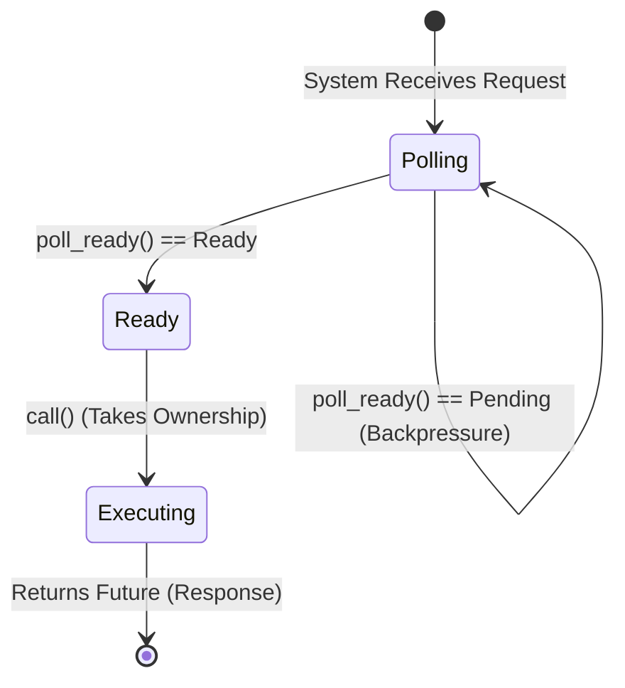

# 1. The Physics of Middleware

In a hyperscale Rust application, Axum handles HTTP routing, but the true power lies in **Tower**. Tower is a library of modular, reusable, robust networking components based on a single, fundamental mathematical trait: `Service`.

A `Service` represents an asynchronous function that takes a Request and returns a Response (or an Error). Every single piece of your application—from a global Rate Limiter down to the final Axum endpoint handler—is mathematically just a `Service`. By nesting these Services inside one another like Russian nesting dolls, we construct a **Middleware Stack**.

```mermaid
sequenceDiagram
    participant Client
    participant Limit as ConcurrencyLimiter (Service)
    participant Auth as AuthMiddleware (Service)
    participant Handler as Axum Handler (Service)
    
    Client->>Limit: HTTP Request
    
    rect rgb(20, 40, 20)
    Note over Limit: poll_ready() - checks available threads
    Limit->>Auth: pass request
    end
    
    rect rgb(40, 20, 40)
    Note over Auth: poll_ready() - reads JWT
    Auth->>Handler: pass request
    end
    
    Handler-->>Auth: HTTP Response
    Auth-->>Limit: HTTP Response
    Limit-->>Client: HTTP Response
```



# 2. Deconstructing the `tower::Service` Trait

To understand how to control traffic at the architectural level, you must understand the exact memory layout of the `Service` trait.

```rust
use std::task::{Context, Poll};
use std::future::Future;

pub trait Service<Request> {
    type Response;
    type Error;
    type Future: Future<Output = Result<Self::Response, Self::Error>>;

    fn poll_ready(&mut self, cx: &mut Context<'_>) -> Poll<Result<(), Self::Error>>;
    fn call(&mut self, req: Request) -> Self::Future;
}
```

This trait defines a profound two-step execution process:



1. **`poll_ready`**: Before the server even accepts the incoming TCP packet, it calls `poll_ready`. This function returns `Poll::Ready` if the service has enough resources (RAM, DB connections, Tokio threads) to handle the request. If the server is overloaded, it returns `Poll::Pending`, mathematically halting execution and asserting **Backpressure** back to the OS socket.
2. **`call`**: Once `poll_ready` is successful, `call` is invoked. It takes ownership of the Request, begins execution, and immediately returns a `Future` containing the eventual Response.


# 3. Architecting a Custom Concurrency Limiter

Assume we want to protect a specific fragile endpoint (like a PDF generator) from being hammered by more than 10 concurrent requests. We will write a custom Tower middleware from scratch.

```rust
use std::sync::atomic::{AtomicUsize, Ordering};
use std::sync::Arc;
use std::task::{Context, Poll};
use tower::Service;
use futures::future::BoxFuture;

#[derive(Clone)]
pub struct ConcurrencyLimiter<S> {
    inner: S,
    max_concurrent: usize,
    current_concurrent: Arc<AtomicUsize>,
}

impl<S> ConcurrencyLimiter<S> {
    pub fn new(inner: S, max_concurrent: usize) -> Self {
        Self {
            inner,
            max_concurrent,
            current_concurrent: Arc::new(AtomicUsize::new(0)),
        }
    }
}
```

Here, we wrap the `inner` Service (the next layer in the nesting doll). We use a highly efficient `AtomicUsize` to track the exact number of requests currently executing.

```rust
impl<S, Request> Service<Request> for ConcurrencyLimiter<S>
where
    S: Service<Request> + Clone + Send + 'static,
    S::Future: Send + 'static,
    Request: Send + 'static,
{
    type Response = S::Response;
    type Error = S::Error;
    type Future = BoxFuture<'static, Result<Self::Response, Self::Error>>;

    fn poll_ready(&mut self, cx: &mut Context<'_>) -> Poll<Result<(), Self::Error>> {
        let current = self.current_concurrent.load(Ordering::Acquire);
        if current >= self.max_concurrent {
            // BACKPRESSURE: The system is full. We physically reject the connection.
            return Poll::Pending; 
        }
        
        // Pass the readiness check down the chain to the inner service
        self.inner.poll_ready(cx)
    }

    fn call(&mut self, req: Request) -> Self::Future {
        // 1. Increment the atomic counter
        self.current_concurrent.fetch_add(1, Ordering::Release);
        
        // 2. Clone the atomic pointer so the Future can decrement it when finished
        let current_concurrent = self.current_concurrent.clone();
        
        // 3. Invoke the inner service (which might be the actual Axum handler)
        let fut = self.inner.call(req);

        // 4. Wrap the returned Future to ensure decrement happens exactly once
        Box::pin(async move {
            let res = fut.await;
            current_concurrent.fetch_sub(1, Ordering::Release);
            res
        })
    }
}
```

# 4. The Physics of the Drop

By utilizing `AtomicUsize`, we achieve lock-free concurrency control. Even if 10,000 requests arrive at the exact same microsecond, the hardware silicon manages the atomic increments across the CPU ring bus without ever acquiring a `Mutex`. If the 11th request arrives, `poll_ready` intercepts it and exerts backpressure *before* the massive HTTP payload is even parsed into memory, completely immunizing the endpoint from OOM crashes.

# 5. Architectural Tradeoffs & Edge Cases

> [!CAUTION]
> The ordering of your Tower middleware stack is mathematically critical. A single layer placed out of order can render the entire stack useless.

*   **Edge Cases**: The Silent Hang. If an inner service panics or hangs infinitely (e.g., waiting on a deadlocked database query) and you do not have a timeout, the `BoxFuture` returned by `call` will never resolve. In our `ConcurrencyLimiter`, this means `current_concurrent.fetch_sub(1)` will *never* execute, permanently leaking a concurrency slot until the server locks up.
*   **Tradeoffs (Robustness vs. Debuggability)**: Highly nested Tower middleware generates notoriously incomprehensible compiler errors and stack traces. If a trait bound fails 10 layers deep, `rustc` will output massive walls of text detailing the precise `Service` type mismatches.
*   **Constraints**: `poll_ready` is synchronous (returning a `Poll`), meaning you cannot easily `await` an asynchronous operation inside it. If your readiness check requires querying a database or an external API, you must use complex polling machinery or push that logic down into the `call` phase, which defeats the purpose of early backpressure.
*   **Best Practices**: 
    1. **Always apply a `TimeoutLayer` at the absolute top of your stack** to guarantee that futures eventually resolve and release resources.
    2. Pair your `ConcurrencyLimitLayer` with a `LoadShedLayer`. If you hit the concurrency limit, return a `503 Service Unavailable` immediately rather than infinitely queuing the request and exhausting the OS TCP backlog.

## 8. Intermediate & Advanced Systems Deep Dive

> [!NOTE]
> Bridging the gap between software abstractions and physical hardware mechanics.

*   **Intermediate Concept**: The Service Trait Abstraction. `tower::Service` is not just for HTTP requests. It is a universal mathematical abstraction for any asynchronous Request/Response cycle. You can wrap gRPC calls, database queries, or raw TCP streams in the exact same `ConcurrencyLimit` and `Retry` middleware stacks.
*   **Advanced Implications**: Future Combinator Overhead and the `Pin<Box<dyn Future>>` Penalty. When you stack 15 Tower middlewares, the Rust compiler generates a massively nested, deeply recursive state machine Future. In older versions of Rust, this would overflow the compiler's recursion limit or generate unoptimized assembly. Tower actively utilizes Type Erasure (`BoxCloneService`) to intentionally break the static type chain at specific boundaries. While this introduces dynamic dispatch, it saves the compiler from generating a 50-megabyte binary consisting of infinitely nested Future states, trading a 1-nanosecond execution penalty for a viable compile time.
