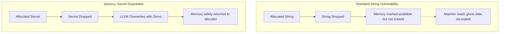
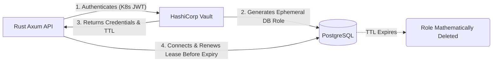

## 1. The Heartbleed Catastrophe & Memory Forensics

In standard web applications, developers load database passwords and API keys from a `.env` file into a standard `String` type. This is a catastrophic vulnerability. When a standard `String` in Rust (or any language) is dropped or reallocated, the memory it occupied is not explicitly erased; it is merely marked as "available" by the OS allocator. The plain-text password remains fully intact in the physical RAM chips.

If an attacker leverages a memory-disclosure vulnerability (exactly like the infamous 2014 OpenSSL **Heartbleed** bug), they can send a malformed packet that forces your server to return 64 kilobytes of uninitialized heap memory. The attacker will instantly read the ghost echoes of your un-erased strings, stealing your master Postgres password in plain text. Furthermore, if the Linux kernel swaps memory to disk during high load, your un-erased passwords are written directly to the hard drive, completely bypassing filesystem encryption.



## 2. Cryptographic Zeroization via the `secrecy` Crate

To operate at a production-grade level, we must mathematically guarantee that secrets are destroyed at the hardware level the exact microsecond they are no longer needed. We achieve this using the `secrecy` crate.

Instead of `String`, we load passwords into a `Secret<String>`. This wrapper acts as a cryptographic black hole. First, it prevents accidental logging; if you attempt to `println!("{:?}", secret)`, it will output `[REDACTED]`, preventing keys from leaking into Datadog or AWS CloudWatch. More importantly, the `secrecy` crate implements the `Zeroize` trait. When the `Secret` falls out of scope, the `Drop` implementation executes a specialized LLVM intrinsic that physically overwrites the specific RAM addresses with zeros before returning the memory to the allocator. It uses `std::sync::atomic::compiler_fence` to mathematically guarantee that the LLVM optimizer cannot "optimize away" the zeroing operation.

```rust
// src/config.rs
use secrecy::{Secret, ExposeSecret};
use serde::Deserialize;

#[derive(Deserialize, Debug)]
pub struct DatabaseConfig {
    pub host: String,
    pub port: u16,
    pub username: String,
    // Secret<T> prevents logging and physically zeroizes RAM on Drop
    pub password: Secret<String>,
}

impl DatabaseConfig {
    pub fn connection_string(&self) -> Secret<String> {
        // To use the password, we must explicitly call expose_secret().
        // This acts as an architectural tripwire, forcing the developer
        // to acknowledge they are handling raw cryptographic material.
        Secret::new(format!(
            "postgres://{}:{}@{}:{}",
            self.username,
            self.password.expose_secret(),
            self.host,
            self.port
        ))
    }
}
```

## 3. The Flaw of Static `.env` Files

Even with memory zeroization, relying on `.env` files or Kubernetes Secrets (which are just Base64 encoded) is unacceptable for a hyperscale architecture. Static secrets do not expire. If a disgruntled employee leaves the company, or an API key is accidentally committed to GitHub, the credentials remain valid indefinitely until manually rotated. Manual rotation requires restarting the entire Kubernetes cluster, resulting in production downtime.

## 4. HashiCorp Vault & Shamir's Secret Sharing

We replace static files with **HashiCorp Vault**, an identity-based secrets and encryption management system. Vault does not just store passwords; it acts as a dynamic cryptographic authority.



### 4.1 Shamir's Secret Sharing (Unsealing the Vault)

When Vault is deployed, it starts in a "Sealed" state, meaning it cannot read its own encrypted hard drive. The master decryption key is mathematically split into 5 pieces using an advanced polynomial interpolation algorithm known as **Shamir's Secret Sharing**. These 5 pieces are given to 5 different human executives in the company.

To unseal Vault, the algorithm dictates that any 3 of the 5 keys must be provided. This mathematically prevents any single rogue employee from accessing the master cryptographic keys, enforcing absolute physical security.

### 4.2 Dynamic Secret Generation

Once unsealed, our Rust application authenticates with Vault using its Kubernetes Service Account token. Instead of asking Vault for "the Postgres password," it asks Vault for a "Database Lease." Vault connects to Postgres via a root account, generates a brand new, highly randomized Postgres user and password, and returns these ephemeral credentials to our Rust app with a **Time-To-Live (TTL)** of exactly 1 hour.

Every hour, a background Tokio task in our Rust application seamlessly contacts Vault to renew the lease or generate a new one. If an attacker manages to steal the Postgres password from our Rust server, the password will mathematically self-destruct in the Postgres database 60 minutes later, completely locking the attacker out without any human intervention or server restarts.

```rust
// src/vault_client.rs
use reqwest::Client;
use secrecy::{Secret, ExposeSecret};
use serde::Deserialize;

#[derive(Deserialize)]
struct VaultResponse {
    lease_duration: u64,
    data: VaultCredentials,
}

#[derive(Deserialize)]
struct VaultCredentials {
    username: String,
    password: Secret<String>,
}

pub async fn fetch_dynamic_postgres_creds(
    client: &Client, 
    vault_addr: &str, 
    vault_token: &Secret<String>
) -> Result<(VaultCredentials, u64), reqwest::Error> {
    let url = format!("{}/v1/database/creds/my-role", vault_addr);

    let response = client.get(&url)
        .header("X-Vault-Token", vault_token.expose_secret())
        .send()
        .await?
        .json::<VaultResponse>()
        .await?;

    // Returns the ephemeral credentials and the TTL in seconds.
    // The caller must spawn a Tokio background task to sleep for (TTL - 60) seconds
    // and then rotate the connection pool with new credentials.
    Ok((response.data, response.lease_duration))
}
```

By combining LLVM-level memory zeroization with the mathematically sound polynomial interpolation of Shamir's Secret Sharing and dynamic lease generation, we construct an impenetrable cryptographic fortress for our hyperscale application.

## 5. Architectural Tradeoffs & Edge Cases

> [!WARNING]
> Dynamic secrets introduce a fatal single point of failure: The Vault Server itself.

*   **Edge Cases**: Vault Outage. If the Vault cluster crashes, the Rust application can no longer renew its ephemeral database lease. When the 1-hour TTL mathematically expires, the Postgres database will automatically delete the role, instantly terminating all active database connections and taking your entire application offline. 
*   **Tradeoffs (Security vs. Availability)**: You are trading static availability for cryptographic security. A `.env` file never crashes, but it leaks permanently. Vault guarantees secrets are never leaked, but it introduces a synchronous network dependency into the critical boot path of every single microservice.
*   **Constraints**: Connection Pool Invalidation. When the TTL approaches and Vault generates a *new* set of credentials, you cannot simply swap the password in RAM. The `sqlx::PgPool` holds physical TCP sockets authenticated with the *old* password. You must gracefully drain and rotate the entire connection pool without dropping active user queries.
*   **Best Practices**: 
    1. Do not write lease renewal logic manually in Rust. Deploy the **Vault Agent Sidecar** in Kubernetes. The sidecar handles the complex network retries and securely writes the ephemeral token to an in-memory `tmpfs` volume shared with the Rust container.
    2. Set the TTL short enough to mitigate theft (e.g., 1 hour), but long enough to survive a temporary Vault outage.

## 8. Intermediate & Advanced Systems Deep Dive

> [!NOTE]
> Bridging the gap between software abstractions and physical hardware mechanics.

*   **Intermediate Concept**: Ephemeral State and `tmpfs`. Storing a decrypted Vault token on a standard hard drive leaves physical magnetic traces. Using a `tmpfs` volume physically mounts the directory into RAM, ensuring that if the server loses power or is physically stolen, the plaintext secret ceases to exist in the universe.
*   **Advanced Implications**: Memory Pinning and `mlock`. Even if you hold the database password strictly in a Rust `String` (RAM), the Linux Kernel's Virtual Memory manager can page that memory out to the physical swap file on the SSD during high memory pressure. A stolen SSD now contains your production database credentials. For highly sensitive cryptographic architectures, you must execute the `mlock()` system call on the memory address containing the secret. This physically forbids the Linux kernel from ever paging the bytes to disk, guaranteeing it remains trapped entirely in volatile RAM until the `Drop` trait forcefully overwrites the memory with zeroes (`zeroize` crate).
