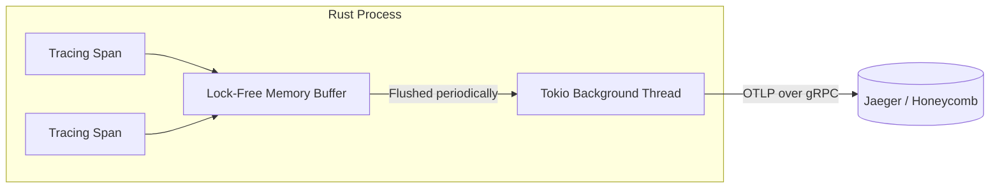

## 1. The Impossibility of `println!` in Distributed Systems

In a simple synchronous application, logging is trivial: you use `println!` or `log::info!` to write text to standard output. However, in a hyperscale asynchronous Rust application powered by Tokio, standard logging is completely useless. Tokio multiplexes thousands of concurrent tasks onto a handful of OS threads. If you look at standard output, you will see a chaotic, interleaved mess of log lines from thousands of different users. You have absolutely no mathematical way to prove which log line belongs to which HTTP request.

If a user reports a 500 Internal Server Error, and your application is processing 10,000 requests per second, finding the specific log lines that caused their error using grep is like finding a needle in a hurricane. We must abandon standard logging and adopt **Structured Tracing**.

## 2. Spans, Events, and the `tracing` Crate

To solve the concurrency problem, we use the `tracing` crate. Instead of emitting isolated strings, `tracing` operates on **Spans**. A Span represents a period of time with a distinct beginning and end (e.g., "process_payment"). Any log lines (called **Events**) emitted while inside that Span are mathematically bound to it.

Crucially, because Rust is asynchronous, a single Span might be paused and resumed dozens of times as Tokio yields execution to wait for database I/O. The `tracing` crate tracks this context dynamically. Using the `#[instrument]` macro on an `async fn` forces the Rust compiler to automatically generate a Span, record the function's arguments as structured JSON key-value pairs, and attach the Span to the Future. Whenever Tokio polls the Future, the Span is entered; whenever Tokio yields, the Span is exited. This guarantees that all logs are perfectly grouped by request, regardless of which physical CPU core executed them.

## 3. The W3C Trace Context & Distributed Propagation

Grouping logs within a single Rust binary is only half the battle. In a modern architecture, a single user action might traverse an API Gateway, a Rust monolith, a Python machine learning worker, and a Postgres database. To debug a latency spike, we must track the request across the physical network boundaries.

We implement the **W3C Trace Context** specification. When a request hits the edge of our network, the API Gateway generates a cryptographically random 128-bit `trace_id`. It injects this ID into the HTTP headers (specifically, the `traceparent` header). When our Rust Axum server receives the HTTP request, our `tower::Service` middleware intercepts the headers, extracts the `trace_id`, and attaches it to the root tracing Span.

```mermaid
flowchart LR
    Client[Mobile App]
    API[API Gateway]
    Rust[Axum Rust Service]
    Python[Python ML Service]
    DB[(PostgreSQL)]
    
    Client -- 1. HTTP Request --> API
    API -- 2. Generates trace_id --> API
    API -- 3. Injects traceparent Header --> Rust
    Rust -- 4. Extracts trace_id & Spawns Root Span --> Rust
    Rust -- 5. Forwards traceparent Header --> Python
    Rust -- 6. SQL Query with SQLcommenter --> DB
    
    %% Tracing Backend
    Jaeger[[Jaeger / Honeycomb]]
    API -.->|Exports Span A| Jaeger
    Rust -.->|Exports Span B (Child of A)| Jaeger
    Python -.->|Exports Span C (Child of B)| Jaeger
```

If the Rust server then makes an HTTP request to an external billing service, it injects that exact same `trace_id` into the outgoing headers. This is called **Distributed Context Propagation**. When all these microservices export their telemetry, we can reconstruct a single, continuous waterfall graph of the entire network transaction.

## 4. OpenTelemetry (OTLP) and gRPC Batch Exporting

Where does this telemetry data go? Writing gigabytes of structured JSON to a local log file will destroy the server's NVMe SSD through write amplification. Instead, we use **OpenTelemetry (OTel)**.

We configure the Rust `tracing-opentelemetry` layer to act as an asynchronous telemetry pipeline. When a Span closes, it is not written to disk. It is pushed into a lock-free memory buffer. A background Tokio thread continuously monitors this buffer. Every 5 seconds, it takes a massive batch of thousands of Spans, compresses them, and exports them directly to an observability backend (like Jaeger, Datadog, or Honeycomb) using the **OTLP (OpenTelemetry Protocol) over gRPC**.



```rust
// src/telemetry.rs
use tracing_subscriber::{layer::SubscriberExt, Registry, util::SubscriberInitExt};
use opentelemetry_otlp::WithExportConfig;
use opentelemetry_sdk::trace::{self, Sampler};

pub fn init_telemetry() {
    // 1. Configure the OTLP Exporter to send data via gRPC
    let tracer = opentelemetry_otlp::new_pipeline()
        .tracing()
        .with_exporter(
            opentelemetry_otlp::new_exporter()
                .tonic() // Use high-performance gRPC
                .with_endpoint("http://jaeger:4317")
        )
        // 2. Configure a Batch Span Processor to prevent blocking the main application thread
        .with_trace_config(
            trace::config()
                .with_sampler(Sampler::AlwaysOn)
        )
        .install_batch(opentelemetry_sdk::runtime::Tokio)
        .unwrap();

    // 3. Create the Tracing Layer that maps Rust Spans to OTel Spans
    let telemetry_layer = tracing_opentelemetry::layer().with_tracer(tracer);

    // 4. Compose the global subscriber
    Registry::default()
        .with(tracing_subscriber::EnvFilter::new("info"))
        .with(telemetry_layer)
        .init();
}
```

By transmitting batches via gRPC, we utilize HTTP/2 multiplexing, drastically reducing TCP overhead. The Rust API can process 100,000 requests per second while exporting millions of telemetry spans with negligible impact on CPU or latency, achieving absolute observability at hyperscale.

## 5. Architectural Tradeoffs & Edge Cases

> [!WARNING]
> Telemetry buffers can cause Out-Of-Memory (OOM) crashes if the downstream observability backend goes offline.

*   **Edge Cases**: The Buffer Overflow. If Jaeger or Honeycomb experiences an outage, the Tokio background thread cannot export its batches via gRPC. The lock-free memory buffer will begin filling with millions of spans. Within minutes, the buffer will exhaust the server's RAM, causing the Linux OOM Killer to brutally terminate your Rust application. You must configure strict buffer limits and enable Load Shedding (dropping spans) when full.
*   **Tradeoffs (Observability vs. CPU Overhead)**: Generating cryptographically secure 128-bit `trace_id`s, capturing stack traces, and formatting JSON attributes consumes CPU cycles. While negligible at 1,000 req/sec, at 1,000,000 req/sec, the telemetry pipeline alone can consume 30% of your total CPU capacity.
*   **Constraints**: Blind Spots. Tracing Spans only capture function entry/exit times and explicit attributes. They do not capture the values of local variables within a function unless you explicitly inject them via `tracing::info!(val)`.
*   **Best Practices**: Do not export 100% of telemetry in production. Implement a **Tail-Based Sampler** at the OpenTelemetry Collector level. Configure it to silently drop 99% of successful HTTP 200 requests, but mathematically guarantee the export of 100% of HTTP 500 errors and requests that take longer than 2 seconds (latency outliers).
