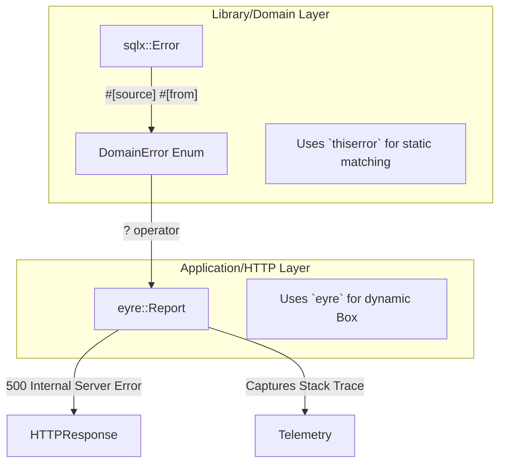
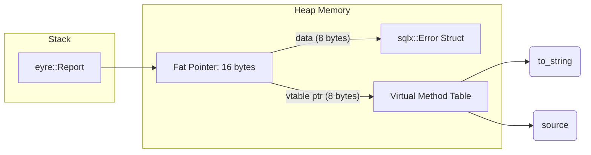

## 1. The Catastrophe of Exceptions

In languages like Java, Python, and C++, errors are handled using Exceptions (`try/catch`). Exceptions are fundamentally broken for hyperscale systems. When an exception is thrown, it violently disrupts the Control Flow Graph. The runtime must pause execution, unwind the call stack (which is a massively expensive CPU operation), and search for a matching `catch` block. Furthermore, exceptions are invisible in the function signature. If you call `fetch_user()` in Python, you have no mathematical way to know if it will return a user or throw a `DatabaseConnectionException`. This leads to production crashes when unhandled exceptions bubble up to the main thread.

Rust eliminates exceptions entirely. Errors in Rust are simply data. The `Result<T, E>` type is an algebraic enum. If a function can fail, it *must* return a `Result`. The compiler forces the caller to explicitly handle both the `Ok` and the `Err` variant. Because errors are returned as standard data via the normal CPU registers, there is absolutely zero stack-unwinding overhead.

## 2. The `std::error::Error` Trait

While returning `Result<T, String>` is possible, it is a severe anti-pattern. An error string cannot be pattern-matched by the caller to execute recovery logic. We must return strongly typed error structs. To unify the ecosystem, Rust provides the `std::error::Error` trait.

The `Error` trait is remarkably simple. It requires the struct to implement `Display` (so it can be printed to the user) and `Debug` (so it can be printed to the logs). Crucially, it provides a `source()` method. If a database error causes an HTTP error, the HTTP error struct can hold the database error inside it, forming a **Chain of Errors**.

## 3. Library vs. Application Errors (`thiserror` vs `eyre`)

A fatal mistake made by intermediate Rust developers is treating all errors the same. In reality, there is a strict architectural dichotomy between **Library Errors** and **Application Errors**.



### 3.1 Library Errors (`thiserror`)

If you are writing a reusable library (like the `domain` crate in our Hexagonal Workspace), you must define exact, exhaustive error enums. The caller needs to know exactly what failed so they can mathematically pattern-match and recover (e.g., `DomainError::UserNotFound` vs `DomainError::DatabaseTimeout`).

We use the `thiserror` crate to automate the boilerplate of implementing the `std::error::Error` trait for our enums. `thiserror` generates purely static, zero-allocation code. It is an absolute requirement for library boundaries.

```rust
// src/domain/error.rs
use thiserror::Error;

#[derive(Error, Debug)]
pub enum DomainError {
    #[error("User with ID {0} was not found in the system")]
    UserNotFound(uuid::Uuid),

    // Using #[source] automatically links the inner sqlx::Error into the Error chain
    #[error("A fatal database timeout occurred")]
    DatabaseTimeout(#[from] #[source] sqlx::Error),
}
```

### 3.2 Application Errors (`eyre` and Dynamic Dispatch)

At the highest level of your application (the Composition Root or the Axum HTTP Handlers), you do not care about pattern matching. If the database times out while processing a web request, there is no "recovery"—you simply need to log the exact line of code that failed and return a 500 Internal Server Error to the user.

If you try to use enums at the application boundary, you will end up with a massive, 50-variant `ApiError` enum that encompasses every possible failure in the entire system. This is a maintenance nightmare.

We solve this using the **`eyre`** crate and **Dynamic Dispatch**. Instead of returning a specific enum, our top-level functions return `eyre::Result<T>`. Under the hood, this is an alias for `Result<T, eyre::Report>`.

## 4. The Mathematics of Fat Pointers

What is an `eyre::Report`? It is a heap-allocated **Fat Pointer** to any struct that implements `std::error::Error` (i.e., `Box<dyn Error>`). When you return a `sqlx::Error` via the `?` operator, `eyre` intercepts it, dynamically allocates it on the heap, and returns a pointer.



A standard pointer in Rust is 8 bytes (on a 64-bit system). A *Fat Pointer* is 16 bytes. The first 8 bytes point to the actual error struct on the heap. The second 8 bytes point to the **vtable (Virtual Method Table)**. The vtable is a static array of function pointers generated by the compiler. When you call `error.to_string()` on a `dyn Error`, the CPU jumps to the vtable, looks up the specific memory address of the `to_string` function for that specific underlying struct, and dynamically executes it.

This dynamic dispatch incurs a microscopic CPU overhead (a pointer indirection), but in the context of an error path (which only happens during a failure), this cost is entirely irrelevant. The tradeoff gives us immense power: `eyre` automatically captures a full **Stack Trace** at the exact microsecond the error is created. When the error bubbles up to the Axum handler and is logged to our OpenTelemetry pipeline, it includes the exact filename and line number where the database query failed, providing unparalleled debuggability in production.

## 5. Architectural Tradeoffs & Edge Cases

> [!WARNING]
> Improperly wrapping errors can permanently destroy the physical error chain.

*   **Edge Cases**: The Swallowed Error. If a developer uses `.map_err(|_| eyre!("database failed"))` instead of `.wrap_err("database failed")`, the original `sqlx::Error` is physically destroyed and replaced. You lose the root cause stack trace entirely. You must always use the `?` operator or `.wrap_err()` to preserve the mathematical chain of causation.
*   **Tradeoffs (Enums vs. Opaque Pointers)**: `thiserror` (Enums) provides mathematical certainty via exhaustive pattern matching, but modifying an enum requires refactoring every single `match` statement in the codebase. `eyre` (Dynamic Pointers) provides ultimate developer velocity (just slap `?` on everything), but the caller has absolutely no idea what type of error actually occurred without unsafe downcasting.
*   **Constraints**: Heap Allocation Penalty. `eyre::Report` mandates a heap allocation (`Box<dyn Error>`). In 99% of web applications, allocating 16 bytes on the heap during an error path is irrelevant. However, in High-Frequency Trading (HFT) engines where nanoseconds matter, this allocation is unacceptable, forcing the use of purely stack-allocated static enums.
*   **Best Practices**: **Never** use `eyre` in a library crate (`src/domain` or `src/infrastructure`). Only use `eyre` at the absolute outer edge of your binary application (e.g., inside the `src/main.rs` routing handlers).

## 8. Intermediate & Advanced Systems Deep Dive

> [!NOTE]
> Bridging the gap between software abstractions and physical hardware mechanics.

*   **Intermediate Concept**: The Error Trait and `Display` vs `Debug`. A standard web application logs errors as strings. However, robust systems require structured logs. Using `eyre` provides dynamic stack traces, but formatting an `eyre::Report` requires traversing the dynamic pointer chain and allocating massive strings in memory.
*   **Advanced Implications**: Zero-Cost Error Propagation via `std::convert::From`. In high-performance data planes, error handling must be computationally free. By strictly leveraging the `?` operator backed by meticulously implemented `From` traits on `enum` definitions, the Rust compiler leverages `Result<T, E>` which is physically stored in the CPU registers. If an error occurs, the CPU executes a single branch instruction (`JMP`) to return the Enum variant. There are zero heap allocations, zero string formatting operations, and zero dynamic pointer lookups until the error finally hits the absolute outer edge (the HTTP Router), maintaining theoretical maximum throughput during failure storms.
