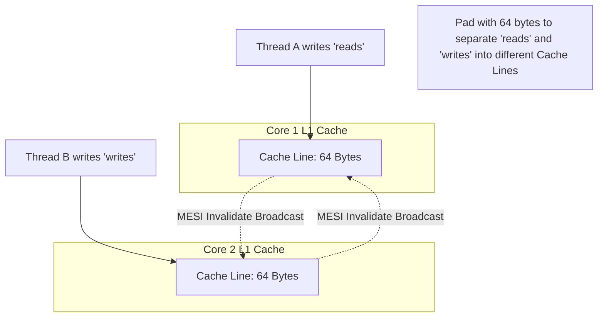

## 1. The Illusion of Shared Memory

In concurrent programming, junior developers assume that memory is a single, unified block of RAM. They believe that if Thread A writes `x = 5`, Thread B will instantly see `x = 5`. This mental model is catastrophically wrong and leads to fatal race conditions in hyperscale systems.

Modern CPUs (Intel, AMD, ARM) are deeply distributed systems on a single silicon die. A 64-core EPYC processor has 64 independent L1 caches. When Thread A writes a value, it does not write to main memory; it writes to its local L1 cache. Unless a strict synchronization primitive forces a hardware-level broadcast (memory barrier), Thread B (running on a different core) will read stale data from its own L1 cache indefinitely. True concurrency requires understanding the physical propagation of electrons across the silicon ring bus.

## 2. Memory Orderings: Relaxed, Acquire, Release, SeqCst

Rust exposes this hardware reality through `std::sync::atomic::Ordering`. You cannot simply increment an atomic counter; you must explicitly dictate the compiler and CPU reordering permissions.

### 2.1 Ordering::Relaxed

`Relaxed` provides zero synchronization. It only guarantees that the specific 8-byte variable is modified atomically without tearing. The CPU and the LLVM compiler are legally permitted to reorder instructions that surround the `Relaxed` operation. If you use `Relaxed` for a spinlock, the CPU will likely reorder your protected data access *before* the lock is acquired, destroying the state.

### 2.2 Acquire-Release Semantics

To build a lock-free queue or a Mutex, we rely on the **Acquire-Release** pair. When Thread A finishes writing data, it publishes a flag using `Ordering::Release`. This acts as a mathematical barrier: no memory writes that occurred *before* the Release operation can be reordered *after* it.

When Thread B reads the flag using `Ordering::Acquire`, it establishes a **Happened-Before Relationship**. Any memory reads occurring *after* the Acquire operation are mathematically guaranteed to see the memory writes that occurred before the Release operation on Thread A. This hardware-level handshake synchronizes the local L1 caches across the silicon.

```mermaid
flowchart TD
    subgraph Core 1 (Thread A)
        A_write1[Write Data: payload = 42]
        A_write2[Write Flag: ready.store(true, Release)]
        A_write1 -->|Compiler Barrier| A_write2
    end
    
    subgraph Core 2 (Thread B)
        B_read1[Read Flag: ready.load(Acquire)]
        B_read2[Read Data: val = payload]
        B_read1 -->|Hardware Sync| B_read2
    end
    
    A_write2 -.->|MESI Invalidate Broadcast| B_read1
```

### 2.3 Ordering::SeqCst (Sequentially Consistent)

`SeqCst` is the most restrictive ordering. It guarantees a single, global total order of operations across all threads. However, enforcing this global order requires the CPU to lock the entire memory bus, stalling all cores. Overusing `SeqCst` in a hyperscale system will completely destroy CPU throughput, reducing a 64-core server to the speed of a single core.

## 3. The MESI Protocol & False Sharing

Cache Coherence is maintained by the hardware using the MESI (Modified, Exclusive, Shared, Invalid) protocol. CPUs load memory in 64-byte chunks called **Cache Lines**. If Thread A modifies a variable, the CPU broadcasts an Invalidate signal for that entire 64-byte line to all other cores.

This introduces **False Sharing**. If two completely independent atomic variables reside in the same 64-byte struct padding, Thread A and Thread B will continuously invalidate each other's L1 caches, causing the Cache Line to violently bounce across the physical ring bus. We eliminate this by using the `#[repr(align(64))]` attribute in Rust, forcing the compiler to space the atomics across different physical cache lines.



```rust
// A lock-free counter structured to avoid False Sharing
use std::sync::atomic::{AtomicUsize, Ordering};

#[repr(align(64))]
struct CachePaddedCounter {
    reads: AtomicUsize,
}

#[repr(align(64))]
struct CachePaddedMetrics {
    writes: AtomicUsize,
}

pub struct SystemMetrics {
    // These fields are physically separated by 64 bytes in RAM,
    // guaranteeing Core 1 and Core 2 do not invalidate each other's L1 caches.
    read_counter: CachePaddedCounter,
    write_counter: CachePaddedMetrics,
}
```

## 4. Permutation Testing via `loom`

Standard unit testing cannot verify lock-free code. A race condition might require a specific thread to be preempted by the OS scheduler at the exact nanosecond between two atomic reads. This specific interleaving might only occur once in 100 billion executions in production.

We solve this using **`loom`**, Tokio's permutation testing engine. `loom` replaces the standard OS threads and atomics with deterministic mocks. During `cargo test`, `loom` systematically explores *every single mathematically possible sequence* of thread interleavings. If there is a one-in-a-trillion state machine vulnerability where Thread B reads before Thread A writes, `loom` will forcefully execute that exact path, crash the test, and output the physical trace. Code that passes `loom` is not just "tested"; it is mathematically proven to be thread-safe.

```rust
// Example of Loom permutation testing
#[cfg(test)]
mod tests {
    use loom::sync::atomic::{AtomicBool, Ordering};
    use loom::sync::Arc;
    use loom::thread;

    #[test]
    fn test_concurrent_flag() {
        loom::model(|| {
            let flag = Arc::new(AtomicBool::new(false));
            let flag_clone = flag.clone();

            thread::spawn(move || {
                flag_clone.store(true, Ordering::Release);
            });

            // Loom will systematically run this read BEFORE, DURING, and AFTER 
            // the other thread's write to prove our code handles all cases.
            let _val = flag.load(Ordering::Acquire);
        });
    }
}
```

## 5. Architectural Tradeoffs & Edge Cases

> [!CAUTION]
> Hardware memory models vary significantly between x86 and ARM architectures.

*   **Edge Cases**: The Combinatorial Explosion. If you write a `loom` test involving 3 threads that execute 10 atomic operations each, the number of mathematical permutations is astronomical. `loom` will run for hours or days without finishing. You must bound the state space by keeping lock-free unit tests microscopically small.
*   **Tradeoffs (Atomics vs. Mutexes)**: Lock-free atomics avoid OS-level thread parking, but they are notoriously difficult to write correctly. Often, a standard `std::sync::Mutex` operating under low contention is actually *faster* than a poorly designed lock-free algorithm suffering from MESI Cache-Line Bouncing.
*   **Constraints**: Architecture Divergence. Intel x86 CPUs have a strongly-ordered memory model (TSO). ARM CPUs (like AWS Graviton) have a weakly-ordered memory model. Code that uses `Ordering::Relaxed` might accidentally work on x86 because the hardware is forgiving, but will violently crash on ARM due to instruction reordering.
*   **Best Practices**: 
    1. **Never write your own lock-free algorithms** unless you have mathematical proof you need them. Use heavily audited crates like `crossbeam` or `dashmap`.
    2. Only use `loom` to verify the most critical, centralized synchronization primitives in your architecture.

## 8. Intermediate & Advanced Systems Deep Dive

> [!NOTE]
> Bridging the gap between software abstractions and physical hardware mechanics.

*   **Intermediate Concept**: The `Mutex` vs `RwLock` Contention. A standard `Mutex` blocks all readers and writers. An `RwLock` allows multiple readers but blocks all writes. In heavily read-optimized systems, developers blindly reach for `RwLock`. However, the internal implementation of `RwLock` requires atomic reference counting for the readers. If 64 CPU cores attempt to acquire read locks simultaneously, they will cause massive L3 Cache invalidation on the atomic reader count, making the `RwLock` *slower* than a standard `Mutex`.
*   **Advanced Implications**: Lock-Free Hardware Primitives. To bypass kernel-level lock contention, you must drop down to silicon-level atomic instructions (`AtomicUsize`, `AtomicPtr`) and employ `Relaxed` or `Acquire/Release` memory orderings. However, lock-free programming introduces terrifying edge cases like the ABA problem (where a pointer is deleted, memory is reallocated to a new struct, and a sleeping thread reads the new struct thinking it's the old one). You must integrate **Hazard Pointers** or **Epoch-Based Reclamation** (e.g., `crossbeam-epoch`) to mathematically guarantee that memory is only freed after all hardware threads have explicitly relinquished their references, bridging the gap between Rust's lifetime checker and raw assembly execution.
