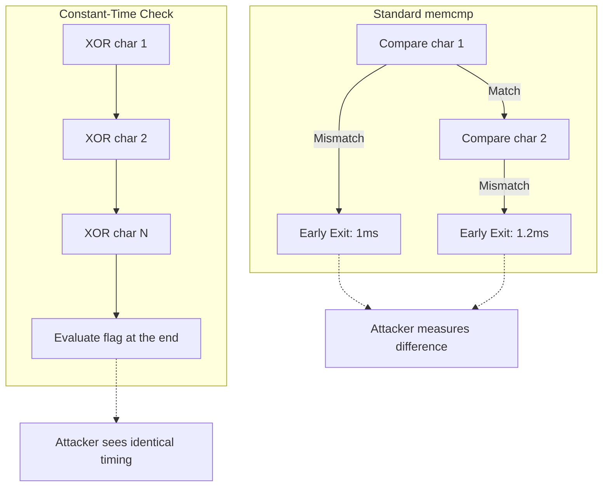

## 1. The Hardware Reality of Cryptographic Hashing

In legacy systems, passwords were hashed using MD5, SHA-1, or SHA-256. These algorithms were designed by the NSA to maximize throughput for data integrity checks. This speed is their fatal flaw when used for authentication. A modern NVIDIA H100 GPU contains over 14,000 CUDA cores. A cluster of these GPUs can calculate hundreds of billions of SHA-256 hashes per second.

If an attacker exfiltrates your database through an SQL injection, they do not need to "decrypt" the passwords. They will simply run a brute-force dictionary attack against the hashes. Because SHA-256 is purely CPU-bound, the attacker's specialized GPU ASICs will crack 99% of your users' passwords in a matter of hours.

## 2. Memory-Hard Functions: The Argon2id Algorithm

To mathematically bankrupt attackers, we must abandon CPU-bound hashing and embrace **Memory-Hard Functions**. We utilize **Argon2id**, the winner of the Password Hashing Competition. Argon2id defeats GPUs not by being mathematically complex, but by monopolizing physical RAM bandwidth.

The algorithm initializes a massive, customizable block of memory (e.g., a 64 Megabyte matrix). It iteratively fills this memory with pseudorandom data, and then executes highly unpredictable memory reads and writes across the entire block. Because GPUs have thousands of cores but severely limited VRAM (e.g., 80 GB), an attacker can only execute a few hundred concurrent Argon2id hashes before physically running out of memory. By tuning the memory cost parameter in Rust, we completely neutralize multi-million dollar GPU cracking rigs.

```mermaid
flowchart TD
    subgraph CPU / ASIC (SHA-256)
        C1[Core] --> H1(Fast Hash)
        C2[Core] --> H2(Fast Hash)
        C3[Core] --> H3(Fast Hash)
        Note1[Billions of operations per second]
    end
    
    subgraph GPU (Argon2id)
        G1[CUDA Core] --> M[64MB RAM Matrix]
        G2[CUDA Core] -.->|Out of Memory| M
        G3[CUDA Core] -.->|Out of Memory| M
        Note2[GPU chokes on memory bandwidth]
    end
    
    M --> Output[Secure Hash generated slowly]
```

Crucially, Argon2id is a hybrid algorithm. The `d` variant provides data-independent memory access (defending against side-channel cache attacks), while the `i` variant provides data-dependent access (defending against ASICs). `Argon2id` combines both for ultimate security.

```rust
// src/domain/password.rs
use argon2::{
    password_hash::{rand_core::OsRng, PasswordHasher, SaltString},
    Argon2, Params,
};
use secrecy::{ExposeSecret, Secret};

pub fn hash_password(password: &Secret<String>) -> Result<String, argon2::password_hash::Error> {
    // 1. Generate a cryptographically secure, randomized salt
    let salt = SaltString::generate(&mut OsRng);

    // 2. Configure Memory-Hard Parameters to crush GPUs
    // 64MB of RAM, 3 iterations, 4 parallel lanes
    let params = Params::new(65536, 3, 4, None)?;
    let argon2 = Argon2::new(
        argon2::Algorithm::Argon2id,
        argon2::Version::V0x13,
        params,
    );

    // 3. Compute the hash, monopolizing the RAM bus
    let password_hash = argon2
        .hash_password(password.expose_secret().as_bytes(), &salt)?
        .to_string();

    Ok(password_hash)
}
```

## 3. The Physics of Side-Channel Timing Attacks

Once a password is hashed, it must be verified against the stored hash in the database. A junior developer will use a standard string comparison: `if input_hash == db_hash`. This compiles down to the `memcmp` CPU instruction.

`memcmp` is optimized for speed. It compares the arrays byte-by-byte from left to right. The absolute microsecond it detects a mismatch (e.g., the first character is wrong), it instantly aborts the loop and returns `false`. This early-abort optimization introduces a catastrophic cryptographic vulnerability: a **Side-Channel Timing Attack**.

If the attacker guesses the first character correctly, the CPU must process the second character, which takes slightly longer. An attacker can send 10,000 HTTP requests, measuring the server's response time down to the nanosecond. By performing statistical regression on the network jitter, the attacker can literally guess the password character-by-character based entirely on microscopic fluctuations in CPU latency.



## 4. Constant-Time Bitwise Verification

We eliminate this mathematically using **Constant-Time Algorithms** provided by the `subtle` crate. A constant-time check does not use `if` statements or early returns. It iterates through *every single byte* of the hash array, performing a bitwise XOR (`^`) between the input byte and the database byte.

It accumulates the results using a bitwise OR (`|`) into a single integer flag. Only at the very end of the loop is the flag evaluated. Whether the attacker guessed 0 characters correctly or 31 characters correctly, the CPU executes the exact same number of instructions, traversing the exact same memory pathways, consuming the exact same number of clock cycles.

```rust
// A simplified visualization of a constant-time check
use subtle::ConstantTimeEq;

pub fn secure_compare(input: &[u8], db_hash: &[u8]) -> bool {
    // Both arrays MUST be exactly the same length.
    if input.len() != db_hash.len() {
        return false; 
    }

    // ct_eq executes a bitwise XOR across the entire slice without early exits,
    // guaranteeing the execution time is completely decoupled from the data.
    let is_equal = input.ct_eq(db_hash);
    
    // Convert the subtle::Choice wrapper into a standard bool
    is_equal.into()
}
```

By forcing the execution time to be mathematically identical across all inputs, we physically sever the side-channel, rendering statistical latency analysis utterly useless.

## 5. Architectural Tradeoffs & Edge Cases

> [!CAUTION]
> Memory-hard functions introduce a massive Denial of Service (DoS) attack vector against your own servers.

*   **Edge Cases**: The VRAM Exhaustion Attack. If you configure Argon2id to require 1GB of RAM per hash, an attacker only needs to send 16 concurrent login requests to instantly OOM-crash a 16GB server. You must severely rate-limit authentication endpoints using Redis before the request ever reaches the hashing logic.
*   **Tradeoffs (Security vs. Latency)**: A password hash that takes 500ms to compute is phenomenal for cryptographic security, but it locks up the CPU. If you run Argon2id directly on a Tokio async worker thread, you will starve the reactor, causing all other incoming HTTP requests to time out.
*   **Constraints**: Aggressive LLVM Optimizations. The Rust compiler is highly optimized. If you attempt to write a constant-time loop manually, LLVM might realize the result is independent of the timing and optimize it back into an early-exit `memcmp` loop, silently re-introducing the side-channel vulnerability in release mode.
*   **Best Practices**: 
    1. Always use `tokio::task::spawn_blocking` to offload Argon2id hashing to a dedicated OS thread pool, preventing it from stalling the asynchronous reactor.
    2. Never write your own constant-time comparison logic. Use `subtle::ConstantTimeEq` which relies on `core::sync::atomic::compiler_fence` to mathematically block LLVM from unrolling or optimizing the loop.
