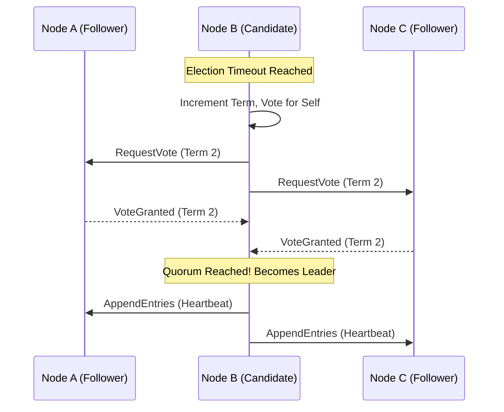

## 1. The Two Generals' Problem and TCP Unreliability

When orchestrating a fleet of distributed background workers, you must confront the most devastating mathematical reality of distributed systems: **The Two Generals' Problem**. No network is reliable. TCP/IP can drop packets, routers can reboot, and BGP routes can blackhole traffic.

If Worker A attempts to charge a credit card and the TCP connection to the Stripe API hangs, Worker A does not know if the payload reached Stripe and the ACK was lost, or if the payload never reached Stripe at all. If it retries, it might double-charge the user. If it crashes, the charge is lost forever. Achieving perfect state coordination over an unreliable network is mathematically impossible.

## 2. Distributed Consensus via the Raft Protocol

To coordinate the distribution of jobs, we use Garnet as our message broker. But what if the primary Garnet node suffers a kernel panic? The cluster must immediately promote a replica to primary. If a network partition occurs (a split-brain), two nodes might both claim to be the primary, silently accepting conflicting job updates and permanently corrupting the system state.

We solve this using the **Raft Consensus Algorithm**. Raft mathematically prevents split-brains by enforcing a strict **Quorum**. In a 5-node cluster, a node can only be elected Leader if it receives cryptographic votes from at least 3 nodes (the majority). If a network partition cuts the cluster into a group of 2 and a group of 3, the group of 2 can never elect a leader, preventing data corruption. The group of 3 will seamlessly continue processing, ensuring high availability with absolute mathematical consistency.



## 3. Exactly-Once Delivery and the Pending Entries List (PEL)

A standard message queue provides "At-Most-Once" delivery (fire and forget) or "At-Least-Once" delivery (retry until acknowledged). In a financial system, neither is acceptable. We require the illusion of **Exactly-Once Delivery**.

We achieve this using Garnet Streams and the **Pending Entries List (PEL)**. When Worker A pulls a job from the stream, the job is not deleted. It is atomically moved into Worker A's PEL. The job remains trapped in this list until Worker A successfully processes it and sends an explicit `XACK` (Acknowledge) command.

If Worker A is OOM-Killed by Kubernetes mid-execution, the `XACK` is never sent. A specialized Rust Supervisor Task continuously scans the cluster using the `XPENDING` command. If it finds a job that has been sitting in a PEL for more than 60 seconds, it uses the `XCLAIM` command to forcefully rip ownership of the job away from the dead worker, reassigning it to a healthy Worker B.

## 4. Idempotency Keys and Database Locking

What if Worker A wasn't dead? What if it was merely paused by a massive 50-second Garbage Collection spike, and the Supervisor assigned the job to Worker B? Now, Worker A wakes up, and both workers attempt to charge the credit card simultaneously.

We defeat this race condition using **Idempotency Keys**. Every job payload includes a cryptographic UUID. Before charging the card, the Rust worker executes an atomic SQL query: `INSERT INTO processed_jobs (id) VALUES ($1)`. Because the `id` column has a Unique Constraint, Postgres utilizes its internal B-Tree locks to guarantee that only one `INSERT` can possibly succeed. The slower worker will receive a Unique Constraint Violation from Postgres, mathematically preventing the double-charge, and perfectly fulfilling our Exactly-Once guarantee.

```rust
// src/jobs/worker.rs
use sqlx::{PgPool, Error as SqlxError};
use uuid::Uuid;

pub async fn execute_idempotent_job(
    pool: &PgPool, 
    job_id: Uuid, 
    payload: &str
) -> Result<(), SqlxError> {
    // 1. Attempt to insert the idempotency key BEFORE taking action
    let result = sqlx::query!(
        "INSERT INTO processed_jobs (job_id) VALUES ($1)",
        job_id
    )
    .execute(pool)
    .await;

    match result {
        Ok(_) => {
            // 2. We successfully acquired the lock. It is mathematically safe to proceed.
            charge_credit_card(payload).await;
            Ok(())
        },
        Err(SqlxError::Database(db_err)) if db_err.is_unique_violation() => {
            // 3. Race condition prevented. Another worker already processed this job.
            tracing::warn!("Job {} already processed. Halting duplicate execution.", job_id);
            Ok(())
        },
        Err(e) => Err(e),
    }
}
```
