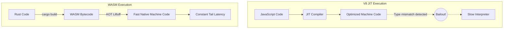

## 1. The Catastrophe of JIT De-optimization

When building a full-stack architecture using a Node.js rendering layer (like Astro or Next.js), developers often fall into the trap of performing heavy CPU tasks in JavaScript (e.g., parsing massive Markdown files or executing complex cryptographic hashes). This is fundamentally flawed due to the physics of the V8 JavaScript engine.

Because JavaScript is dynamically typed, V8 utilizes a Just-In-Time (JIT) compiler. When V8 executes a function, it observes the types of the arguments. If it sees that a function is repeatedly called with integers, the TurboFan optimizer generates highly efficient native machine code tailored specifically for integers. However, if the 100,000th request maliciously sends a floating-point number instead, the machine code becomes mathematically invalid. V8 suffers a **Bailout (De-optimization)**. It violently halts execution, discards the machine code, and falls back to the slow interpreter. In a hyperscale API, these unpredictable JIT bailouts cause massive, unacceptable spikes in p99 tail latency.

## 2. Deterministic Execution via WebAssembly (WASM)

We eliminate JIT volatility entirely by offloading all intensive computation to **WebAssembly (WASM)**. We compile our core Rust logic (such as our custom Markdown parser) into the `wasm32-unknown-unknown` target.

WebAssembly is a statically typed, low-level bytecode. When V8 receives the WASM module, it performs a single, highly efficient streaming compilation pass (Liftoff). It does not guess types. It does not perform speculative profiling. It translates the WASM directly into optimized native machine code. The resulting execution speed is mathematically constant, completely eliminating JIT bailouts and guaranteeing perfectly flat tail latency.



## 3. The Foreign Function Interface (FFI) Bottleneck

However, integrating WASM introduces the deadliest bottleneck in frontend engineering: The Foreign Function Interface (FFI) boundary. A WASM module is a complete mathematical sandbox. It executes inside a flat, isolated block of memory known as **Linear Memory**. It has absolutely zero access to the Node.js V8 heap, and Node.js cannot directly read WASM variables.

The naive approach to passing data (used by 99% of libraries) is disastrous. If Node.js needs the WASM module to parse a 20MB Markdown string, Node.js must allocate 20MB of space inside the WASM Linear Memory, copy the string byte-by-byte across the FFI boundary, execute the parser, allocate another 20MB for the HTML output, and copy it back to the V8 heap. This extreme memory serialization and copying destroys the CPU, making the WASM implementation significantly slower than pure JavaScript.

## 4. Zero-Copy Pointer Arithmetics via `wasm-bindgen`

To achieve true expert-level performance, we bypass copying entirely using the `wasm-bindgen` crate and raw pointer arithmetic. When Node.js has a massive 20MB string, it does not pass the string across the boundary.

Instead, Node.js calls a Rust WASM function that executes `alloc` to reserve 20MB of raw bytes inside the Linear Memory. The Rust function returns the **raw memory pointer (`*mut u8`)** back to Node.js. Node.js then creates a `Uint8Array` view in JavaScript that perfectly overlaps with that specific physical memory address inside the WASM `ArrayBuffer`.

Node.js writes the 20MB string directly into the WASM memory space. When Node.js invokes the WASM parser, it simply passes the memory pointer (a single 32-bit integer). The Rust code instantly executes against the memory with zero serialization, zero copying, and zero GC overhead, achieving C-level execution speeds directly inside the JavaScript runtime.

```mermaid
flowchart TD
    subgraph Node.js (V8)
      JSView[Uint8Array View]
      JSCode[JavaScript FFI]
    end
    
    subgraph WASM Sandbox
      LinMem[WASM Linear Memory ArrayBuffer]
      RustWASM[Rust Parser]
    end
    
    JSCode -- 1. Calls allocate_memory() --> RustWASM
    RustWASM -- 2. Returns raw pointer --> JSCode
    JSCode -- 3. Creates View mapped to ptr --> JSView
    JSView -. 4. Directly overwrites physical bytes .-> LinMem
    JSCode -- 5. Calls parse(ptr) --> RustWASM
    RustWASM -- 6. Reads perfectly in-place (Zero-Copy) --> LinMem
```

```rust
// src/wasm_ffi.rs
use wasm_bindgen::prelude::*;
use std::mem;

// 1. Export a function so JS can ask Rust for a raw pointer to memory
#[wasm_bindgen]
pub fn allocate_memory(size: usize) -> *mut u8 {
    let mut buffer = Vec::with_capacity(size);
    let ptr = buffer.as_mut_ptr();
    
    // Mathematically leak the memory so Rust doesn't deallocate it.
    // We are handing ownership of this raw memory address to JavaScript.
    mem::forget(buffer);
    
    ptr
}

// 2. JavaScript passes the pointer back, and we instantly read it in place
#[wasm_bindgen]
pub fn parse_markdown(ptr: *mut u8, len: usize) -> String {
    // Reconstruct the slice directly from the physical memory address (Zero-Copy)
    let slice = unsafe { std::slice::from_raw_parts(ptr, len) };
    let markdown_string = std::str::from_utf8(slice).unwrap();
    
    // ... execute lightning fast Rust parsing ...
    markdown_string.to_uppercase()
}
```

## 5. Architectural Tradeoffs & Edge Cases

> [!WARNING]
> WebAssembly Linear Memory is NOT garbage collected by the JavaScript V8 engine.

*   **Edge Cases**: The Silent Memory Leak. If your Rust code allocates 20MB of memory and returns the pointer to JavaScript, JavaScript must explicitly call a `free_memory(ptr)` function (exported by Rust) when it finishes. If the JavaScript developer forgets, that 20MB is permanently leaked. After a few hundred calls, the browser tab will crash with an OOM error.
*   **Tradeoffs (FFI Overhead vs. Execution Speed)**: Passing massive strings via pointers is fast, but invoking a WASM function across the FFI boundary still carries a ~10-nanosecond penalty. If you call a WASM function 10 million times inside a tight JavaScript `for` loop, the boundary overhead will completely obliterate the Rust execution speed gains.
*   **Constraints**: Single-Threaded Limitations. By default, WASM runs on a single thread. While `wasm-bindgen-rayon` exists, utilizing physical hardware threads inside the browser or Node.js requires `SharedArrayBuffer` headers, which trigger severe Cross-Origin Isolation (CORS) security restrictions.
*   **Best Practices**: Only cross the FFI boundary for massive, monolithic computations. Pass the pointer once, execute all the heavy lifting in Rust, and pass the result back. Never use WASM for microscopic operations.
