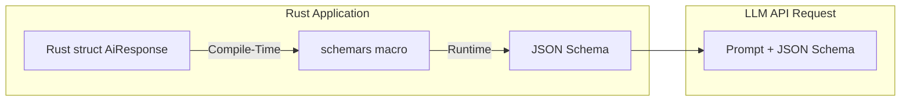
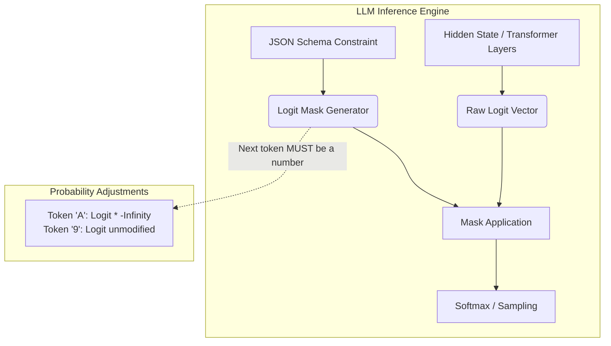

## 1. The Fallacy of Prompt Engineering

When integrating Large Language Models (LLMs) into a production system, junior developers attempt to extract structured data (like JSON or CSV) using "Prompt Engineering." They will append strings like `"Please return ONLY valid JSON without markdown backticks."` to the system prompt. This is a fatal architectural error.

An LLM is not a deterministic state machine; it is a massive probabilistic neural network. It calculates the statistical likelihood of the next token based on its training weights. There is always a non-zero mathematical probability that the model will output a trailing comma, an unescaped quote, or a hallucinated key. If you pipe this probabilistic text directly into a strict Rust JSON parser like `serde_json`, your application will violently panic in production.

## 2. Deterministic Structured Generation

We eliminate this failure mode entirely using **Structured Generation** (e.g., OpenAI's `json_schema` or open-source equivalents like Guidance/Outlines). We stop asking the model nicely. Instead, we use mathematical constraints to physically alter the neural network's internal generation engine.

In Rust, we define the exact desired output format as a struct. Using the `schemars` crate, the Rust compiler analyzes this struct at compile-time and generates a mathematically rigorous JSON Schema. We inject this Schema directly into the LLM API request payload.



```rust
// src/ai/models.rs
use schemars::JsonSchema;
use serde::{Deserialize, Serialize};

// 1. We define the exact Rust struct we want to instantiate
#[derive(Deserialize, Serialize, JsonSchema, Debug)]
pub struct AiResponse {
    pub confidence: f32,
    pub extracted_entities: Vec<String>,
}

// 2. We mathematically derive the JSON Schema at runtime
pub fn get_schema() -> String {
    let schema = schemars::schema_for!(AiResponse);
    serde_json::to_string(&schema).unwrap()
}
```

## 3. The Physics of Logit Masking

When the LLM inference engine receives the JSON Schema, it alters how it calculates token probabilities (logits). As the neural network predicts the next token, the inference engine applies a real-time mathematical mask to the output vector.



If the JSON Schema dictates that the next character *must* be a floating-point number (for the `confidence` field), the inference engine intercepts the probability distribution. It multiplies the logits of every token that represents a letter (A-Z) or a special symbol by negative infinity. The probability of outputting an invalid token is physically crushed to absolute zero.

Because the invalid tokens are mathematically erased from existence before the sampling phase, the model is physically forced to output a valid number. By utilizing Logit Masking, we guarantee with 100% mathematical certainty that the string returned by the LLM will map flawlessly to our Rust struct via `serde_json::from_str`. We have successfully converted a probabilistic AI model into a perfectly deterministic, type-safe function.

## 4. Architectural Tradeoffs & Edge Cases

> [!CAUTION]
> Logit Masking forces valid syntax, but it cannot force valid semantics.

*   **Edge Cases**: The Deterministic Loop. If the LLM generates a mathematically valid JSON structure but fundamentally misunderstands the prompt, it might get "stuck" outputting valid but useless data in an infinite loop just to satisfy the schema. You must enforce strict token limits (`max_tokens`) to physically break the generation.
*   **Best Practices**: Do not force the model to generate massive, deeply nested arrays in a single pass. Break complex JSON schemas into smaller, sequential LLM calls. This prevents context degradation and maintains high semantic accuracy while strictly enforcing syntax.

## 8. Intermediate & Advanced Systems Deep Dive

> [!NOTE]
> Bridging the gap between software abstractions and physical hardware mechanics.

*   **Intermediate Concept**: Prompt Engineering vs Deterministic State Machines. Asking an LLM to "Please return valid JSON" relies on statistical probability. In an automated backend pipeline, a 1% syntax error rate mathematically translates to 10,000 catastrophic pipeline failures per day. You must enforce physical constraints at the silicon level.
*   **Advanced Implications**: Finite State Machine (FSM) Logit Masking. Tools like Outlines or generic LLM constraints do not just post-process the text. They physically convert your JSON Schema into a mathematical Regex-based Finite State Machine. During generation, before the GPU samples the next token, the Rust engine queries the FSM. If the current state requires a quotation mark `"`, the engine explicitly forces the probability (Logit) of all other 100,000 tokens to Negative Infinity (`-inf`) in the GPU's memory. This physically forces the model to generate the exact character required, guaranteeing 100.000% adherence to the data structure without degrading the semantic intelligence of the surrounding words.
