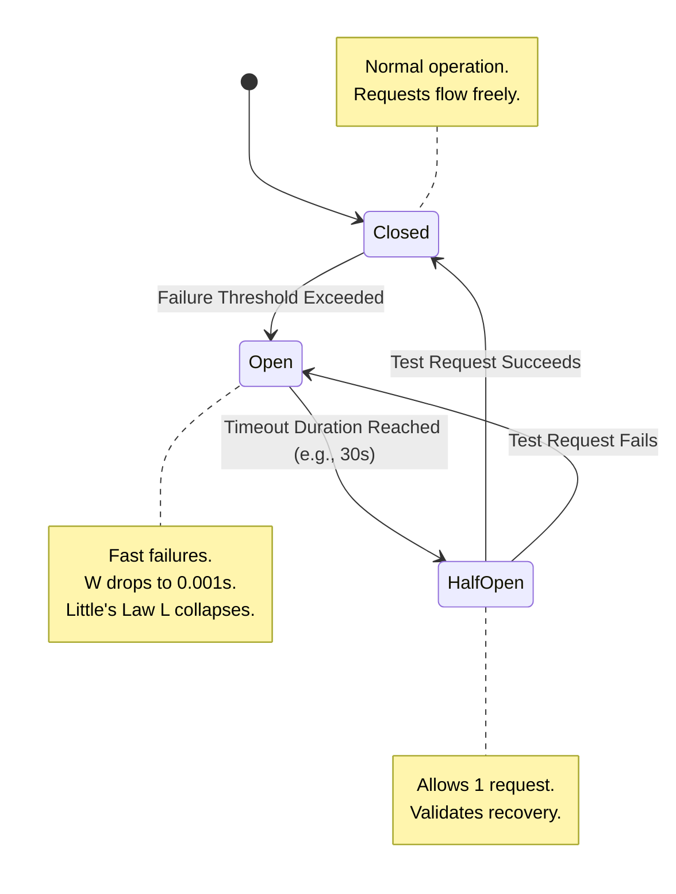

## 1. The Mathematics of Cascading Failures (Little's Law)

In a distributed system, reliability is not a software design pattern; it is a mathematical property defined by **Queueing Theory**. The foundational equation of Queueing Theory is Little's Law: `L = λW`, where `L` is the total number of concurrent requests in the system, `λ` (lambda) is the arrival rate (requests per second), and `W` is the average processing time per request.

Assume your Rust API receives 1,000 requests per second (`λ = 1000`), and your external Postgres database responds in 0.05 seconds (`W = 0.05`). According to Little's Law, your server handles exactly 50 concurrent requests at any given microsecond. Tokio effortlessly multiplexes these 50 requests across your CPU cores.

Now, imagine Postgres suffers a minor degradation, and its response time spikes to 5.0 seconds. Your arrival rate remains 1,000 req/sec. Instantly, `L = 1000 * 5.0 = 5000`. Your Rust API is now holding 5,000 concurrent requests open. Each request consumes a TCP socket file descriptor, memory for the HTTP payload, and a Tokio task overhead. Within seconds, your server physically exhausts its RAM and OS file descriptors. The Linux Kernel's OOM Killer assassinates your Rust process. A minor database slowdown has mathematically caused a total Cascading Failure of your entire API tier.

## 2. The Circuit Breaker Pattern

To prevent Cascading Failures, we must actively intervene in the `W` (processing time) variable of Little's Law. We wrap all external network calls in a **Circuit Breaker** (e.g., via the `tower` crate).

A Circuit Breaker operates like a physical electrical fuse. It monitors the failure rate and latency of the external Postgres database. If 5 consecutive queries timeout or exceed 2.0 seconds, the Circuit Breaker "trips" into an **Open State**.



While the circuit is open, the Circuit Breaker intercepts all incoming database queries and instantly returns an error (e.g., `503 Service Unavailable`) without even attempting to contact the database. By failing instantly, the processing time `W` drops to 0.001 seconds. Little's Law dictates that the concurrent load `L` plummets immediately, freeing up the Tokio threads. Your server remains perfectly healthy and can continue serving cached data or other non-database routes.

```rust
// src/infrastructure/resilience.rs
use tower::ServiceBuilder;
use tower::retry::Policy;
use tower_circuit_breaker::{CircuitBreakerLayer, CircuitBreaker};

// Implementing a basic circuit breaker around our DB connection pool
pub fn build_resilient_db_client(pool: DbPool) -> impl Service<Request> {
    ServiceBuilder::new()
        // Trip circuit if 5 consecutive errors occur.
        // Wait 30 seconds before attempting Half-Open.
        .layer(CircuitBreakerLayer::new(
            5, 
            std::time::Duration::from_secs(30)
        ))
        // Standard timeout to guarantee W never exceeds 2.0 seconds
        .timeout(std::time::Duration::from_secs(2))
        .service(pool)
}
```

## 3. The Thundering Herd and Cryptographic Jitter

After a designated timeout (e.g., 30 seconds), the Circuit Breaker enters a **Half-Open State**, allowing a single test request through to see if Postgres has recovered. If it succeeds, the circuit closes, and normal operation resumes. However, if 5,000 waiting background workers immediately retry their failed jobs the second the database recovers, they will instantly knock Postgres offline again—a phenomenon known as the **Thundering Herd**.

We eliminate this using **Exponential Backoff with Cryptographic Jitter**. Instead of retrying every 1 second, we double the delay mathematically: 1s, 2s, 4s, 8s, 16s. This exponential decay prevents the database from being overwhelmed.

Crucially, if 1,000 Kubernetes Pods all crashed at exactly 12:00:00, they will all retry at exactly 12:00:01, 12:00:03, etc., still creating synchronized spikes. We break this synchronization by injecting **Jitter**. We use a cryptographically secure random number generator to apply variance to the backoff duration (e.g., 1.1s, 2.8s, 4.2s). By randomizing the retry intervals across the cluster, we physically scatter the network load, ensuring the database receives a smooth, manageable stream of recovery traffic.
