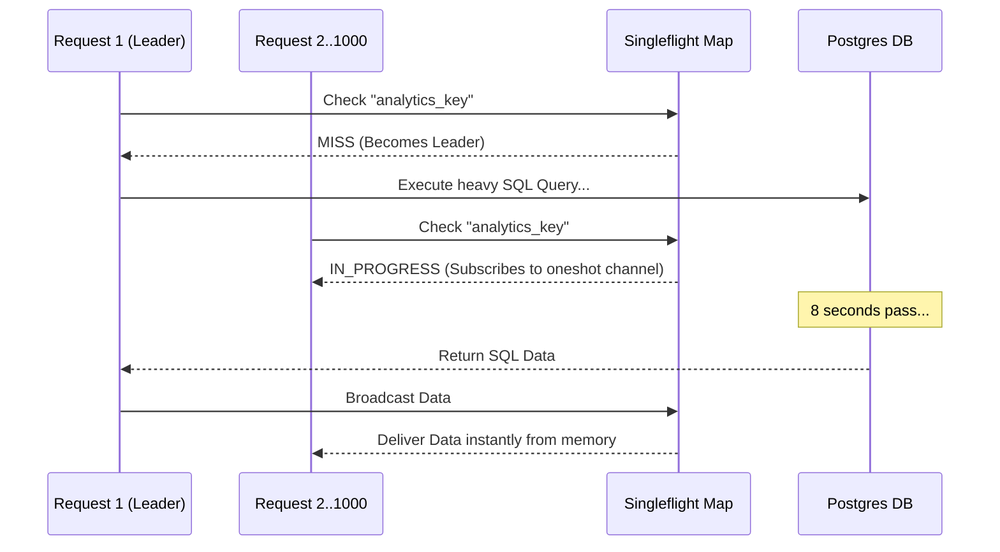

## 1. The Cache Stampede (Thundering Herd) Vulnerability

Caching is not a performance optimization; in a hyperscale system, caching is a structural requirement for survival. However, a naive caching implementation introduces a fatal vulnerability known as a **Cache Stampede**.

Imagine your Rust API executes a heavy analytical SQL query that takes 8 seconds to run. You cache the result in Garnet (Redis) with a Time-To-Live (TTL) of 60 minutes. For 59 minutes and 59 seconds, the system is flawless, serving the cached data to 1,000 users per second in less than 1 millisecond.

At exactly the 60-minute mark, the cache key expires. Because your API processes 1,000 requests per second, the next 1,000 incoming requests all check the cache simultaneously. All 1,000 requests experience a Cache Miss. Instantly, all 1,000 requests attempt to execute the heavy 8-second SQL query against the Postgres database. The database's connection pool is exhausted, the CPU hits 100%, and the Postgres instance violently crashes under the synchronized load. The cache expiration has mathematically triggered a self-inflicted Denial of Service (DoS) attack.

## 2. The Singleflight Deduplication Algorithm

We mathematically immunize the system against Cache Stampedes using the **Singleflight** pattern. Singleflight is an asynchronous deduplication algorithm. It intercepts concurrent requests for the identical cache key before they hit the database.

When the 1,000 concurrent requests arrive during the Cache Miss, Singleflight designates the very first request as the "Leader." The Leader is allowed to proceed and execute the 8-second SQL query. The remaining 999 requests are intercepted and placed into a lock-free asynchronous waiting queue (via Tokio `oneshot` channels).



When the Leader finishes the database query, it writes the result back to the Garnet cache. Crucially, it then takes that single result in memory and broadcasts it across the `oneshot` channels to the 999 waiting requests. A single physical database query successfully satisfies 1,000 users. By collapsing synchronized traffic into a single execution, Singleflight completely shields the database from traffic spikes, ensuring flat latency regardless of load.

```rust
// src/cache/singleflight.rs
use std::sync::Arc;
use tokio::sync::{broadcast, Mutex};
use std::collections::HashMap;

pub struct SingleFlight<T: Clone> {
    // Maps a cache key to an active broadcast channel if a query is in progress
    in_flight: Mutex<HashMap<String, broadcast::Sender<T>>>,
}

impl<T: Clone> SingleFlight<T> {
    pub async fn execute_or_wait<F, Fut>(&self, key: &str, closure: F) -> T
    where
        F: FnOnce() -> Fut,
        Fut: std::future::Future<Output = T>,
    {
        let mut map = self.in_flight.lock().await;

        if let Some(tx) = map.get(key) {
            // We are NOT the leader. Subscribe and wait for the broadcast.
            let mut rx = tx.subscribe();
            drop(map);
            return rx.recv().await.unwrap();
        }

        // We ARE the leader. Setup the broadcast channel.
        let (tx, _rx) = broadcast::channel(1);
        map.insert(key.to_string(), tx.clone());
        drop(map); // Release the lock immediately so others can subscribe

        // Execute the heavy closure (e.g. Postgres query)
        let result = closure().await;

        // Cleanup and Broadcast to all waiting tasks in O(1) time
        let mut map = self.in_flight.lock().await;
        map.remove(key);
        let _ = tx.send(result.clone());

        result
    }
}
```

## 3. Redis Serialization Protocol (RESP) Parsing

When our Rust application communicates with Garnet, it uses the **Redis Serialization Protocol (RESP)**. Most developers blindly rely on libraries like `redis-rs` without understanding the underlying physics. RESP is a binary-safe, text-based protocol.

When you execute a `GET` command, Garnet returns a RESP string, for example: `$5\r\nhello\r\n`. The `$5` indicates a Bulk String of 5 bytes, followed by the Carriage Return/Line Feed (`\r\n`), followed by the exact 5 bytes of payload, followed by a final `\r\n`.

To process this at 5 million operations per second, our Rust client does not parse this into a standard `String` (which would trigger a massive heap allocation). Instead, it uses zero-copy parsing. It reads the raw TCP buffer, verifies the length, and creates a lightweight slice (`&[u8]`) pointing directly into the raw network buffer. By completely bypassing the OS memory allocator, we can deserialize massive cached payloads in nanoseconds.

```mermaid
flowchart LR
    subgraph TCP Socket Buffer
      RawBytes["$5\r\nhello\r\n"]
    end
    
    subgraph Traditional Approach
      Alloc[Allocate String on Heap]
      Copy[Copy 'hello' to Heap]
    end
    
    subgraph Zero-Copy Approach
      Slice[Rust Slice: &u8]
      Pointer[Pointer points to byte 4]
    end
    
    RawBytes -.-> Zero-Copy Approach
    Slice -.->|Directly references| RawBytes
```

## 4. Architectural Tradeoffs & Edge Cases

> [!CAUTION]
> The Singleflight algorithm creates massive asynchronous waiting queues in memory.

*   **Edge Cases**: The Poisoned Cache. If the Leader request executes the database query, but the database returns an erroneous result (e.g., an empty array due to a transient lock), Singleflight will flawlessly and instantly broadcast this poisoned data to all 1,000 waiting clients. You must strictly validate the Leader's payload before broadcasting.
*   **Best Practices**: Combine Singleflight with **Stale-While-Revalidate (SWR)**. Serve the slightly expired cached data immediately to the 999 users, while the Leader asynchronously fetches the fresh data from the database in a detached background Tokio task. This yields 0ms latency for all users.

## 8. Intermediate & Advanced Systems Deep Dive

> [!NOTE]
> Bridging the gap between software abstractions and physical hardware mechanics.

*   **Intermediate Concept**: The Cache Stampede. When a highly popular cache key (e.g., the front-page news feed) expires in Redis, 10,000 concurrent HTTP requests might hit the API at the exact same millisecond. They all see a cache miss. All 10,000 requests query the SQL database simultaneously for the exact same data. The database CPU hits 100% and crashes instantly.
*   **Advanced Implications**: Request Coalescing (Singleflight). To defeat the Stampede, the Rust server maintains an asynchronous `DashMap` (a concurrent hashmap) of actively running queries. When Request 1 queries the DB, it stores a `tokio::sync::watch` channel in the map. When Requests 2 through 10,000 arrive, they check the map, see that Request 1 is already fetching the data, and they physically yield their Tokio tasks, subscribing to the channel. When Request 1 finishes, it broadcasts the payload over the channel to all 9,999 sleeping tasks simultaneously. A 10,000-query database DOS attack is algorithmically reduced to exactly 1 query.
