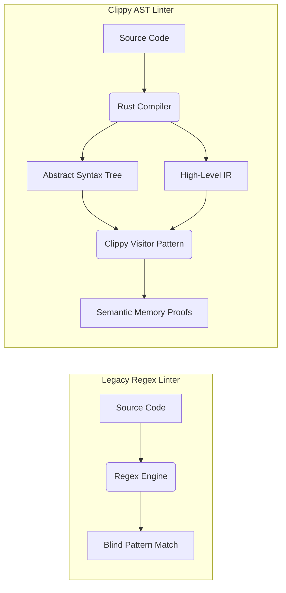
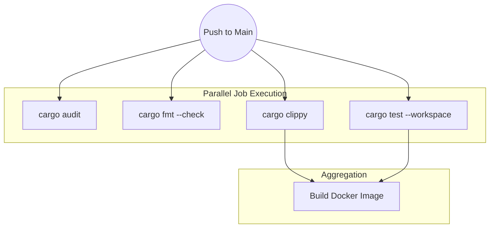

## 1. The Statistical Impossibility of Human Code Review

In a hyperscale engineering organization, relying on human Code Review to catch architectural flaws is a mathematical failure. Humans suffer from decision fatigue. A developer reviewing a 3,000-line Pull Request on a Friday afternoon will inevitably approve a memory leak or a race condition. Production stability cannot rely on human vigilance; it must be enforced by an iron-clad Continuous Integration (CI) pipeline that acts as a deterministic state machine.

## 2. Semantic Abstract Syntax Tree (AST) Linting

Our CI pipeline relies on `clippy`, but it is critical to understand the compiler mechanics underlying it. Standard linters (like ESLint for JavaScript) largely use Regex string matching. They scan the text for bad patterns. `clippy` operates entirely differently. It hooks directly into the Rust compiler's internal pipeline, analyzing the **Abstract Syntax Tree (AST)** and the **High-Level Intermediate Representation (HIR)**.

Because `clippy` has absolute knowledge of the exact memory layouts, types, and lifetimes of every variable, it can detect profound semantic flaws. It can mathematically prove that you are allocating a `String` on the heap inside a tight loop when a zero-cost `&str` slice would suffice. By running `cargo clippy -- -D warnings` in CI, we elevate these performance suggestions into fatal compilation errors. We systematically force developers to write optimal code, physically preventing suboptimal memory layouts from entering the `main` branch.

## 3. Supply Chain Security and Cryptographic Auditing

Modern software development is heavily dependent on open-source libraries (crates). If a single crate deeply nested in your dependency tree is compromised (a supply chain attack), your entire production cluster is compromised.

We integrate `cargo-audit` into our pipeline. It parses the cryptographic SHA-256 hashes inside your `Cargo.lock` file and cross-references them against the RustSec Advisory Database. If any dependency contains a known CVE (Common Vulnerabilities and Exposures), such as a buffer overflow or a zero-day RCE, the pipeline instantly fails the build. This mathematically guarantees that no known vulnerabilities can be deployed.

## 4. Directed Acyclic Graphs (DAGs) for Pipeline Optimization

A sequential CI pipeline (Build &rarr; Test &rarr; Lint &rarr; Audit) is far too slow for agile iteration. We utilize GitHub Actions to construct a **Directed Acyclic Graph (DAG)**. The DAG mathematically defines the dependency relationships between CI jobs.

Because Linting and Auditing do not depend on the output of the Unit Tests, the DAG execution engine schedules them to run simultaneously across multiple isolated Ubuntu virtual machines. Furthermore, we implement aggressive caching based on the hash of the `Cargo.lock` file, caching the compiled `target/` artifacts and the Cargo registry. This DAG optimization compresses a 20-minute sequential pipeline into a 45-second parallel execution, maintaining absolute security without sacrificing developer velocity.

## 5. Production Post-Mortem: The Left-Pad Catastrophe
While cryptographic hashing (`Cargo.lock`) prevents supply chain mutation, it does not prevent supply chain deletion. In 2016, the entire NodeJS ecosystem collapsed when a single developer deleted the 11-line `left-pad` library from NPM. Every CI pipeline on Earth failed simultaneously because the DAGs could not fetch the dependency. To prevent this in hyperscale environments, we run a **Vendor Proxy** (like `cargo-vendor` or a private Artifactory). Every crate hash approved by `cargo-audit` is physically downloaded and cached in a private S3 bucket. If crates.io goes offline or a package is yanked, our DAG execution continues flawlessly using the immutable S3 mirrors.

## 6. Advanced Mathematical Physics: Big O of AST Traversal
How does `clippy` analyze 50,000 lines of code in seconds? It relies on the physics of Tree Traversal algorithms. A standard regex linter scales poorly (approaching O(N^2) for complex lookarounds across massive files). The Rust AST is a perfect Directed Acyclic Graph representing the syntax logic. Clippy implements the **Visitor Pattern**, traversing the AST in precisely `O(N)` time complexity (where N is the number of syntax nodes). Because the layout is mathematically structured by the compiler first, semantic linting is vastly more CPU-efficient per rule than blind regex scanning.

## 7. The Architect's Challenge
> **Scenario:** Your DAG pipeline is aggressively caching the `target/` directory between GitHub Actions runs based on the `Cargo.lock` hash. However, developers complain that changing a simple `println!` string inside `src/main.rs` takes 5 minutes to compile in CI, entirely bypassing the cache. Why?

*Hint: Changing `src/main.rs` does not alter `Cargo.lock`. If your CI cache key relies solely on `hashFiles('Cargo.lock')`, the GitHub Actions cache system sees a cache hit and restores the `target/` directory. However, `cargo` detects that the timestamp/hash of `main.rs` has changed. Because the workspace code mutated without the lockfile changing, `cargo` invalidates the incremental cache for the binary crate and rebuilds it. For perfect CI speed, cache keys must factor in the hash of the `src/` directory, or rely on remote distributed caching tools like `sccache`.*

## 8. Architectural Tradeoffs & Edge Cases

> [!WARNING]
> Hyper-strict AST linting physically slows down initial developer velocity.

*   **Edge Cases**: The Flaky Test. A unit test that relies on system time, random number generators, or network latency might pass 99% of the time but fail randomly. This breaks the mathematical determinism of the CI DAG, randomly blocking production deployments. Flaky tests must be ruthlessly quarantined or deleted entirely.
*   **Best Practices**: Use `cargo-deny` in addition to `cargo-audit` to mathematically enforce licensing compliance (e.g., automatically banning GPL-licensed crates in a proprietary commercial codebase) directly within the CI DAG, preventing legal catastrophes before the code is even merged.

## 8. Intermediate & Advanced Systems Deep Dive

> [!NOTE]
> Bridging the gap between software abstractions and physical hardware mechanics.

*   **Intermediate Concept**: Cargo Feature Unification. In a large workspace, if Crate A depends on `tokio` with the `rt-multi-thread` feature, and Crate B depends on `tokio` without it, Cargo will unify the features and compile `tokio` once for the entire workspace using the union of all requested features.
*   **Advanced Implications**: The Build-Time Explosion. Feature unification is catastrophic for CI/CD matrices. If a core domain crate accidentally enables the `derive` feature on the `serde` crate, the Rust compiler will heavily compile the `syn` and `quote` procedural macro crates across the entire workspace, adding 30 seconds to the build time of completely unrelated microservices. You must meticulously split workspaces using `resolver = "2"` and aggressively isolate procedural macro dependencies to physically prevent AST-parsing overhead from polluting the global dependency tree.
