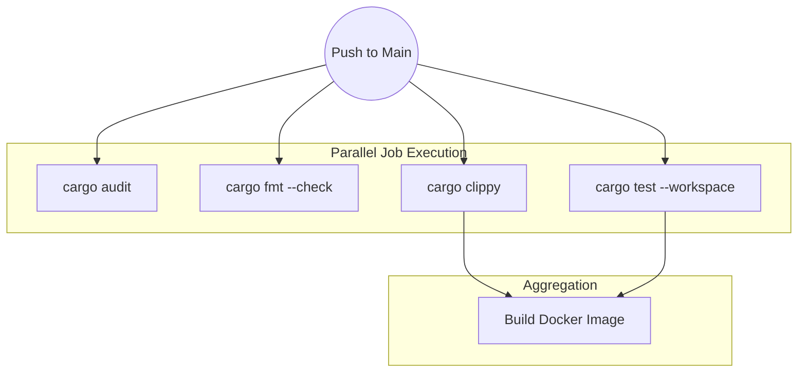

## 1. The Statistical Impossibility of Human Code Review

In a hyperscale engineering organization, relying on human Code Review to catch architectural flaws is a mathematical failure. Humans suffer from decision fatigue. A developer reviewing a 3,000-line Pull Request on a Friday afternoon will inevitably approve a memory leak or a race condition. Production stability cannot rely on human vigilance; it must be enforced by an iron-clad Continuous Integration (CI) pipeline that acts as a deterministic state machine.

## 2. Semantic Abstract Syntax Tree (AST) Linting

Our CI pipeline relies on `clippy`, but it is critical to understand the compiler mechanics underlying it. Standard linters (like ESLint for JavaScript) largely use Regex string matching. They scan the text for bad patterns. `clippy` operates entirely differently. It hooks directly into the Rust compiler's internal pipeline, analyzing the **Abstract Syntax Tree (AST)** and the **High-Level Intermediate Representation (HIR)**.

Because `clippy` has absolute knowledge of the exact memory layouts, types, and lifetimes of every variable, it can detect profound semantic flaws. It can mathematically prove that you are allocating a `String` on the heap inside a tight loop when a zero-cost `&str` slice would suffice. By running `cargo clippy -- -D warnings` in CI, we elevate these performance suggestions into fatal compilation errors. We systematically force developers to write optimal code, physically preventing suboptimal memory layouts from entering the `main` branch.

## 3. Supply Chain Security and Cryptographic Auditing

Modern software development is heavily dependent on open-source libraries (crates). If a single crate deeply nested in your dependency tree is compromised (a supply chain attack), your entire production cluster is compromised.

We integrate `cargo-audit` into our pipeline. It parses the cryptographic SHA-256 hashes inside your `Cargo.lock` file and cross-references them against the RustSec Advisory Database. If any dependency contains a known CVE (Common Vulnerabilities and Exposures), such as a buffer overflow or a zero-day RCE, the pipeline instantly fails the build. This mathematically guarantees that no known vulnerabilities can be deployed.

## 4. Directed Acyclic Graphs (DAGs) for Pipeline Optimization

A sequential CI pipeline (Build &rarr; Test &rarr; Lint &rarr; Audit) is far too slow for agile iteration. We utilize GitHub Actions to construct a **Directed Acyclic Graph (DAG)**. The DAG mathematically defines the dependency relationships between CI jobs.

Because Linting and Auditing do not depend on the output of the Unit Tests, the DAG execution engine schedules them to run simultaneously across multiple isolated Ubuntu virtual machines. Furthermore, we implement aggressive caching based on the hash of the `Cargo.lock` file, caching the compiled `target/` artifacts and the Cargo registry. This DAG optimization compresses a 20-minute sequential pipeline into a 45-second parallel execution, maintaining absolute security without sacrificing developer velocity.
