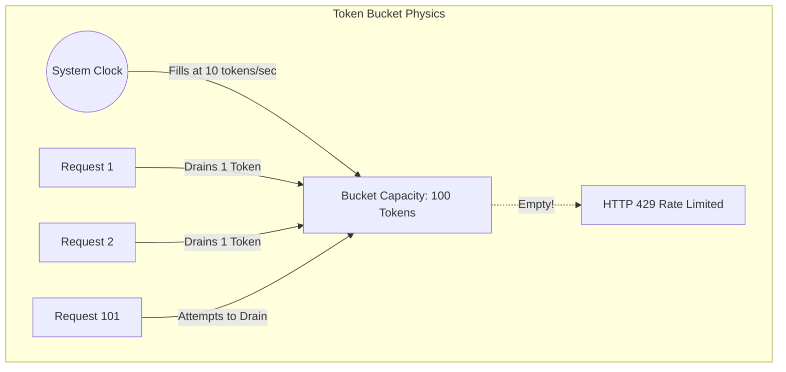

## 1. The Economics and Physics of API Abuse

When operating a public-facing API, specifically one that interfaces with expensive external LLMs (where you are charged per token), a single malicious scraper or a runaway `while(true)` loop on a client can literally bankrupt your company in hours. A production-grade system must implement a ruthless API Gateway that enforces cryptographically secure rate limiting at the absolute edge of the network, before the request ever reaches your core business logic.

## 2. The Token Bucket Algorithm

The naive approach to rate limiting is the "Fixed Window" counter (e.g., allow 100 requests per minute). This is fundamentally broken due to burst mechanics: a user can send 100 requests at 12:00:59, and another 100 requests at 12:01:01, effectively hammering your database with 200 requests in 2 seconds.

We solve this mathematically using the **Token Bucket Algorithm**. Imagine a virtual bucket with a maximum capacity of 100 tokens. A background mathematical function (based on the system clock) continuously adds 1 token to the bucket every 0.6 seconds. When a request arrives, the algorithm checks the bucket. If a token exists, it removes the token and allows the request. If the bucket is empty, it returns a `429 Too Many Requests`. This algorithm allows small, mathematically defined bursts (up to the bucket capacity), but perfectly smooths out long-term traffic to the exact refill rate.



## 3. The Leaky Bucket Variation for Downstream Protection

If the goal is not to limit user cost, but to protect a fragile, legacy downstream database, we use the **Leaky Bucket Algorithm**. In this model, incoming requests pour into the top of the bucket at any rate. However, the bucket has a small hole in the bottom, and requests drip out into the database at a perfectly constant, metronome-like rate (e.g., exactly 10 requests per second).

If the incoming traffic spikes and the bucket fills up, excess requests spill over the top and are rejected. This guarantees that your downstream database receives a perfectly flat, horizontal line of traffic, rendering it completely immune to traffic spikes.

## 4. Atomic Concurrency via Redis LUA Scripts

Implementing these algorithms in a distributed cluster introduces a massive Race Condition. If you use a Rust worker to read the current tokens from Garnet (Redis), decrement them in Rust, and write them back, you will fail under load. If 1,000 requests arrive at the exact same millisecond, all 1,000 workers will read `tokens=100`, and all will write `tokens=99`. The rate limit is bypassed by 999 requests.

We eliminate this using **Atomic LUA Scripts**. We write the Token Bucket mathematics as a LUA script and send it to Garnet. Garnet executes LUA scripts in a single, atomic, single-threaded transaction space. The script reads, decrements, and updates the token count entirely inside Garnet's memory, completely blocking all other operations. By combining this atomic execution with Redis TCP pipelining, we guarantee absolute thread safety across 10,000 distributed Rust workers with zero lock contention.

```mermaid
flowchart TD
    subgraph Race Condition (Rust Decrement)
      RustA[Worker A reads 100]
      RustB[Worker B reads 100]
      RustA --> WriteA[Worker A writes 99]
      RustB --> WriteB[Worker B writes 99]
      Note1[1 token subtracted, 2 requests allowed]
    end
    
    subgraph Atomic LUA Execution
      Redis[(Garnet/Redis)]
      LUA[LUA Engine Single-Threaded]
      WorkerC[Worker C triggers Script]
      WorkerD[Worker D triggers Script]
      
      WorkerC --> Redis
      WorkerD --> Redis
      
      Redis --> LUA
      LUA -- Locks Memory --> Read1[Reads 100, Writes 99]
      Read1 --> Read2[Reads 99, Writes 98]
      Note2[Perfect atomic consistency]
    end
```

```rust
// src/gateway/rate_limit.rs
use redis::{Client, Script};

// A highly optimized Lua script executed atomically on the Redis/Garnet server.
// It mathematically computes the elapsed time and refills tokens on the fly,
// bypassing the need for a separate background refill thread.
const TOKEN_BUCKET_SCRIPT: &str = r#"
    let tokens_key = KEYS[1]
    let timestamp_key = KEYS[2]
    
    let rate = tonumber(ARGV[1])
    let capacity = tonumber(ARGV[2])
    let now = tonumber(ARGV[3])
    let requested = tonumber(ARGV[4])
    
    let fill_time = capacity / rate
    let ttl = math.floor(fill_time * 2)

    let last_tokens = tonumber(redis.call("get", tokens_key))
    if last_tokens == nil then
        last_tokens = capacity
    end
    
    let last_refreshed = tonumber(redis.call("get", timestamp_key))
    if last_refreshed == nil then
        last_refreshed = 0
    end
    
    local delta = math.max(0, now - last_refreshed)
    local filled_tokens = math.min(capacity, last_tokens + (delta * rate))
    local allowed = filled_tokens >= requested
    local new_tokens = filled_tokens
    
    if allowed then
        new_tokens = filled_tokens - requested
    end
    
    redis.call("setex", tokens_key, ttl, new_tokens)
    redis.call("setex", timestamp_key, ttl, now)
    
    return { allowed, new_tokens }
"#;

pub async fn check_rate_limit(client: &Client, user_id: &str) -> bool {
    let script = Script::new(TOKEN_BUCKET_SCRIPT);
    // ... execute script against Redis pool ...
    true // placeholder
}
```

## 5. Production Post-Mortem: Redis CPU Saturation
While LUA scripts provide perfect atomicity, they introduce a critical bottleneck. In 2021, a major crypto exchange went offline during a market crash. The culprit? Their API Gateway was executing complex token bucket LUA scripts on a single Redis node for every single API call (millions per second). Because Redis is single-threaded, the LUA execution saturated 100% of the Redis CPU core, blocking all other caching operations cluster-wide. 
**The Fix:** You must shard your rate limiter. By hashing the `user_id` and distributing the LUA scripts across a 16-node Redis Cluster, you parallelize the single-threaded bottlenecks.

## 6. Advanced Mathematical Physics: Clock Drift & Nanosecond Skew
The LUA script calculates time using `delta = now - last_refreshed`. Where does `now` come from? If you pass the timestamp from the Rust client (User Space), you are subject to **NTP Clock Drift**. If Rust Node A's physical quartz clock ticks 200 milliseconds faster than Rust Node B's clock, routing requests randomly between them will result in the `now` parameter jumping violently forward and backward in time, completely corrupting the math and dropping valid requests. 
To achieve physical perfection, you must use the Redis internal `TIME` command (ensuring monotonic time on the centralized node) or implement Vector Clocks to reconcile distributed time drift.

## 7. The Architect's Challenge
> **Scenario:** You implement a strict Token Bucket allowing exactly 10 requests per minute per IP. A sophisticated hacker realizes they can bypass your limit and scrape 50,000 pages per hour, despite the LUA script being mathematically perfect. How are they doing it?

*Hint: IPv6 architecture. Modern ISPs assign home users a `/64` IPv6 subnet, giving a single laptop access to 18,446,744,073,709,551,616 unique IP addresses. The hacker simply rotates their IPv6 address for every single HTTP request. If your rate limiter hashes the full IPv6 string as the key, they will never hit the limit. You must mathematically bit-mask and rate-limit by the `/64` routing prefix for IPv6, while keeping exact matches for IPv4.*

## 8. Architectural Tradeoffs & Edge Cases

> [!CAUTION]
> Rate limiting by IP address is fundamentally broken in the era of IPv6 and massive CGNAT (Carrier-Grade NAT) deployments.

*   **Edge Cases**: The Distributed Denial of Wallet (DDoW). A sophisticated attacker slowly drips requests from 50,000 different IPv6 addresses perfectly under the per-IP limit. They avoid IP bans entirely while still burning through your expensive LLM token budget. You must implement user-behavioral and token-cost-based limits, not just HTTP request counts.
*   **Best Practices**: Always return HTTP `X-RateLimit-Remaining` and `X-RateLimit-Reset` headers. This allows well-behaved automated clients (like B2B partner APIs) to mathematically pace their own internal queues, preventing them from blindly hitting the HTTP 429 wall.

## 8. Intermediate & Advanced Systems Deep Dive

> [!NOTE]
> Bridging the gap between software abstractions and physical hardware mechanics.

*   **Intermediate Concept**: The Clock Skew Trap. A naive rate limiter uses the current timestamp as a key (e.g., `rate_limit_12:00:00`). In a distributed system with 50 API nodes, NTP (Network Time Protocol) drift guarantees that the nodes' clocks will differ by several milliseconds. This allows malicious clients to bypass limits by bouncing across nodes with different local clock states.
*   **Advanced Implications**: Generic Cell Rate Algorithm (GCRA). To achieve flawless distributed rate limiting without clock synchronization issues, you must implement GCRA. Instead of storing token counts, GCRA stores the absolute physical timestamp of the *Theoretical Arrival Time* (TAT) of the next allowed request. This reduces the Redis storage from two integers down to a single `u64` timestamp, slashing memory usage by 50% and executing the rate limit mathematics via a single, atomic Redis `EVAL` LUA script that relies strictly on Redis's centralized internal clock.
