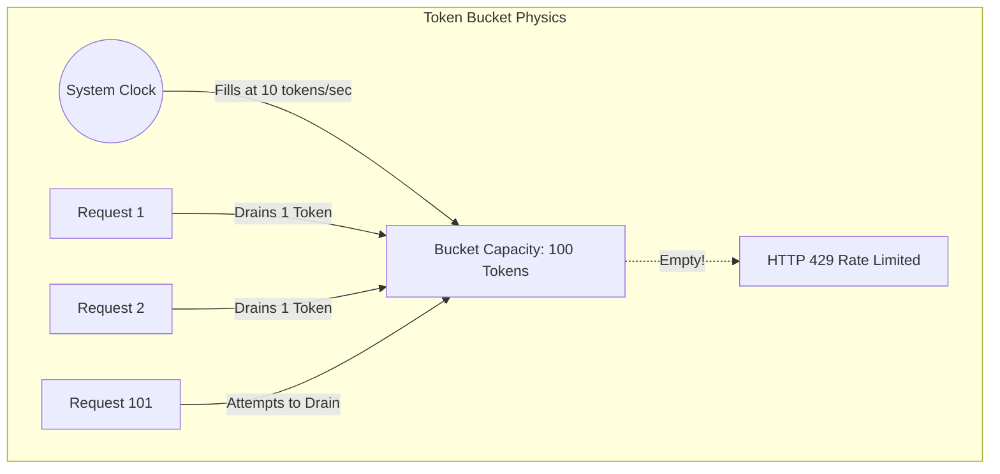

## 1. The Economics and Physics of API Abuse

When operating a public-facing API, specifically one that interfaces with expensive external LLMs (where you are charged per token), a single malicious scraper or a runaway `while(true)` loop on a client can literally bankrupt your company in hours. A production-grade system must implement a ruthless API Gateway that enforces cryptographically secure rate limiting at the absolute edge of the network, before the request ever reaches your core business logic.

## 2. The Token Bucket Algorithm

The naive approach to rate limiting is the "Fixed Window" counter (e.g., allow 100 requests per minute). This is fundamentally broken due to burst mechanics: a user can send 100 requests at 12:00:59, and another 100 requests at 12:01:01, effectively hammering your database with 200 requests in 2 seconds.

We solve this mathematically using the **Token Bucket Algorithm**. Imagine a virtual bucket with a maximum capacity of 100 tokens. A background mathematical function (based on the system clock) continuously adds 1 token to the bucket every 0.6 seconds. When a request arrives, the algorithm checks the bucket. If a token exists, it removes the token and allows the request. If the bucket is empty, it returns a `429 Too Many Requests`. This algorithm allows small, mathematically defined bursts (up to the bucket capacity), but perfectly smooths out long-term traffic to the exact refill rate.



## 3. The Leaky Bucket Variation for Downstream Protection

If the goal is not to limit user cost, but to protect a fragile, legacy downstream database, we use the **Leaky Bucket Algorithm**. In this model, incoming requests pour into the top of the bucket at any rate. However, the bucket has a small hole in the bottom, and requests drip out into the database at a perfectly constant, metronome-like rate (e.g., exactly 10 requests per second).

If the incoming traffic spikes and the bucket fills up, excess requests spill over the top and are rejected. This guarantees that your downstream database receives a perfectly flat, horizontal line of traffic, rendering it completely immune to traffic spikes.

## 4. Atomic Concurrency via Redis LUA Scripts

Implementing these algorithms in a distributed cluster introduces a massive Race Condition. If you use a Rust worker to read the current tokens from Garnet (Redis), decrement them in Rust, and write them back, you will fail under load. If 1,000 requests arrive at the exact same millisecond, all 1,000 workers will read `tokens=100`, and all will write `tokens=99`. The rate limit is bypassed by 999 requests.

We eliminate this using **Atomic LUA Scripts**. We write the Token Bucket mathematics as a LUA script and send it to Garnet. Garnet executes LUA scripts in a single, atomic, single-threaded transaction space. The script reads, decrements, and updates the token count entirely inside Garnet's memory, completely blocking all other operations. By combining this atomic execution with Redis TCP pipelining, we guarantee absolute thread safety across 10,000 distributed Rust workers with zero lock contention.

```rust
// src/gateway/rate_limit.rs
use redis::{Client, Script};

// A highly optimized Lua script executed atomically on the Redis/Garnet server.
// It mathematically computes the elapsed time and refills tokens on the fly,
// bypassing the need for a separate background refill thread.
const TOKEN_BUCKET_SCRIPT: &str = r#"
    let tokens_key = KEYS[1]
    let timestamp_key = KEYS[2]
    
    let rate = tonumber(ARGV[1])
    let capacity = tonumber(ARGV[2])
    let now = tonumber(ARGV[3])
    let requested = tonumber(ARGV[4])
    
    let fill_time = capacity / rate
    let ttl = math.floor(fill_time * 2)

    let last_tokens = tonumber(redis.call("get", tokens_key))
    if last_tokens == nil then
        last_tokens = capacity
    end
    
    let last_refreshed = tonumber(redis.call("get", timestamp_key))
    if last_refreshed == nil then
        last_refreshed = 0
    end
    
    local delta = math.max(0, now - last_refreshed)
    local filled_tokens = math.min(capacity, last_tokens + (delta * rate))
    local allowed = filled_tokens >= requested
    local new_tokens = filled_tokens
    
    if allowed then
        new_tokens = filled_tokens - requested
    end
    
    redis.call("setex", tokens_key, ttl, new_tokens)
    redis.call("setex", timestamp_key, ttl, now)
    
    return { allowed, new_tokens }
"#;

pub async fn check_rate_limit(client: &Client, user_id: &str) -> bool {
    let script = Script::new(TOKEN_BUCKET_SCRIPT);
    // ... execute script against Redis pool ...
    true // placeholder
}
```
