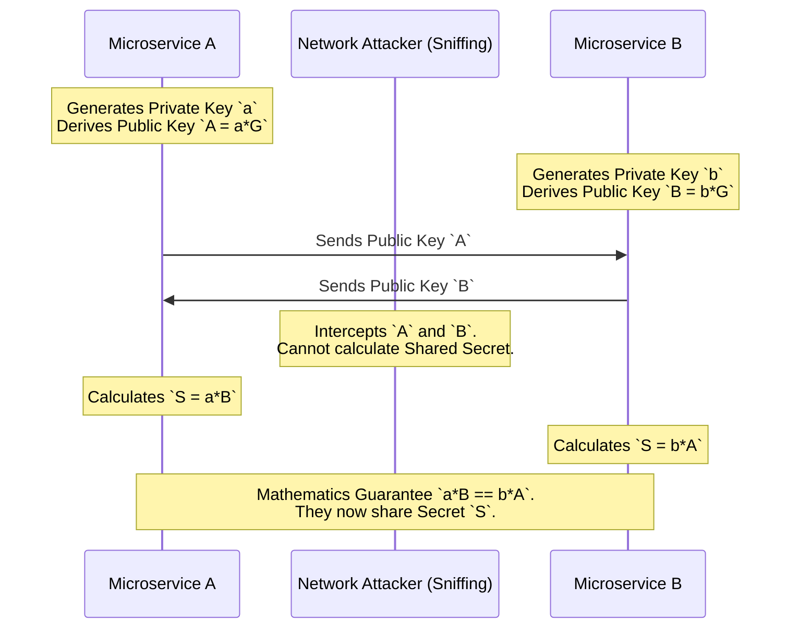

## 1. The Myth of the Internal Network

In standard microservice architectures, developers secure the perimeter using a WAF (Web Application Firewall) and TLS 1.2, but send internal traffic (e.g., from the API Gateway to the billing service) in plain text over the internal VPC. This is a catastrophic architectural flaw known as the "Soft Center." If a single internal server is compromised (perhaps via a vulnerable dependency), the attacker can deploy a packet sniffer and passively intercept all plain-text HTTP traffic, stealing database credentials and user sessions.

A true production-grade system enforces **Zero-Trust Networking**. Every single internal microservice must communicate using End-to-End Encryption (E2EE) at the application layer, completely distrusting the physical network.

## 2. The Mathematics of Elliptic Curve Diffie-Hellman (ECDH)

To establish a secure cryptographic channel over a compromised network, we cannot simply send a password. The attacker sniffing the network would instantly steal it. We must use the **Elliptic Curve Diffie-Hellman (ECDH)** protocol.

Both Rust microservices generate their own Private Key (a massive random integer). They then mathematically derive a Public Key by multiplying a known base point on a mathematical Elliptic Curve (such as `Curve25519`) by their Private Key. They exchange these Public Keys in plain text over the compromised network.



Microservice A multiplies its Private Key with Microservice B's Public Key. Microservice B multiplies its Private Key with Microservice A's Public Key. Due to the commutative mathematical properties of Elliptic Curves, both calculations result in the exact same **Shared Secret**. The attacker, who intercepted the public keys, cannot calculate the Shared Secret. To do so, they would have to calculate the Discrete Logarithm of the Elliptic Curve—a mathematical operation that would take modern supercomputers billions of years.

## 3. The Catastrophe of Static Keys and Perfect Forward Secrecy (PFS)

If Microservice A and Microservice B use static, long-lived Private Keys to derive their Shared Secret, the system remains vulnerable. An attacker can deploy a packet sniffer and silently record 5 years of encrypted ciphertext. If the attacker eventually hacks the server in year 6 and steals the static Private Key, they can retroactively decrypt all 5 years of historical traffic.

We completely eliminate this vulnerability by enforcing **Perfect Forward Secrecy (PFS)**. Our Rust microservices never use static keys for encryption. They generate completely new, **Ephemeral Elliptic Curve Keypairs (ECDHE)** for *every single network session*.

```rust
// src/crypto/ecdh.rs
use x25519_dalek::{EphemeralSecret, PublicKey};
use rand_core::OsRng;
use secrecy::{ExposeSecret, Secret};

pub fn perform_key_exchange(bob_public_bytes: [u8; 32]) -> Secret<[u8; 32]> {
    // 1. Generate a mathematically volatile, Ephemeral Private Key.
    // The instant this struct is dropped, the memory is physically zeroized.
    let alice_secret = EphemeralSecret::random_from_rng(OsRng);
    
    // 2. Derive the Public Key to send over the network
    let alice_public = PublicKey::from(&alice_secret);
    
    // 3. Receive Bob's public key from the network
    let bob_public = PublicKey::from(bob_public_bytes);
    
    // 4. Calculate the Shared Secret.
    // Notice that `diffie_hellman` consumes (`self`) the EphemeralSecret.
    // The private key is physically erased from RAM the nanosecond the shared 
    // secret is computed. It is mathematically impossible to retrieve it later.
    let shared_secret = alice_secret.diffie_hellman(&bob_public);
    
    Secret::new(shared_secret.to_bytes())
}
```

Once the TCP session concludes, the ephemeral Private Keys are cryptographically zeroized from RAM (using the `secrecy` crate). The keys literally cease to exist. Even if the attacker compromises the physical server the very next day and extracts the NVMe hard drives and RAM chips, they cannot decrypt the historical traffic, because the keys physically no longer exist anywhere in the universe.

## 4. Production Post-Mortem: Heartbleed and RAM Scraping
Even with PFS, your Shared Secret must reside in RAM for the duration of the TCP connection. In the infamous 2014 Heartbleed OpenSSL vulnerability, attackers exploited a C-language bounds-checking flaw to read raw chunks of server RAM over the internet. They extracted these Shared Secrets directly from memory, bypassing all cryptographic math. 
**The Rust Fix:** Rust's compiler guarantees memory bounds-checking, physically preventing Heartbleed buffer over-reads. Furthermore, using crates like `zeroize`, we enforce `Drop` traits that overwrite the memory location of the Shared Secret with `0x00` the absolute microsecond the variable goes out of scope, leaving no cryptographic ghost in RAM for an attacker to scrape.

## 5. Advanced Mathematical Physics: Curve25519 Equation
The fundamental security of ECDH relies on the curve equation `y^2 = x^3 + 486662x^2 + x` over a prime field `p = 2^255 - 19` (hence the name Curve25519). 
Why this specific prime? Generating keys requires heavy modular arithmetic. By choosing `2^255 - 19`, the CPU can perform modular reductions using extremely fast bitwise bit-shifts (`>> 255`) and rapid hardware addition, completely avoiding the slow CPU division (`IDIV`) instructions required by standard primes. This allows a Rust server to execute over 10,000 ephemeral ECDHE handshakes per second per core.

## 6. The Architect's Challenge
> **Scenario:** Two microservices perfectly execute the ECDHE handshake and establish a Shared Secret. They use this secret to encrypt the payload using AES-GCM. However, a malicious Man-In-The-Middle (MITM) attacker manages to completely hijack the connection and decrypt the payload in real-time. How did they bypass the unbreakable ECDH math?

*Hint: ECDH provides secure key exchange, but it provides **zero authentication**. The MITM attacker intercepted Alice's Public Key, replaced it with their own, and sent it to Bob. Bob established a perfect encrypted tunnel... with the attacker. To prevent this, the Public Keys must be cryptographically signed by a trusted Certificate Authority (CA) via RSA or ECDSA (this is how TLS certificates work) before the Diffie-Hellman exchange occurs.*
