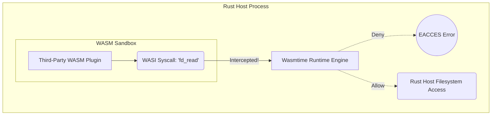

## 1. The Danger of Untrusted Plugin Architectures

If you build an extensible platform (like an API Gateway or a Serverless edge router) that allows third-party developers to upload custom logic, executing that logic natively is a massive security vulnerability. If you execute a user's Python or Lua script directly, they can use `os.system('cat /etc/passwd')` to steal system configuration, or they can open a raw TCP socket and exfiltrate your internal database credentials.

Using Docker containers for these plugins is too slow and heavy, requiring hundreds of megabytes of RAM and seconds to boot. 

## 2. WebAssembly System Interface (WASI)

We solve this by requiring users to upload WebAssembly (WASM) modules. We execute these modules directly inside our Rust server using the `wasmtime` runtime. A raw WASM module is a pure mathematical sandbox. It has absolutely zero ability to interact with the outside world; it cannot read files, open network sockets, or even read the system clock.

To allow the plugin to perform useful work, we implement the **WebAssembly System Interface (WASI)**. WASI defines a standardized set of system calls (like `fd_read` or `random_get`) that the WASM module can call. However, when the WASM module executes these calls, they do not hit the Linux OS kernel. They are intercepted by the `wasmtime` runtime running securely in our Rust host.



## 3. Capability-Based Sandboxing

This interception layer allows us to implement **Capability-Based Security**. By default, the WASM plugin has zero capabilities. If the plugin attempts to open `/etc/passwd`, the `wasmtime` interceptor instantly denies the request and returns an error.

The Rust host must explicitly grant the WASM module a specific "Capability." For example, the Rust host can grant a file descriptor pointing *only* to a specific virtual directory like `/tmp/plugin_123_data/`. When the WASM module calls `fd_read("/")`, it believes it is reading the root of the operating system, but it is actually trapped inside a virtualized, chroot-like filesystem mapped to that specific temporary folder.

```rust
// src/plugins/wasi_engine.rs
use wasmtime::*;
use wasmtime_wasi::sync::WasiCtxBuilder;

pub fn execute_plugin(wasm_bytes: &[u8]) -> Result<()> {
    let engine = Engine::default();
    let module = Module::new(&engine, wasm_bytes)?;
    
    // Create a strict Capability-Based WASI context.
    // We grant EXACTLY ONE directory. No network. No environment variables.
    let wasi_ctx = WasiCtxBuilder::new()
        .preopened_dir(
            std::fs::File::open("/tmp/plugin_123_data/")?, 
            "/"
        )?
        .build();
        
    let mut store = Store::new(&engine, wasi_ctx);
    let mut linker = Linker::new(&engine);
    wasmtime_wasi::add_to_linker(&mut linker, |s| s)?;
    
    let instance = linker.instantiate(&mut store, &module)?;
    let start_func = instance.get_typed_func::<(), ()>(&mut store, "_start")?;
    
    // Execute the plugin safely. If it tries to read outside "/tmp/plugin_123_data/",
    // Wasmtime will mathematically block the WASI syscall.
    start_func.call(&mut store, ())?;
    
    Ok(())
}
```

If the plugin suffers a memory corruption bug (like a buffer overflow) due to poorly written C++ code compiled to WASM, the damage is strictly confined to the WASM Linear Memory. The Rust host memory remains completely untouched. This mathematically proven isolation allows us to safely execute untrusted third-party code directly within our core API at near-native speeds, achieving a level of security that Linux containers can never match.

## 4. Production Post-Mortem: Linear Memory Exfiltration
In 2022, a security researcher found a vulnerability in a multi-tenant WASM architecture. The host application was allocating a massive 4GB contiguous block of RAM and dividing it into smaller blocks to share among multiple WASM sandboxes. Because WebAssembly uses 32-bit pointers (Wasm32), a malicious plugin could theoretically overflow its pointer arithmetic and read the memory of *another* sandbox if the host's memory boundary enforcement was flawed. 
**The Fix:** Modern runtimes like `wasmtime` rely on OS Virtual Memory paging. Each WASM instance is granted an isolated 4GB Virtual Address Space, backed by hardware `mmap` Guard Pages. If the WASM code attempts to read memory index `4GB + 1`, the physical CPU MMU (Memory Management Unit) triggers a `SIGSEGV` (Segmentation Fault) hardware trap, instantly terminating the sandbox at the silicon level.

```mermaid
flowchart TD
    subgraph WASM Linear Memory (Virtual Address Space)
      Addr0[Address 0x00]
      Valid[Valid Sandboxed Memory 4GB]
      AddrMax[Address 0xFFFFFFFF]
      Valid --> AddrMax
    end
    
    subgraph Hardware Memory Management Unit
      Guard[OS Guard Page unmapped memory]
      MMU[Hardware CPU MMU]
    end
    
    Malicious(Malicious WASM Plugin)
    Malicious -->|Reads 4GB + 1 byte| Guard
    Guard -->|Hardware Page Fault| MMU
    MMU -.->|SIGSEGV| Kill(Terminates Sandbox instantly)
```

## 5. Advanced Mathematical Physics: JIT Compilation vs AOT
How does `wasmtime` execute WASM at near-native speeds? It does not interpret the WASM bytecode line-by-line. It utilizes the **Cranelift** code generator. Cranelift translates the stack-based WASM AST into a mathematical Control Flow Graph (CFG), performs SSA (Static Single Assignment) optimization, and JIT (Just-In-Time) compiles it directly into x86-64 machine code instructions before execution begins. Because Cranelift is mathematically deterministic, it guarantees that the generated x86 code contains strict bounds-checking instructions before every single memory access, enforcing the sandbox mechanically at the CPU pipeline level.

## 6. The Architect's Challenge
> **Scenario:** You are allowing users to upload WASM modules to process images. You configure WASI to completely block filesystem and network access. However, a malicious user uploads a module that successfully crashes your entire Rust host process. How?

*Hint: If a WASM module contains an infinite loop or performs a mathematically absurd operation (like calculating the billionth Fibonacci number), it will monopolize the OS thread. If your Rust executor is awaiting the WASM execution on a Tokio worker thread, the thread is blocked, leading to thread starvation and a Denial of Service. You must configure **Wasmtime Fuel** (a deterministic CPU cycle counter) or execute the WASM module inside a `tokio::task::spawn_blocking` thread pool to prevent the async reactor from freezing.*

## 7. Architectural Tradeoffs & Edge Cases

> [!CAUTION]
> The WebAssembly sandbox requires explicit instruction limiting to prevent Host Thread Starvation.

*   **Edge Cases**: Clock Manipulation. Even if file and network access is mathematically blocked via WASI, if the WASM module is allowed to read the high-resolution system clock (via `clock_time_get`), a sophisticated attacker can still execute Side-Channel Timing Attacks against the host CPU's L1 cache. You must explicitly strip the clock capability in high-security environments.
*   **Best Practices**: Define a strictly typed binary interface between the Rust host and the WASM plugin using the `WIT` (Wasm Interface Type) standard and the `bindgen` macro. Never rely on raw pointer manipulation to pass complex data structures (like JSON strings) across the FFI boundary, as it introduces severe memory corruption risks.

## 8. Intermediate & Advanced Systems Deep Dive

> [!NOTE]
> Bridging the gap between software abstractions and physical hardware mechanics.

*   **Intermediate Concept**: WASM Host-Guest Isolation. In a WASM plugin architecture, if a plugin panics, it only crashes its isolated sandbox, leaving the host Rust proxy completely unaffected. However, every time a host calls a WASM plugin function, it must create a new execution context.
*   **Advanced Implications**: Cranelift vs LLVM JIT Compilation. Running WASM requires a runtime (like Wasmtime). When you load a `.wasm` file, the runtime compiles it to native machine code. You can choose different compilers. Cranelift compiles exceptionally fast (microseconds) but produces slightly unoptimized assembly. LLVM produces mathematically perfect, highly optimized assembly but takes seconds to compile. In a dynamic edge-computing environment where you load thousands of different user-uploaded WASM plugins on the fly, you must use Cranelift to avoid blocking the host thread for seconds while JIT-compiling the guest code.
