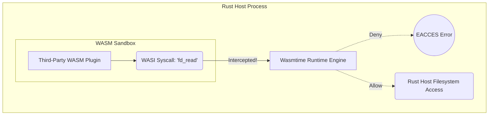

## 1. The Danger of Untrusted Plugin Architectures

If you build an extensible platform (like an API Gateway or a Serverless edge router) that allows third-party developers to upload custom logic, executing that logic natively is a massive security vulnerability. If you execute a user's Python or Lua script directly, they can use `os.system('cat /etc/passwd')` to steal system configuration, or they can open a raw TCP socket and exfiltrate your internal database credentials.

Using Docker containers for these plugins is too slow and heavy, requiring hundreds of megabytes of RAM and seconds to boot. 

## 2. WebAssembly System Interface (WASI)

We solve this by requiring users to upload WebAssembly (WASM) modules. We execute these modules directly inside our Rust server using the `wasmtime` runtime. A raw WASM module is a pure mathematical sandbox. It has absolutely zero ability to interact with the outside world; it cannot read files, open network sockets, or even read the system clock.

To allow the plugin to perform useful work, we implement the **WebAssembly System Interface (WASI)**. WASI defines a standardized set of system calls (like `fd_read` or `random_get`) that the WASM module can call. However, when the WASM module executes these calls, they do not hit the Linux OS kernel. They are intercepted by the `wasmtime` runtime running securely in our Rust host.



## 3. Capability-Based Sandboxing

This interception layer allows us to implement **Capability-Based Security**. By default, the WASM plugin has zero capabilities. If the plugin attempts to open `/etc/passwd`, the `wasmtime` interceptor instantly denies the request and returns an error.

The Rust host must explicitly grant the WASM module a specific "Capability." For example, the Rust host can grant a file descriptor pointing *only* to a specific virtual directory like `/tmp/plugin_123_data/`. When the WASM module calls `fd_read("/")`, it believes it is reading the root of the operating system, but it is actually trapped inside a virtualized, chroot-like filesystem mapped to that specific temporary folder.

```rust
// src/plugins/wasi_engine.rs
use wasmtime::*;
use wasmtime_wasi::sync::WasiCtxBuilder;

pub fn execute_plugin(wasm_bytes: &[u8]) -> Result<()> {
    let engine = Engine::default();
    let module = Module::new(&engine, wasm_bytes)?;
    
    // Create a strict Capability-Based WASI context.
    // We grant EXACTLY ONE directory. No network. No environment variables.
    let wasi_ctx = WasiCtxBuilder::new()
        .preopened_dir(
            std::fs::File::open("/tmp/plugin_123_data/")?, 
            "/"
        )?
        .build();
        
    let mut store = Store::new(&engine, wasi_ctx);
    let mut linker = Linker::new(&engine);
    wasmtime_wasi::add_to_linker(&mut linker, |s| s)?;
    
    let instance = linker.instantiate(&mut store, &module)?;
    let start_func = instance.get_typed_func::<(), ()>(&mut store, "_start")?;
    
    // Execute the plugin safely. If it tries to read outside "/tmp/plugin_123_data/",
    // Wasmtime will mathematically block the WASI syscall.
    start_func.call(&mut store, ())?;
    
    Ok(())
}
```

If the plugin suffers a memory corruption bug (like a buffer overflow) due to poorly written C++ code compiled to WASM, the damage is strictly confined to the WASM Linear Memory. The Rust host memory remains completely untouched. This mathematically proven isolation allows us to safely execute untrusted third-party code directly within our core API at near-native speeds, achieving a level of security that Linux containers can never match.
