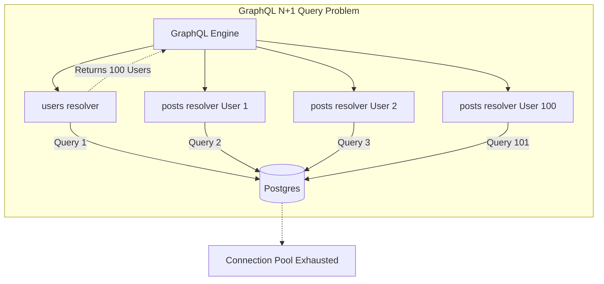
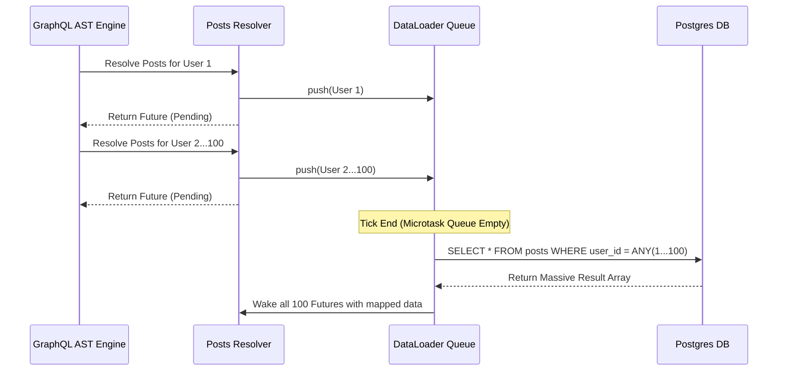

## 1. The Physics of Graph Traversal

GraphQL is profoundly misunderstood as a simple alternative to REST. It is actually a powerful AST execution engine. When a client sends a query like `query { users(limit: 100) { id, posts { title } } }`, the server parses this string into an Abstract Syntax Tree (AST). The GraphQL execution engine then traverses this tree recursively, invoking specific Rust functions (Resolvers) at every node.

## 2. The N+1 Catastrophe

This recursive traversal introduces the most devastating performance bottleneck in web architecture: **The N+1 Query Problem**. The engine first executes the `users` resolver, which executes 1 SQL query to fetch 100 users. The engine then iterates over those 100 users. For *every single user*, it invokes the `posts` resolver.

If the `posts` resolver executes a standard SQL query (`SELECT * FROM posts WHERE user_id = $1`), the server will execute 100 separate, sequential SQL queries. If the query requested comments on those posts, it would trigger 10,000 queries. A single HTTP request will instantly exhaust the Postgres connection pool and crash the database.



## 3. The Dataloader Batching Algorithm

We eliminate the N+1 problem mathematically using the **Dataloader Pattern**. A Dataloader acts as an asynchronous queue and deduplicator. When the 100 `posts` resolvers are invoked, they do **not** execute SQL queries. Instead, each resolver pushes its `user_id` into the Dataloader's memory queue and immediately returns a `Future`.



Because Rust is asynchronous, the Tokio executor pauses all 100 resolvers. At the end of the current micro-task tick (when the executor runs out of immediate work), the Dataloader looks at its queue. It finds 100 `user_id`s. It deduplicates them, and executes a **single** batch SQL query: `SELECT * FROM posts WHERE user_id = ANY($1)`.

```rust
// src/graphql/loaders.rs
use dataloader::non_cached::Loader;
use std::collections::HashMap;

// The struct defining our Batch Loading logic
pub struct PostBatcher {
    pool: sqlx::PgPool,
}

#[async_trait::async_trait]
impl dataloader::BatchFn<i32, Vec<Post>> for PostBatcher {
    // This function is called EXACTLY ONCE per micro-task tick
    async fn load(&mut self, keys: &[i32]) -> HashMap<i32, Vec<Post>> {
        // We execute a single SQL query using the ANY operator
        let posts = sqlx::query_as!(
            Post,
            "SELECT * FROM posts WHERE user_id = ANY($1)",
            &keys[..]
        )
        .fetch_all(&self.pool)
        .await
        .unwrap();

        // We sort the results back into a HashMap to satisfy the futures
        let mut map: HashMap<i32, Vec<Post>> = HashMap::new();
        for post in posts {
            map.entry(post.user_id).or_default().push(post);
        }
        
        map
    }
}
```

When Postgres returns the massive array of posts, the Dataloader sorts them into memory and pushes the results back into the 100 paused Futures, waking them up. By exploiting the mechanics of the Tokio event loop, we compress 10,000 recursive database queries into exactly 3 batch queries, achieving O(1) performance scalability regardless of graph depth.

## 4. Production Post-Mortem: The Dataloader Memory Explosion
A company implemented Dataloaders to fix their N+1 problem. It worked perfectly. A month later, their servers crashed with OOM panics. A malicious user had sent a GraphQL query heavily nested 15 levels deep: `users -> posts -> comments -> author -> posts...`. Because the Dataloader optimizes query *count* but not query *size*, the final batch execution resulted in a massive Cartesian product SQL query that pulled 12GB of raw text data from Postgres into the Rust memory allocator in a single micro-task tick, destroying the heap. 
**The Fix:** You must implement **Query Complexity Analysis** (limiting AST depth) and enforce **Pagination Boundaries** on every Dataloader (e.g., `LIMIT 10` per sub-query using lateral joins), mathematically capping the maximum possible RAM consumption.

## 5. Advanced Mathematical Physics: The `ANY($1)` vs `IN (...)` Syntax
Why does the code use `WHERE user_id = ANY($1)` instead of the traditional SQL `WHERE user_id IN (1, 2, 3...)`? 
If you use the `IN` clause, your SQL string dynamically changes length depending on the batch size. Postgres treats `IN (1, 2)` and `IN (1, 2, 3)` as completely distinct queries, requiring it to invoke the SQL Query Planner to recalculate execution paths for every single variation (a heavy CPU operation). By passing a single array parameter to `ANY($1)`, the query string is mathematically immutable. Postgres compiles the query plan exactly once, caches the AST, and executes it thousands of times with `O(1)` planning overhead.

## 6. The Architect's Challenge
> **Scenario:** Your Dataloader accepts a batch of 50 `user_ids`. It executes the `ANY($1)` query. The query returns 45 records (5 users have zero posts). The Dataloader pushes the 45 records back. However, the GraphQL engine panics and crashes the request. Why?

*Hint: The `dataloader` crate expects a mathematically strict 1-to-1 mapping. If the executor pauses 50 Futures, you must wake exactly 50 Futures. If you only return a `HashMap` with 45 keys, the remaining 5 Futures will wait for data that never arrives, hanging the entire GraphQL request forever. Your Dataloader MUST explicitly return an empty `Vec<Post>` for the missing keys by inserting default empty arrays into the HashMap before returning it.*

## 7. Architectural Tradeoffs & Edge Cases

> [!WARNING]
> Dataloaders optimize query count, but they can easily trigger OOM panics if pagination is ignored.

*   **Edge Cases**: The Memory Pagination Explosion. If a GraphQL query requests a 1-to-many relationship (Users -> Posts), the Dataloader might fetch 50 users, and each user might have 1,000 posts. The final SQL batch query fetches 50,000 rows into the Rust memory allocator at once, triggering an OOM panic. Dataloaders must enforce strict window-function based pagination (`ROW_NUMBER() OVER`) inside the batch SQL query itself.
*   **Best Practices**: Use `DashMap` or thread-local caches for the Dataloader layer to prevent cross-request cache bleeding, ensuring that User A's GraphQL execution cannot accidentally pull unauthorized cached database records belonging to User B's execution context.

## 8. Intermediate & Advanced Systems Deep Dive

> [!NOTE]
> Bridging the gap between software abstractions and physical hardware mechanics.

*   **Intermediate Concept**: The N+1 Query Problem. If a GraphQL query requests 10 Users and their respective 100 Posts, a naive resolver architecture will execute 1 SQL query for the users, and then execute 10 separate SQL queries for the posts. This triggers the N+1 problem, obliterating database performance.
*   **Advanced Implications**: The Dataloader Batching Algorithm. To fix N+1, you implement the Dataloader pattern. A Dataloader intercepts the 10 separate resolver requests and queues them in an asynchronous task. It yields the Tokio thread for a microscopic duration (e.g., 2 milliseconds). Once the 2ms window closes, it mathematically coalesces the 10 requests into a single SQL `IN` clause (`SELECT * FROM posts WHERE user_id IN (1,2,3...10)`). This physically converts O(N) database latency into O(1) database latency, achieving extreme query throughput at the cost of exactly 2ms of artificial delay.
