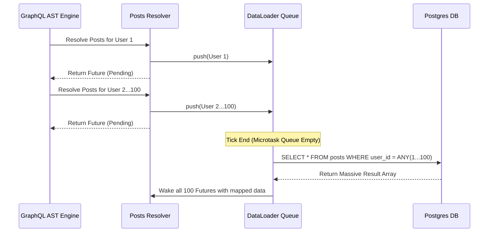

## 1. The Physics of Graph Traversal

GraphQL is profoundly misunderstood as a simple alternative to REST. It is actually a powerful AST execution engine. When a client sends a query like `query { users(limit: 100) { id, posts { title } } }`, the server parses this string into an Abstract Syntax Tree (AST). The GraphQL execution engine then traverses this tree recursively, invoking specific Rust functions (Resolvers) at every node.

## 2. The N+1 Catastrophe

This recursive traversal introduces the most devastating performance bottleneck in web architecture: **The N+1 Query Problem**. The engine first executes the `users` resolver, which executes 1 SQL query to fetch 100 users. The engine then iterates over those 100 users. For *every single user*, it invokes the `posts` resolver.

If the `posts` resolver executes a standard SQL query (`SELECT * FROM posts WHERE user_id = $1`), the server will execute 100 separate, sequential SQL queries. If the query requested comments on those posts, it would trigger 10,000 queries. A single HTTP request will instantly exhaust the Postgres connection pool and crash the database.

## 3. The Dataloader Batching Algorithm

We eliminate the N+1 problem mathematically using the **Dataloader Pattern**. A Dataloader acts as an asynchronous queue and deduplicator. When the 100 `posts` resolvers are invoked, they do **not** execute SQL queries. Instead, each resolver pushes its `user_id` into the Dataloader's memory queue and immediately returns a `Future`.



Because Rust is asynchronous, the Tokio executor pauses all 100 resolvers. At the end of the current micro-task tick (when the executor runs out of immediate work), the Dataloader looks at its queue. It finds 100 `user_id`s. It deduplicates them, and executes a **single** batch SQL query: `SELECT * FROM posts WHERE user_id = ANY($1)`.

```rust
// src/graphql/loaders.rs
use dataloader::non_cached::Loader;
use std::collections::HashMap;

// The struct defining our Batch Loading logic
pub struct PostBatcher {
    pool: sqlx::PgPool,
}

#[async_trait::async_trait]
impl dataloader::BatchFn<i32, Vec<Post>> for PostBatcher {
    // This function is called EXACTLY ONCE per micro-task tick
    async fn load(&mut self, keys: &[i32]) -> HashMap<i32, Vec<Post>> {
        // We execute a single SQL query using the ANY operator
        let posts = sqlx::query_as!(
            Post,
            "SELECT * FROM posts WHERE user_id = ANY($1)",
            &keys[..]
        )
        .fetch_all(&self.pool)
        .await
        .unwrap();

        // We sort the results back into a HashMap to satisfy the futures
        let mut map: HashMap<i32, Vec<Post>> = HashMap::new();
        for post in posts {
            map.entry(post.user_id).or_default().push(post);
        }
        
        map
    }
}
```

When Postgres returns the massive array of posts, the Dataloader sorts them into memory and pushes the results back into the 100 paused Futures, waking them up. By exploiting the mechanics of the Tokio event loop, we compress 10,000 recursive database queries into exactly 3 batch queries, achieving O(1) performance scalability regardless of graph depth.
