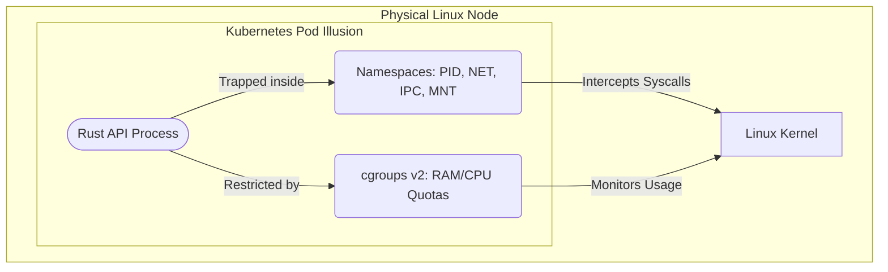

## 1. The Illusion of the Pod

Kubernetes (K8s) is the apex of distributed container orchestration, but to truly understand it, you must understand the Linux Kernel. A Kubernetes "Pod" does not physically exist. A Pod is not a Virtual Machine. It has no hardware boundaries.

A Pod is a mathematical illusion maintained by the kernel using **Linux Namespaces**. When the Kubelet starts a Rust binary, it isolates it using namespaces. The `PID` namespace intercepts all system calls and lies to the binary, telling it that it is Process ID 1. The `Network` namespace assigns the binary a virtual ethernet device (`veth`) with its own isolated IP address. The Rust application believes it is running on a dedicated server, but it is actually just a heavily restricted process sharing the host's kernel.

## 2. Resource Exhaustion and `cgroups v2`

If the Rust application suffers a memory leak and attempts to consume all 128GB of the physical server's RAM, it would crash every other Pod on the node. The Kubelet prevents this using **cgroups v2 (Control Groups)**.

The Kubelet creates a strict mathematical boundary in the kernel's memory controller for that specific Pod's Process Tree. If you set a Kubernetes memory limit of 500MB, the kernel monitors every single page of RAM allocated by your Rust process. The absolute microsecond the application attempts to allocate 500MB + 1 byte, the kernel's OOM Killer physically terminates the process with extreme prejudice. This guarantees mathematical isolation of resources.

Similarly, CPU allocation uses the `Completely Fair Scheduler (CFS)` quota subsystem. If you assign a CPU limit of `0.5` (500 millicores), the kernel grants your Rust process exactly 50 milliseconds of CPU execution time per 100ms period. Once those 50ms are consumed, the kernel physically halts the thread, forcing it to sleep until the next 100ms period begins. This prevents noisy neighbors from stealing CPU time.

## 3. The Reconciliation Loop State Machine

The core genius of Kubernetes is the Control Plane (the API Server, Controller Manager, and `etcd`). It does not operate via imperative commands (like "deploy this app"). It operates as a continuous, asynchronous state machine known as the **Reconciliation Loop**.

You provide a declarative YAML file representing the **Desired State** (e.g., "I want exactly 5 replicas of the Rust API"). The Controller Manager constantly queries the `etcd` database to determine the **Actual State**. If a physical EC2 instance catches fire and dies, the Actual State drops to 3 replicas.

The Controller calculates the mathematical delta between Desired (5) and Actual (3). It then immediately executes commands to force reality to match the desired state by scheduling 2 new Pods onto healthy nodes. By relying entirely on asynchronous state reconciliation instead of imperative commands, K8s achieves absolute, mathematically robust self-healing.
