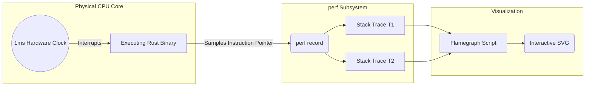

## 1. The Deception of Mean Latency

Junior engineers measure performance using average (mean) latency. In a hyperscale system processing 10,000 requests per second, the average is a mathematically useless metric. If the average latency is 10ms, but 1% of your requests take 5,000ms (due to a lock contention or a massive memory allocation), that 1% represents 100 furious users every single second.

True engineering mastery requires focusing exclusively on the **99th Percentile (p99) Tail Latency**. If your p99 latency is 12ms, it means that 99% of all users experience a response time of 12ms or better. Optimizing the p99 guarantees a perfectly uniform experience across the entire user base.

## 2. Hardware Profiling via `perf`

To optimize tail latency in Rust, standard logging is completely inadequate. Logging requires modifying the code and recompiling, and it introduces its own latency observer effect. To truly understand performance, we must profile the physical CPU silicon.

We use the Linux `perf` tool. `perf` does not modify your Rust code. It taps directly into the hardware performance counters of the CPU. We configure `perf` to execute a hardware interrupt every 1 millisecond. When the interrupt fires, the CPU halts, and `perf` records the exact memory address of the Instruction Pointer (the current physical stack trace of the Rust binary).



## 3. Flamegraph Visualization

By running the server under extreme load and collecting millions of these stack traces, we can statistically reconstruct exactly what the CPU was doing. We use Brendan Gregg's scripts (or the `cargo-flamegraph` wrapper) to compile this data into a **Flamegraph**.

A Flamegraph visually stacks the function calls. The X-axis represents CPU time (specifically, the percentage of statistical samples). It does *not* show chronological time from left to right; it sorts the functions alphabetically to merge identical code paths. The Y-axis represents the stack depth. 

```rust
// A classic performance trap detectable via Flamegraphs
pub fn process_data(data: &[u8]) -> String {
    // A flamegraph will instantly reveal that the CPU is spending 40% of its
    // time inside `String::from_utf8`. By seeing a massive wide block on the X-axis 
    // labeled `std::string::String::from_utf8`, we know exactly where to optimize.
    let string_data = String::from_utf8(data.to_vec()).unwrap();
    
    // ... logic ...
    string_data.to_uppercase()
}
```

The wider a function block is on the graph, the more CPU cycles it physically consumed. By analyzing the Flamegraph, we can mathematically prove exactly where the CPU is stalling. We might discover that a seemingly harmless `serde_json::to_string` call is consuming 40% of our CPU cycles due to unnecessary string allocations. The Flamegraph allows us to pinpoint the exact line of Rust code causing the p99 spike, enabling surgical, nanosecond-level optimizations.

## 4. Production Post-Mortem: The Missing Frame Pointers
A team deployed `cargo-flamegraph` to debug a catastrophic latency spike in production. When they opened the SVG graph, it was entirely useless. Instead of a beautiful hierarchy of function names, the graph consisted of massive, flat, unbroken blocks labeled `[unknown]`. 
**The Fix:** By default, Rust's release profiles compile code with `debug = false` and strip debug symbols. More critically, modern compilers heavily optimize the code by omitting the Frame Pointers (the `%rbp` register tracking the stack). Without frame pointers, the `perf` hardware interrupt has no mathematical way to unwind the call stack to see *who called who*. You must compile your Rust production binaries with `debug = 1` (line tables only) and ensure `force-frame-pointers = true` in your `.cargo/config.toml` to generate readable stack traces at the cost of a ~2% CPU overhead.

## 5. Advanced Mathematical Physics: Instruction Per Cycle (IPC)
While Flamegraphs show *where* time is spent, they do not show *why*. The most advanced metric in CPU profiling is **IPC (Instructions Per Cycle)**. A modern x86 CPU is superscalar; it can mathematically execute 4 distinct machine instructions simultaneously within a single clock cycle (an IPC of 4.0). If you look at `perf stat`, you might see an IPC of `0.8`. This means the CPU is physically stalling for 3 out of every 4 nanoseconds! Why? **Cache Misses**. The CPU requested memory that was not in the L1/L2 Silicon Cache, forcing it to fetch data from the slow DDR4 RAM. 
To fix low IPC in Rust, you must reorganize your structs into contiguous arrays (`Vec<T>` instead of `Vec<Box<T>>`) to perfectly align with the CPU's 64-byte hardware cache lines, leveraging Data-Oriented Design (DOD).

```mermaid
flowchart TD
    subgraph Data-Oriented Design (Contiguous)
      L1_A[L1 Cache Line: 64 bytes]
      Array[Array: A, B, C, D]
      Array --> L1_A
      CPU1[CPU Core] -.->|Fast Cache Hit: IPC 4.0| L1_A
    end
    
    subgraph Object-Oriented Design (Fragmented)
      L1_B[L1 Cache Line]
      Pointer[Pointer to Heap]
      Pointer --> L1_B
      L1_B -.->|Cache Miss| RAM[(Main DDR4 RAM)]
      CPU2[CPU Core] -.->|Slow RAM Fetch: IPC 0.8| RAM
    end
```

## 6. The Architect's Challenge
> **Scenario:** Your Rust web server shows a massive block in the Flamegraph labeled `<std::sync::mutex::Mutex as std::ops::Drop>::drop`. This block consumes 30% of your total CPU execution time on a 64-core machine. What is physically happening, and how do you fix it?

*Hint: This indicates extreme Lock Contention. You have 64 CPU cores fiercely fighting to acquire a single global Mutex. When a thread releases the Mutex (`drop`), the Linux kernel executes a `futex_wake` syscall to violently wake up all other sleeping threads fighting for the lock, resulting in a Thundering Herd. You must shard the global Mutex into an array of 64 smaller Mutexes (Lock Sharding), or eliminate it entirely by adopting a lock-free Actor Model or `DashMap`.*

## 7. Architectural Tradeoffs & Edge Cases

> [!WARNING]
> Hardware profiling introduces an observer effect that can skew high-frequency algorithms.

*   **Edge Cases**: The Profiler Observer Effect (Heisenberg's Uncertainty Principle applied to silicon). Running `perf` introduces a microscopic CPU interruption every 1ms. If you are profiling a high-frequency trading algorithm where microsecond precision is required, the interrupt itself will subtly shift thread scheduling and hardware cache behavior, resulting in a Flamegraph that completely misrepresents the true production execution path.
*   **Best Practices**: Integrate Continuous Profiling (e.g., Parca or Pyroscope) directly into your cluster infrastructure. Do not wait for a catastrophic outage to run `perf`. Constantly sample the CPU at 99Hz across all production nodes to build a historical baseline of Flamegraphs, allowing you to mathematically diff CPU consumption between software releases.

## 8. Intermediate & Advanced Systems Deep Dive

> [!NOTE]
> Bridging the gap between software abstractions and physical hardware mechanics.

*   **Intermediate Concept**: The Instruction Pointer (IP). When `perf` profiles a running Rust binary, it interrupts the CPU 99 times a second and records the exact memory address of the Instruction Pointer (IP). Without Debug Symbols (`-g`), these addresses are just meaningless hexadecimal numbers (`0x0042FC8A`), making Flamegraphs useless.
*   **Advanced Implications**: Frame Pointers and the eBPF Revolution. To generate stack traces, `perf` must traverse the call stack. Historically, this required compiling with `-C force-frame-pointers=yes`, which degrades CPU performance by 2-5% because it consumes a dedicated CPU register. In modern hyperscale tracing, you abandon standard `perf` entirely and utilize eBPF with DWARF-based stack walking. eBPF can dynamically read the DWARF debug information natively inside the Linux kernel without requiring frame pointers. This allows you to mathematically trace production Rust code at 100Hz with zero statistical overhead, capturing microscopic latency spikes in asynchronous Tokio contexts that traditional profilers completely miss.
