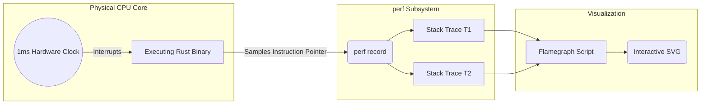

## 1. The Deception of Mean Latency

Junior engineers measure performance using average (mean) latency. In a hyperscale system processing 10,000 requests per second, the average is a mathematically useless metric. If the average latency is 10ms, but 1% of your requests take 5,000ms (due to a lock contention or a massive memory allocation), that 1% represents 100 furious users every single second.

True engineering mastery requires focusing exclusively on the **99th Percentile (p99) Tail Latency**. If your p99 latency is 12ms, it means that 99% of all users experience a response time of 12ms or better. Optimizing the p99 guarantees a perfectly uniform experience across the entire user base.

## 2. Hardware Profiling via `perf`

To optimize tail latency in Rust, standard logging is completely inadequate. Logging requires modifying the code and recompiling, and it introduces its own latency observer effect. To truly understand performance, we must profile the physical CPU silicon.

We use the Linux `perf` tool. `perf` does not modify your Rust code. It taps directly into the hardware performance counters of the CPU. We configure `perf` to execute a hardware interrupt every 1 millisecond. When the interrupt fires, the CPU halts, and `perf` records the exact memory address of the Instruction Pointer (the current physical stack trace of the Rust binary).



## 3. Flamegraph Visualization

By running the server under extreme load and collecting millions of these stack traces, we can statistically reconstruct exactly what the CPU was doing. We use Brendan Gregg's scripts (or the `cargo-flamegraph` wrapper) to compile this data into a **Flamegraph**.

A Flamegraph visually stacks the function calls. The X-axis represents CPU time (specifically, the percentage of statistical samples). It does *not* show chronological time from left to right; it sorts the functions alphabetically to merge identical code paths. The Y-axis represents the stack depth. 

```rust
// A classic performance trap detectable via Flamegraphs
pub fn process_data(data: &[u8]) -> String {
    // A flamegraph will instantly reveal that the CPU is spending 40% of its
    // time inside `String::from_utf8`. By seeing a massive wide block on the X-axis 
    // labeled `std::string::String::from_utf8`, we know exactly where to optimize.
    let string_data = String::from_utf8(data.to_vec()).unwrap();
    
    // ... logic ...
    string_data.to_uppercase()
}
```

The wider a function block is on the graph, the more CPU cycles it physically consumed. By analyzing the Flamegraph, we can mathematically prove exactly where the CPU is stalling. We might discover that a seemingly harmless `serde_json::to_string` call is consuming 40% of our CPU cycles due to unnecessary string allocations. The Flamegraph allows us to pinpoint the exact line of Rust code causing the p99 spike, enabling surgical, nanosecond-level optimizations.
