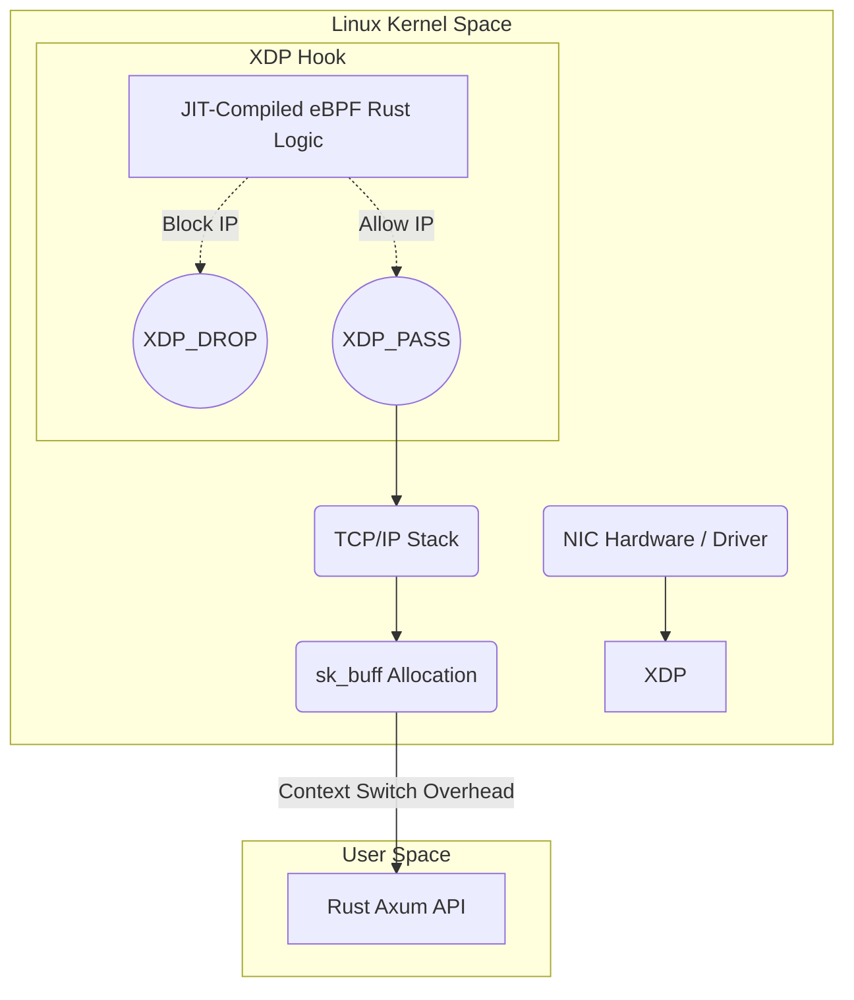

## 1. The Context Switch Bottleneck

When an attacker launches a massive DDoS attack against your server, a naive architecture attempts to block the IPs using application logic. However, for a network packet to reach your Rust Axum application, the Linux kernel must first receive the packet on the NIC, parse the TCP/IP headers, allocate a socket buffer (`sk_buff`), and copy the data from Kernel Space into User Space.

This Kernel-to-User Space boundary requires an expensive CPU Context Switch. If you receive 10 million malicious packets per second, the context switching overhead alone will completely saturate all your CPU cores, causing the server to crash before your Rust code even has a chance to inspect the IP addresses.

## 2. The eBPF Virtual Machine

To operate at hyperscale, we must push our code down into the OS kernel. We achieve this using **eBPF (Extended Berkeley Packet Filter)**. eBPF is a highly restricted, mathematically proven Virtual Machine that resides physically *inside* the Linux Kernel.

Using the `aya` crate, we write a small Rust program and compile it to eBPF bytecode. When we inject this bytecode into the kernel, the kernel runs a strict Verifier to mathematically guarantee that our code contains no infinite loops or invalid memory accesses (ensuring our code cannot kernel-panic the OS). Once verified, the kernel's JIT compiler translates our eBPF bytecode directly into native machine code.



## 3. XDP (eXpress Data Path) Hooking

We hook our compiled eBPF program directly into the **XDP (eXpress Data Path)** layer. XDP is the absolute lowest level of the Linux network stack, executing immediately after the physical NIC driver receives an electron pulse.

```rust
// src-ebpf/main.rs (Compiled strictly to eBPF bytecode, NOT standard x86)
#![no_std]
#![no_main]

use aya_ebpf::{bindings::xdp_action, macros::xdp, programs::XdpContext};
use core::mem;
use network_types::{eth::EthHdr, ip::Ipv4Hdr};

#[xdp]
pub fn firewall(ctx: XdpContext) -> u32 {
    let ethhdr: *const EthHdr = unsafe { ptr_at(&ctx, 0) };
    let ipv4hdr: *const Ipv4Hdr = unsafe { ptr_at(&ctx, mem::size_of::<EthHdr>()) };

    unsafe {
        // Read the raw IP directly from the NIC's memory buffer in nanoseconds
        let src_ip = u32::from_be((*ipv4hdr).src_addr);
        
        if is_malicious(src_ip) {
            // Drop the packet in the kernel. Zero overhead. Zero context switches.
            return xdp_action::XDP_DROP;
        }
    }
    
    xdp_action::XDP_PASS
}
```

When a malicious packet arrives, the kernel instantly executes our eBPF program in Kernel Space, completely bypassing the TCP/IP stack and socket buffers. Our eBPF program parses the raw IP headers, identifies the malicious IP, and issues the `XDP_DROP` command.

The kernel drops the packet instantly, without a single byte ever crossing the User Space boundary. By executing our Rust logic as a JIT-compiled kernel extension, we can easily drop 20 million DDoS packets per second using only 2% of the CPU's capacity.

## 4. Production Post-Mortem: The Verifier Infinite Loop Failure
A security engineer wrote a brilliant eBPF program to iterate over the HTTP headers of incoming TCP packets to block a specific Layer 7 payload. They used a standard Rust `while` loop to scan the byte array. When they attempted to load the program into the kernel via `aya`, the Linux Kernel instantly rejected it, crashing their deployment pipeline. 
**The Fix:** The eBPF Verifier guarantees that your code will never freeze the Linux kernel. It mathematically proves this by analyzing the Control Flow Graph. If the Verifier detects an unbounded loop (or a loop where it cannot mathematically prove the exact maximum number of iterations at compile-time), it forcefully rejects the bytecode. You must unroll your loops using `#pragma unroll` (or Rust equivalent macros) and enforce absolute, hardcoded bounds checking on all byte array traversals.

## 5. Advanced Mathematical Physics: eBPF Maps
If the eBPF program lives in Kernel Space, how does the User Space Rust Axum application tell it which IP addresses to block dynamically? You cannot pass variables directly. We solve this mathematically using **eBPF Maps** (specifically BPF Hash Maps or LPM Tries). These are specialized, lock-free memory structures allocated physically in kernel RAM, but accessible from User Space via the `bpf()` syscall. 
When your User Space Rust API detects a malicious user, it calls `bpf_map_update_elem()`. The Kernel Space eBPF program simultaneously performs a `bpf_map_lookup_elem()` on every incoming packet. This allows you to update the firewall rules of a live, running kernel dynamically with exactly zero milliseconds of downtime.

## 6. The Architect's Challenge
> **Scenario:** You implement XDP dropping logic perfectly. Your server easily survives a 5 million packet-per-second volumetric DDoS attack. However, your Cloud Provider bill arrives, and you owe $15,000 in bandwidth ingress fees. Why didn't XDP save your money?

*Hint: XDP executes on your server's physical CPU after the packet has already traveled across the internet, crossed the Cloud Provider's backbone routers, and entered your Virtual Machine's Network Interface. You successfully saved your CPU from crashing, but the raw bandwidth was still consumed at the ingress point. To mitigate volumetric attacks economically, you must use eBPF at the edge (Cloudflare/Fastly) or rely on BGP Anycast and AWS Shield to scrub the bandwidth before it hits your VPC.*
