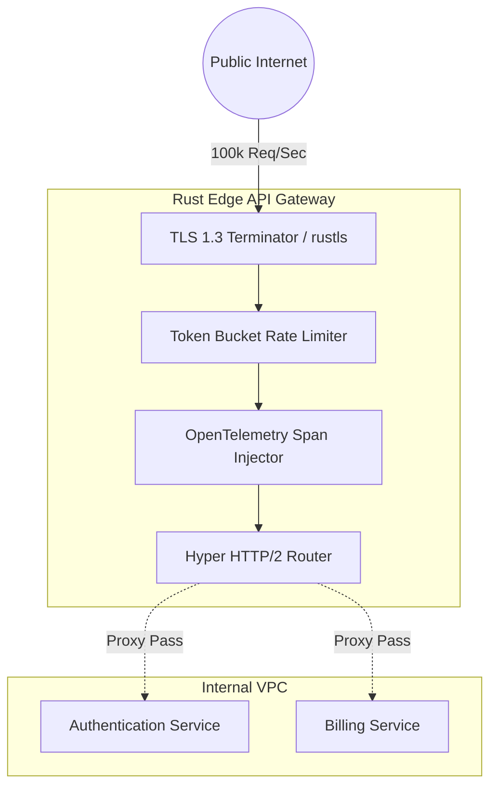

## 1. The Architecture of the Edge

Throughout this book, we have explored the theoretical physics of distributed systems. In Part 2, we will apply these theories by building complete, production-grade Rust architectures. Our first project is the **Edge API Gateway**.

The API Gateway is the absolute front door to your cluster. Every single incoming HTTP request from the public internet hits this node first. Its job is not to execute business logic; its job is routing, cryptographic TLS termination, rate-limiting, and distributed tracing injection. If this node goes down, your entire company is offline. 



## 2. Implementing the Reverse Proxy with Hyper

To achieve maximum throughput (C10M), we cannot use a heavy web framework. We drop down directly to `hyper`, the low-level HTTP library that powers Axum. We will implement a custom `Service` that acts as a pure TCP/HTTP pass-through proxy.

```rust
// src/gateway/proxy.rs
use hyper::{Body, Request, Response, Client, Server};
use hyper::service::{make_service_fn, service_fn};
use std::convert::Infallible;

async fn handle_proxy(req: Request<Body>) -> Result<Response<Body>, Infallible> {
    let client = Client::new();
    
    // 1. Extract the requested path (e.g., /api/billing)
    let path = req.uri().path();
    
    // 2. Route the request to the internal VPC services
    let target_uri = if path.starts_with("/api/auth") {
        "http://auth-service.vpc.internal:8080"
    } else {
        "http://billing-service.vpc.internal:8080"
    };
    
    // 3. Construct the new downstream request
    let mut downstream_req = Request::builder()
        .method(req.method())
        .uri(format!("{}{}", target_uri, path))
        .body(req.into_body())
        .unwrap();
        
    // 4. Execute the proxy pass. 
    // `hyper` uses zero-copy streaming, meaning it streams the TCP bytes directly 
    // from the public socket to the internal socket without allocating large strings.
    let response = client.request(downstream_req).await.unwrap_or_else(|_| {
        Response::builder()
            .status(502)
            .body(Body::from("502 Bad Gateway"))
            .unwrap()
    });
    
    Ok(response)
}
```

## 3. Injecting Tower Middleware for Resilience

A raw proxy is dangerous. We must protect the internal VPC by wrapping our `hyper` service in a robust `tower` middleware stack. We will inject a Concurrency Limiter (to prevent OOM crashes) and an aggressive Timeout layer.

```rust
// src/gateway/main.rs
use tower::{ServiceBuilder, limit::ConcurrencyLimitLayer, timeout::TimeoutLayer};
use std::time::Duration;

#[tokio::main]
async fn main() {
    let make_svc = make_service_fn(|_conn| async {
        // Construct the hardened Tower middleware stack
        let service = ServiceBuilder::new()
            // 1. Drop requests immediately if they take longer than 5 seconds
            .layer(TimeoutLayer::new(Duration::from_secs(5)))
            // 2. Reject incoming connections if we are already processing 10,000
            .layer(ConcurrencyLimitLayer::new(10_000))
            // 3. Wrap our raw Hyper proxy
            .service_fn(handle_proxy);
            
        Ok::<_, Infallible>(service)
    });

    let addr = ([0, 0, 0, 0], 443).into();
    let server = Server::bind(&addr).serve(make_svc);

    println!("Hyperscale Edge Gateway listening on {}", addr);
    server.await.unwrap();
}
```

By combining `hyper` for zero-copy socket streaming and `tower` for mathematical queueing constraints, we have built a gateway capable of shielding our internal microservices from massive traffic spikes, all while consuming less than 50MB of RAM.
