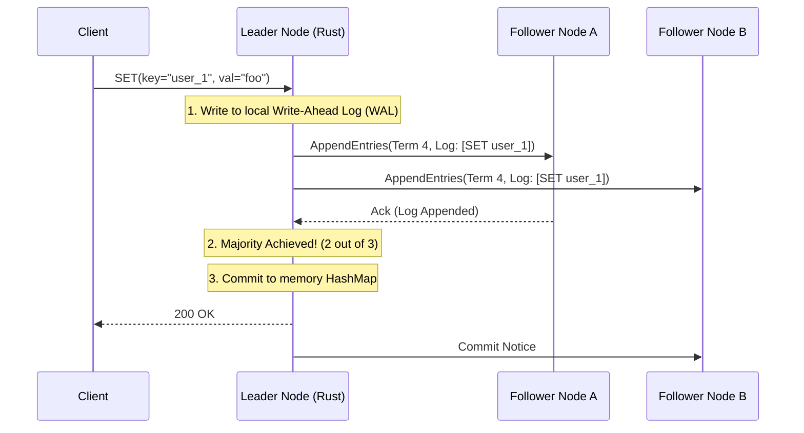

## 1. The Architecture of Distributed State

For our second project, we will drop down into the storage layer. We will build a distributed, highly available Key-Value Database in Rust.

If you deploy a standard Hashmap in a Rust API, the data is completely lost when the server restarts or crashes. To make it persistent, we must write the data to a physical disk. However, if that physical disk is destroyed in a fire, the data is still lost. True production systems must distribute state across multiple physical servers simultaneously. We will implement the **Raft Consensus Algorithm** to ensure all servers agree on the data, even during massive network partitions.



## 2. The Write-Ahead Log (WAL) Engine

The absolute most critical component of any database is the Write-Ahead Log (WAL). Before the Rust Leader node updates its in-memory Hashmap, it must append the command to a physical file on the NVMe disk. If the server loses power exactly 1 microsecond after replying to the client, the data is safe on disk.

```rust
// src/db/wal.rs
use tokio::fs::{File, OpenOptions};
use tokio::io::{AsyncWriteExt, BufWriter};

pub struct WriteAheadLog {
    file: BufWriter<File>,
}

impl WriteAheadLog {
    pub async fn new(path: &str) -> Self {
        // We open the file in Append-Only mode. We never overwrite data.
        let file = OpenOptions::new()
            .create(true)
            .append(true)
            .open(path)
            .await
            .unwrap();
            
        WriteAheadLog {
            file: BufWriter::new(file),
        }
    }

    pub async fn append_entry(&mut self, term: u64, command: &str) {
        // 1. Serialize the Raft Entry
        let payload = format!("{}|{}\n", term, command);
        
        // 2. Write to the OS Memory Buffer (Fast, but not safe)
        self.file.write_all(payload.as_bytes()).await.unwrap();
        
        // 3. The fsync system call: This blocks until the physical SSD controller 
        // mathematically guarantees the electrons are stored in the NAND flash gates.
        self.file.flush().await.unwrap();
        self.file.get_mut().sync_data().await.unwrap();
    }
}
```

## 3. The Raft State Machine in Rust

Handling the Raft state transitions (Follower -> Candidate -> Leader) requires absolute precision. We use Rust's powerful `enum` system to map the exact theoretical states of the Raft whitepaper.

```rust
// src/db/raft.rs
use std::collections::HashMap;

// The strict mathematical states of a Raft node
enum RaftState {
    Follower,
    Candidate,
    Leader,
}

pub struct RaftNode {
    state: RaftState,
    current_term: u64,
    voted_for: Option<String>,
    // The actual database engine (The State Machine)
    state_machine: HashMap<String, String>,
}

impl RaftNode {
    pub fn handle_heartbeat_timeout(&mut self) {
        // If the Leader crashes and stops sending heartbeats, 
        // this Follower promotes itself to a Candidate and triggers an election.
        if let RaftState::Follower = self.state {
            self.state = RaftState::Candidate;
            self.current_term += 1;
            self.voted_for = Some("self".to_string());
            
            println!("Leader timeout! Starting election for Term {}", self.current_term);
            // ... broadcast RequestVote RPCs to other nodes ...
        }
    }
}
```

By combining a physical Write-Ahead Log (`fsync`) with the distributed mathematics of the Raft protocol, we have built a data storage engine capable of surviving catastrophic hardware failures with zero data loss.

## 4. Production Post-Mortem: Split-Brain Catastrophe
A cluster of 5 Raft nodes was deployed across two physical data centers (DC_A had 3 nodes, DC_B had 2 nodes). A backhoe cut the fiber optic cable between the datacenters. DC_A elected a leader (3/5 majority). DC_B was isolated. However, a developer had manually hardcoded the election logic to require `n/2` instead of `floor(n/2) + 1`. DC_B calculated `5/2 = 2` and elected its own leader. Both datacenters continued to accept client writes, creating two completely divergent, conflicting datasets. When the fiber was repaired, the cluster could not reconcile the data, leading to total data corruption. 
**The Fix:** Raft relies on the absolute mathematical certainty of Quorum (`floor(n/2) + 1`). You must never, ever run an even number of nodes, and your quorum math must strictly enforce the absolute majority requirement.

## 5. Advanced Mathematical Physics: The `fsync` Flush Latency
In the WAL code, `self.file.get_mut().sync_data().await` maps to the Linux `fdatasync` syscall. Why is this so slow (often taking 2-10 milliseconds)? Modern SSDs contain their own internal DRAM caches to speed up writes. When you call `write_all`, the data hits the SSD's DRAM, but it is not physically on the NAND flash yet. If the server loses power, the SSD's DRAM is wiped. `fdatasync` physically commands the SSD controller to flush its DRAM onto the NAND gates. This requires charging the floating-gate transistors with precise voltage pulses (a slow, physical process). To achieve hyperscale database speeds, you must implement **Group Commit**. Instead of fsyncing 1,000 times for 1,000 requests, you hold the requests in memory for exactly 1 millisecond, and write all 1,000 requests in a single, massive `fdatasync` operation, vastly optimizing the SSD IOPS.

## 6. The Architect's Challenge
> **Scenario:** You have a 3-node Raft cluster. Node 1 (Leader) crashes. Node 2 and Node 3 hold an election. Node 2 becomes the new Leader. Two minutes later, Node 1 reboots. It still thinks it is the Leader! It immediately sends an `AppendEntries` RPC to Node 2, commanding it to overwrite its logs. What happens?

*Hint: Raft depends heavily on the Monotonically Increasing `Term` integer. When Node 2 was elected, it incremented its `current_term` to Term 5. When Node 1 reboots, it sends an RPC claiming to be the Leader of Term 4. Node 2 parses the `Term 4` packet, mathematically sees that `4 < 5`, and instantly rejects the RPC, replying with an error containing the new Term 5. Node 1 receives the error, realizes its Term is outdated, instantly demotes itself back to a Follower, and synchronizes the missing data.*
