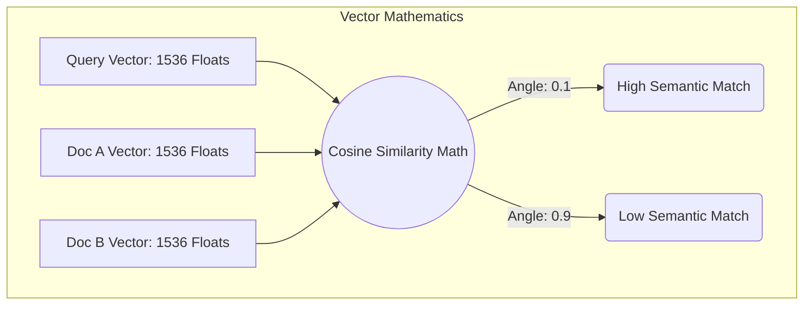
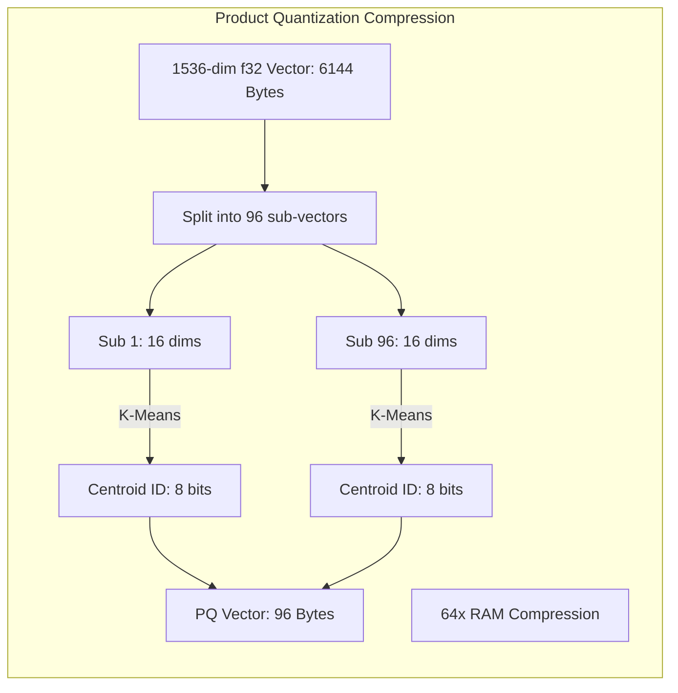

## 1. The Physics of AI Semantic Search

In this project, we will build the core engine of an AI Retrieval-Augmented Generation (RAG) system: a custom Vector Database.

When an LLM converts text into an Embedding Vector, it outputs a dense array of floating-point numbers (e.g., 1,536 dimensions for OpenAI). To find the most relevant document for a user's search query, the database must calculate the **Cosine Similarity** between the query vector and millions of document vectors.



## 2. Hardware Acceleration with SIMD

Calculating the Cosine angle between two 1,536-dimension vectors requires thousands of multiplication and addition operations. If we iterate through the array using a standard Rust `for` loop, the CPU will execute exactly one multiplication per clock cycle. At scale, this is completely unviable.

We must break the sequential loop using **SIMD (Single Instruction, Multiple Data)**. Modern Intel and AMD CPUs have massive 256-bit or 512-bit registers (AVX instructions). By utilizing the `std::simd` module (or crates like `wide`), we can load 8 floating-point numbers into the CPU register simultaneously and execute 8 multiplications in a *single* hardware clock cycle.

```rust
// src/vector/simd_math.rs
use std::simd::{f32x8, num::SimdFloat};

// Calculates the dot product of two 1536-dimensional vectors using SIMD AVX registers
pub fn simd_dot_product(a: &[f32], b: &[f32]) -> f32 {
    assert_eq!(a.len(), b.len());
    assert_eq!(a.len() % 8, 0); // Ensure perfect 256-bit alignment

    // Initialize an empty 256-bit register to accumulate the sum
    let mut sum_register = f32x8::splat(0.0);

    // We step through the arrays 8 numbers at a time
    for i in (0..a.len()).step_by(8) {
        // Load 8 floats from RAM directly into CPU Registers in 1 instruction
        let vector_a = f32x8::from_slice(&a[i..i+8]);
        let vector_b = f32x8::from_slice(&b[i..i+8]);
        
        // Execute 8 physical multiplications simultaneously on the silicon
        sum_register += vector_a * vector_b;
    }

    // Collapse the 8-lane register down to a single f32 scalar
    sum_register.reduce_sum()
}
```

## 3. The HNSW Graph Engine

Even with SIMD processing a vector in nanoseconds, performing a linear scan (K-Nearest Neighbors) across 1 billion documents will still take seconds. We must implement an **Approximate Nearest Neighbors (ANN)** algorithm. We will build an in-memory **HNSW (Hierarchical Navigable Small World)** graph.

```rust
// src/vector/hnsw.rs
use std::collections::HashMap;

// A simplified node in our HNSW Graph Layer
pub struct HnswNode {
    pub vector_id: u64,
    pub data: Vec<f32>,
    // Neighbors in this specific graph layer
    pub connections: Vec<u64>, 
}

pub struct HnswLayer {
    nodes: HashMap<u64, HnswNode>,
}

impl HnswLayer {
    // The greedy routing algorithm
    pub fn search(&self, query: &[f32], enter_point: u64) -> u64 {
        let mut current_best = enter_point;
        let mut best_distance = simd_dot_product(query, &self.nodes[&enter_point].data);
        
        loop {
            let mut found_better = false;
            let node = &self.nodes[&current_best];
            
            // Check all connected neighbors in the graph
            for &neighbor_id in &node.connections {
                let neighbor = &self.nodes[&neighbor_id];
                let dist = simd_dot_product(query, &neighbor.data);
                
                // If a neighbor is mathematically closer to the query, move there
                if dist > best_distance {
                    best_distance = dist;
                    current_best = neighbor_id;
                    found_better = true;
                }
            }
            
            // If we checked all neighbors and none are closer, we have found the local minima
            if !found_better { break; }
        }
        
        current_best
    }
}
```

By marrying the hardware-level parallelism of SIMD registers with the logarithmic traversal speed of HNSW graphs, our custom Rust engine can search millions of semantic documents in under 2 milliseconds, forming the ultimate backend for AI RAG applications.

## 4. Production Post-Mortem: Float Un-Normalization
A custom vector database written in Rust was incredibly fast, until one day a specific user's query vector caused the server to hang completely. The CPU utilization pinned at 100%, and the request timed out. 
**The Fix:** The embedding model had output a vector containing `Subnormal` floating-point numbers (values so microscopically close to zero that they bypass standard IEEE 754 float representation). When the CPU encounters a Subnormal float during a SIMD multiplication, it cannot process it in hardware; it generates a "Microcode Assist" hardware trap, forcing the OS to calculate the math slowly in software, causing a 100x performance penalty. You must configure your Rust application to aggressively set the `DAZ` (Denormals-Are-Zero) and `FTZ` (Flush-To-Zero) hardware CPU flags, forcing the silicon to instantly treat these microscopic errors as exactly `0.0`.

## 5. Advanced Mathematical Physics: Product Quantization (PQ)
Storing 100 million 1536-dimensional `f32` vectors requires ~614 GB of raw RAM (not including the massive HNSW graph pointers). This is cost-prohibitive. To achieve hyperscale, we use **Product Quantization (PQ)**. PQ splits the massive 1536-dim vector into 96 smaller sub-vectors (16 dimensions each). It runs K-Means clustering on the dataset to create 256 "Centroids" for each sub-vector. Now, instead of storing 1536 `f32` floats (6,144 bytes), we just store an array of 96 `u8` bytes (pointing to the Centroid IDs). We compress 6KB of data into 96 Bytes—a 64x mathematical compression. The cosine similarity is approximated using pre-computed lookup tables against the Centroids. This allows the Vector Database to hold billions of vectors entirely in RAM on a single cheap server.



## 6. The Architect's Challenge
> **Scenario:** You are iterating through the HNSW graph in Rust. You look up a neighbor node in your `HashMap<u64, HnswNode>`. You calculate the dot product. Performance profiling reveals you have a terrible IPC (Instructions Per Cycle) of 0.4 due to massive L3 Cache Misses. Why is `HashMap` bad for graph traversal?

*Hint: A standard `HashMap` allocates memory non-contiguously. Node 5 might be located in physical RAM address `0xAA`, and its neighbor Node 6 might be at address `0xFF`. Every single graph step requires jumping randomly across the RAM chips, completely defeating the CPU hardware prefetcher. To build a world-class engine, you must abandon `HashMap` and allocate all vectors inside a single, massive, pre-allocated `Vec<f32>` (a flat array), converting graph pointers into basic integer indices (`node_id * 1536`), guaranteeing perfect Cache Line locality.*

## 7. Architectural Tradeoffs & Edge Cases

> [!WARNING]
> ANN Search trades mathematical perfection (Recall) for sub-millisecond response times.

*   **Edge Cases**: Graph Disconnection (Orphaned Nodes). During HNSW graph construction, if vectors are inserted in a highly specific, adversarial geometric order, it is mathematically possible for regions of the graph to become completely disconnected from the main enter point. The search algorithm will silently fail to traverse into those regions, completely blinding the AI to millions of relevant documents.
*   **Best Practices**: Aggressively utilize Product Quantization (PQ) and memory-map (`mmap`) the compressed Centroid indices directly into the Linux Page Cache. This ensures that the billion-scale index never exceeds physical RAM and the CPU prefetcher is constantly fed by the kernel.

## 8. Intermediate & Advanced Systems Deep Dive

> [!NOTE]
> Bridging the gap between software abstractions and physical hardware mechanics.

*   **Intermediate Concept**: Euclidean Distance vs Cosine Similarity. Calculating distance in 1,536 dimensions requires executing complex floating-point mathematical equations sequentially on every single coordinate.
*   **Advanced Implications**: AVX-512 SIMD Intrinsics. Standard Rust math compiles to scalar instructions (one calculation per clock cycle). For extreme vector search speeds, you must physically map your vector arrays to 512-bit hardware registers using `core::arch::x86_64::_mm512_add_ps`. This executes 16 floating-point calculations simultaneously in a single microscopic clock cycle. Failing to explicitly leverage SIMD intrinsics in a Vector Database guarantees your system will be mathematically crushed by hardware-optimized competitors.
