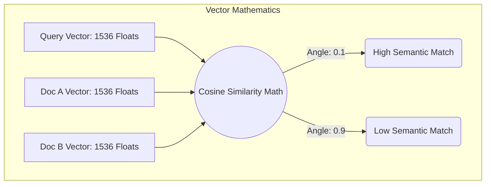

## 1. The Physics of AI Semantic Search

In this project, we will build the core engine of an AI Retrieval-Augmented Generation (RAG) system: a custom Vector Database.

When an LLM converts text into an Embedding Vector, it outputs a dense array of floating-point numbers (e.g., 1,536 dimensions for OpenAI). To find the most relevant document for a user's search query, the database must calculate the **Cosine Similarity** between the query vector and millions of document vectors.



## 2. Hardware Acceleration with SIMD

Calculating the Cosine angle between two 1,536-dimension vectors requires thousands of multiplication and addition operations. If we iterate through the array using a standard Rust `for` loop, the CPU will execute exactly one multiplication per clock cycle. At scale, this is completely unviable.

We must break the sequential loop using **SIMD (Single Instruction, Multiple Data)**. Modern Intel and AMD CPUs have massive 256-bit or 512-bit registers (AVX instructions). By utilizing the `std::simd` module (or crates like `wide`), we can load 8 floating-point numbers into the CPU register simultaneously and execute 8 multiplications in a *single* hardware clock cycle.

```rust
// src/vector/simd_math.rs
use std::simd::{f32x8, num::SimdFloat};

// Calculates the dot product of two 1536-dimensional vectors using SIMD AVX registers
pub fn simd_dot_product(a: &[f32], b: &[f32]) -> f32 {
    assert_eq!(a.len(), b.len());
    assert_eq!(a.len() % 8, 0); // Ensure perfect 256-bit alignment

    // Initialize an empty 256-bit register to accumulate the sum
    let mut sum_register = f32x8::splat(0.0);

    // We step through the arrays 8 numbers at a time
    for i in (0..a.len()).step_by(8) {
        // Load 8 floats from RAM directly into CPU Registers in 1 instruction
        let vector_a = f32x8::from_slice(&a[i..i+8]);
        let vector_b = f32x8::from_slice(&b[i..i+8]);
        
        // Execute 8 physical multiplications simultaneously on the silicon
        sum_register += vector_a * vector_b;
    }

    // Collapse the 8-lane register down to a single f32 scalar
    sum_register.reduce_sum()
}
```

## 3. The HNSW Graph Engine

Even with SIMD processing a vector in nanoseconds, performing a linear scan (K-Nearest Neighbors) across 1 billion documents will still take seconds. We must implement an **Approximate Nearest Neighbors (ANN)** algorithm. We will build an in-memory **HNSW (Hierarchical Navigable Small World)** graph.

```rust
// src/vector/hnsw.rs
use std::collections::HashMap;

// A simplified node in our HNSW Graph Layer
pub struct HnswNode {
    pub vector_id: u64,
    pub data: Vec<f32>,
    // Neighbors in this specific graph layer
    pub connections: Vec<u64>, 
}

pub struct HnswLayer {
    nodes: HashMap<u64, HnswNode>,
}

impl HnswLayer {
    // The greedy routing algorithm
    pub fn search(&self, query: &[f32], enter_point: u64) -> u64 {
        let mut current_best = enter_point;
        let mut best_distance = simd_dot_product(query, &self.nodes[&enter_point].data);
        
        loop {
            let mut found_better = false;
            let node = &self.nodes[&current_best];
            
            // Check all connected neighbors in the graph
            for &neighbor_id in &node.connections {
                let neighbor = &self.nodes[&neighbor_id];
                let dist = simd_dot_product(query, &neighbor.data);
                
                // If a neighbor is mathematically closer to the query, move there
                if dist > best_distance {
                    best_distance = dist;
                    current_best = neighbor_id;
                    found_better = true;
                }
            }
            
            // If we checked all neighbors and none are closer, we have found the local minima
            if !found_better { break; }
        }
        
        current_best
    }
}
```

By marrying the hardware-level parallelism of SIMD registers with the logarithmic traversal speed of HNSW graphs, our custom Rust engine can search millions of semantic documents in under 2 milliseconds, forming the ultimate backend for AI RAG applications.
