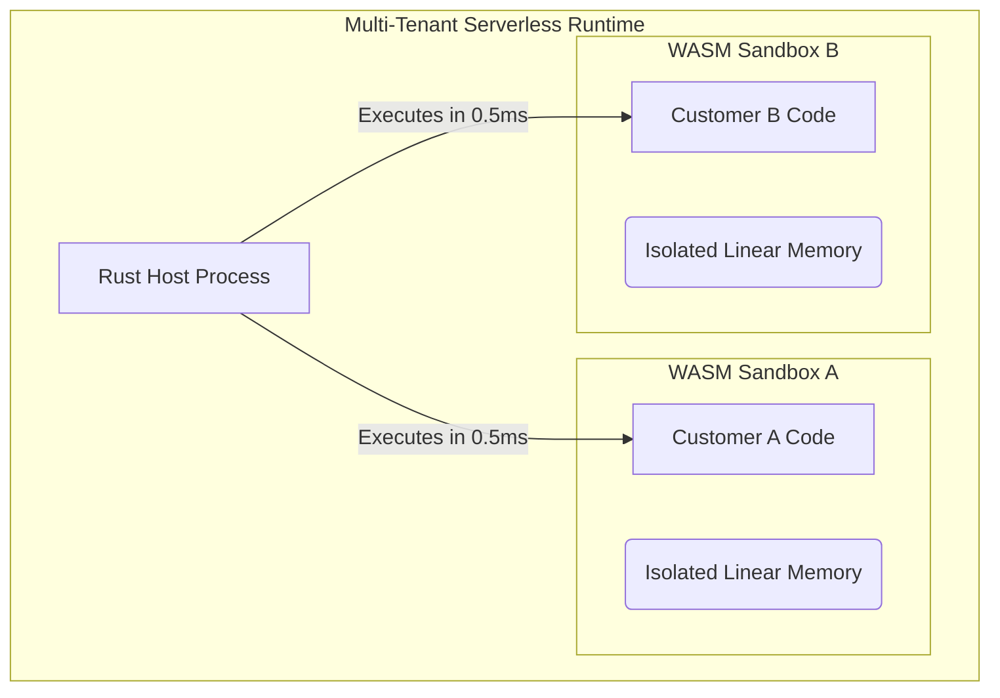
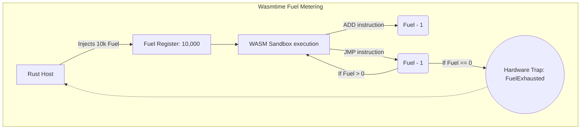

## 1. The Physics of the Serverless Edge

In our final architectural project, we will construct a multi-tenant Serverless Edge Runtime (similar to Cloudflare Workers or Deno Deploy).

We need to execute user-submitted code in response to HTTP requests. If we spawn a Docker container for every HTTP request, the 3-second Cold Start time will destroy our latency metrics. If we use Firecracker MicroVMs, the 125-millisecond boot time is excellent, but still too slow for an edge proxy handling 10,000 requests a second. We must achieve cold starts in **under 1 millisecond**.



## 2. WebAssembly (WASM) Isolation

We achieve sub-millisecond cold starts using **WebAssembly**. Users compile their Rust/Go/TypeScript code into a `.wasm` binary. WebAssembly is fundamentally a purely mathematical execution environment. It has no OS kernel overhead.

When the `wasmtime` runtime executes a module, it creates an isolated block of RAM known as Linear Memory. Because the WASM instruction set has mathematically proven bounds checking, it is physically impossible for Customer A's WASM module to read the RAM belonging to Customer B.

```rust
// src/serverless/engine.rs
use wasmtime::*;
use wasmtime_wasi::sync::WasiCtxBuilder;

pub struct ServerlessEngine {
    engine: Engine,
}

impl ServerlessEngine {
    pub fn new() -> Self {
        // We configure Wasmtime to aggressively compile WASM to native x86 machine code
        let mut config = Config::new();
        config.cranelift_opt_level(OptLevel::Speed);
        
        ServerlessEngine {
            engine: Engine::new(&config).unwrap(),
        }
    }

    pub fn execute_customer_code(&self, wasm_bytes: &[u8], request_payload: &str) -> String {
        // 1. Compile the WASM to native code (This is usually cached in production)
        let module = Module::new(&self.engine, wasm_bytes).unwrap();
        
        // 2. Establish Capability-Based Security via WASI.
        // We grant absolutely NO access to the network or the filesystem.
        let wasi_ctx = WasiCtxBuilder::new().build();
        let mut store = Store::new(&self.engine, wasi_ctx);
        let mut linker = Linker::new(&self.engine);
        wasmtime_wasi::add_to_linker(&mut linker, |s| s).unwrap();
        
        // 3. Instantiate the Sandbox. This takes less than 500 microseconds.
        let instance = linker.instantiate(&mut store, &module).unwrap();
        
        // 4. Pass the HTTP payload into the Sandbox
        // (Memory pointer arithmetic omitted for brevity, see Chapter 14)
        
        // 5. Execute the exported `handle_request` function
        let handler = instance.get_typed_func::<(), ()>(&mut store, "handle_request").unwrap();
        handler.call(&mut store, ()).unwrap();
        
        "Response generated securely!".to_string()
    }
}
```

## 3. The Fuel Consumption Mechanic

While WASM guarantees memory isolation, it does not guarantee CPU isolation. A malicious user could upload a WASM module containing an infinite loop (`loop {}`), completely hijacking the CPU core and causing a Denial of Service (DoS).

We prevent this using **Wasmtime Fuel**. Fuel is a deterministic execution limiter. 

Before invoking the WASM module, the Rust host injects 10,000 "Fuel" points into the sandbox. As `wasmtime` executes the user's code, every single CPU instruction (add, multiply, jump) automatically deducts 1 point of Fuel. If the WASM code hits an infinite loop, the Fuel rapidly drops to 0. The absolute instant Fuel reaches 0, `wasmtime` violently intercepts the execution and traps the module, returning a `FuelExhausted` error to the Rust host.

By combining Linear Memory isolation and precise CPU Fuel metering, we have built a mathematically secure, multi-tenant execution engine capable of running untrusted third-party code with zero infrastructure overhead.



## 4. Production Post-Mortem: Reentrancy Exploits
A multi-tenant architecture allowed WASM plugins to call back into the Rust host to query a database (`host_db_query`). A malicious plugin crafted a massive SQL injection payload and called the host function. While the host was suspended awaiting the database, the plugin maliciously manipulated the shared memory buffers. When the host resumed, it read corrupted memory, leading to a catastrophic Rust panic that brought down the entire Edge node. 
**The Fix:** Never blindly trust memory buffers across the WASM boundary, especially during asynchronous yields. Implement strict Reentrancy Guards on your host functions, and always copy data out of the WASM Linear Memory into isolated Rust heap memory *before* initiating any asynchronous `.await` boundary.

## 5. Advanced Mathematical Physics: The Epoch Interruption Engine
Wasmtime Fuel requires the compiler to inject `fuel -= 1` instructions throughout the generated x86 code, introducing a minor CPU overhead. For hyper-optimized systems, we use the **Epoch Interruption Engine**. The Rust host runs a background timer thread that increments a global `epoch` integer every 10 milliseconds. The generated WASM x86 code checks this `epoch` against a deadline. Because checking an atomic integer is vastly faster than decrementing fuel on every basic block, it achieves near-zero overhead while still mathematically guaranteeing the sandbox can be terminated if it exceeds a 50ms time limit.

## 6. The Architect's Challenge
> **Scenario:** You run `Wasmtime` to instantiate a sandbox for every single HTTP request. The cold start time is 0.5ms. However, under load testing (10,000 req/sec), your Rust server OOM crashes. You notice that memory allocation scales linearly with the number of requests, even though the sandboxes are supposed to be destroyed. Why?

*Hint: Calling `Module::new(engine, wasm_bytes)` invokes the Cranelift JIT Compiler. This is an extremely heavy operation that allocates memory to store the compiled machine code. If you JIT compile the user's WASM binary on every single HTTP request, you will exhaust your RAM instantly. You must compile the module exactly once at deployment time, store the compiled `Module` object in an `Arc`, and clone it. Instantiating a pre-compiled module (`linker.instantiate`) is lightning fast and memory efficient.*

## 7. Architectural Tradeoffs & Edge Cases

> [!CAUTION]
> WASM isolates memory effectively, but multi-threading APIs are severely restricted.

*   **Edge Cases**: Non-Deterministic Floating Point Math. While WASM is designed to be perfectly reproducible, specific operations like `NaN` bit-patterns or hardware-specific trigonometric rounding (`sin`, `cos`) can produce mathematically different byte patterns on ARM vs. x86 CPUs, completely destroying the determinism required for decentralized blockchain execution or state-machine replication.
*   **Best Practices**: Embrace the WASI (WebAssembly System Interface) capability-based security model. Never inject raw OS sockets or file descriptors into the sandbox. Strictly provide the absolute minimum virtualized streams required to read the HTTP request and write the HTTP response, guaranteeing mathematical immunity against container escape vulnerabilities.

## 8. Intermediate & Advanced Systems Deep Dive

> [!NOTE]
> Bridging the gap between software abstractions and physical hardware mechanics.

*   **Intermediate Concept**: Fuel Metering vs OS Preemption. If a user uploads an untrusted WASM module containing an infinite `while(true)` loop, the host Rust thread will mathematically hang forever, destroying edge availability.
*   **Advanced Implications**: Instruction Fuel Injection. The `wasmtime` runtime solves this mathematically by injecting "Fuel". You pre-allocate 10,000 Fuel units to the execution sandbox. Before executing any WASM assembly instruction, the engine automatically subtracts Fuel. When Fuel hits 0, the engine physically halts the instruction pointer, throws a `Trap`, and forcefully reclaims the CPU core. This guarantees that malicious edge functions can never steal CPU cycles beyond their strictly allotted computational quota.
