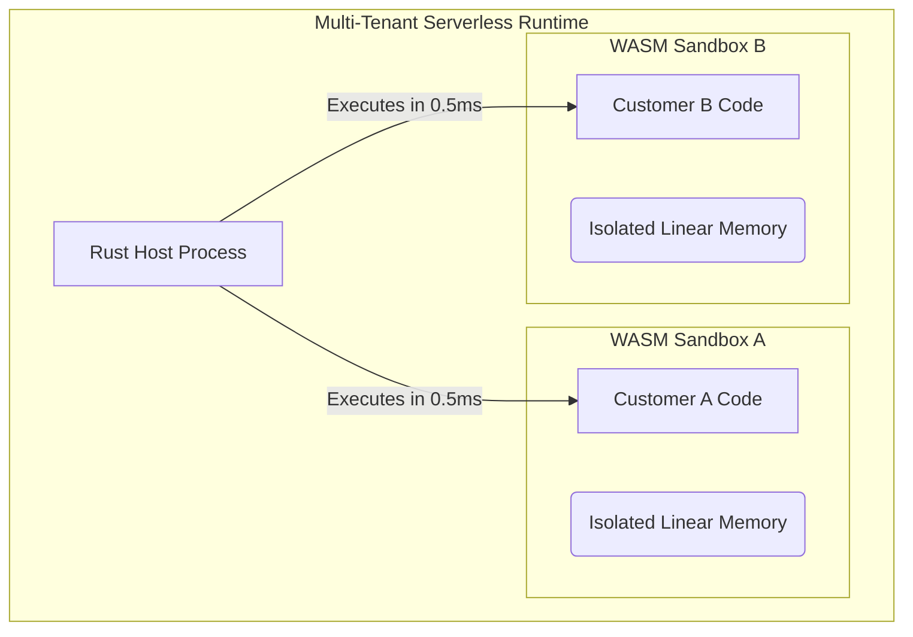

## 1. The Physics of the Serverless Edge

In our final architectural project, we will construct a multi-tenant Serverless Edge Runtime (similar to Cloudflare Workers or Deno Deploy).

We need to execute user-submitted code in response to HTTP requests. If we spawn a Docker container for every HTTP request, the 3-second Cold Start time will destroy our latency metrics. If we use Firecracker MicroVMs, the 125-millisecond boot time is excellent, but still too slow for an edge proxy handling 10,000 requests a second. We must achieve cold starts in **under 1 millisecond**.



## 2. WebAssembly (WASM) Isolation

We achieve sub-millisecond cold starts using **WebAssembly**. Users compile their Rust/Go/TypeScript code into a `.wasm` binary. WebAssembly is fundamentally a purely mathematical execution environment. It has no OS kernel overhead.

When the `wasmtime` runtime executes a module, it creates an isolated block of RAM known as Linear Memory. Because the WASM instruction set has mathematically proven bounds checking, it is physically impossible for Customer A's WASM module to read the RAM belonging to Customer B.

```rust
// src/serverless/engine.rs
use wasmtime::*;
use wasmtime_wasi::sync::WasiCtxBuilder;

pub struct ServerlessEngine {
    engine: Engine,
}

impl ServerlessEngine {
    pub fn new() -> Self {
        // We configure Wasmtime to aggressively compile WASM to native x86 machine code
        let mut config = Config::new();
        config.cranelift_opt_level(OptLevel::Speed);
        
        ServerlessEngine {
            engine: Engine::new(&config).unwrap(),
        }
    }

    pub fn execute_customer_code(&self, wasm_bytes: &[u8], request_payload: &str) -> String {
        // 1. Compile the WASM to native code (This is usually cached in production)
        let module = Module::new(&self.engine, wasm_bytes).unwrap();
        
        // 2. Establish Capability-Based Security via WASI.
        // We grant absolutely NO access to the network or the filesystem.
        let wasi_ctx = WasiCtxBuilder::new().build();
        let mut store = Store::new(&self.engine, wasi_ctx);
        let mut linker = Linker::new(&self.engine);
        wasmtime_wasi::add_to_linker(&mut linker, |s| s).unwrap();
        
        // 3. Instantiate the Sandbox. This takes less than 500 microseconds.
        let instance = linker.instantiate(&mut store, &module).unwrap();
        
        // 4. Pass the HTTP payload into the Sandbox
        // (Memory pointer arithmetic omitted for brevity, see Chapter 14)
        
        // 5. Execute the exported `handle_request` function
        let handler = instance.get_typed_func::<(), ()>(&mut store, "handle_request").unwrap();
        handler.call(&mut store, ()).unwrap();
        
        "Response generated securely!".to_string()
    }
}
```

## 3. The Fuel Consumption Mechanic

While WASM guarantees memory isolation, it does not guarantee CPU isolation. A malicious user could upload a WASM module containing an infinite loop (`loop {}`), completely hijacking the CPU core and causing a Denial of Service (DoS).

We prevent this using **Wasmtime Fuel**. Fuel is a deterministic execution limiter. 

Before invoking the WASM module, the Rust host injects 10,000 "Fuel" points into the sandbox. As `wasmtime` executes the user's code, every single CPU instruction (add, multiply, jump) automatically deducts 1 point of Fuel. If the WASM code hits an infinite loop, the Fuel rapidly drops to 0. The absolute instant Fuel reaches 0, `wasmtime` violently intercepts the execution and traps the module, returning a `FuelExhausted` error to the Rust host.

By combining Linear Memory isolation and precise CPU Fuel metering, we have built a mathematically secure, multi-tenant execution engine capable of running untrusted third-party code with zero infrastructure overhead.
